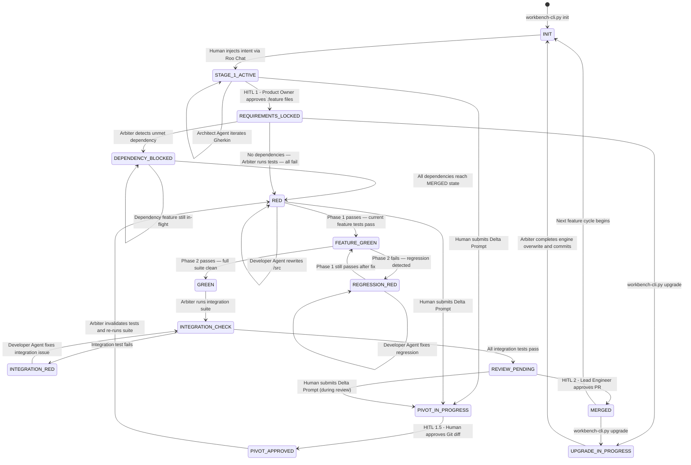

# The Agentic Workbench Architecture v2.0: Complete Specification

This document provides a highly detailed, comprehensive architectural blueprint of the Agentic Workbench. It defines a rigorous environment where autonomous AI execution is governed by deterministic rules, explicit human oversight, and immutable historical ledgers.

---

## Part 1: The Separation of Powers

To ensure ultimate operational rigor and prevent unverified AI outputs from compromising the system, the workbench architecture is strictly divided into three distinct entities. This separation forms the constitutional foundation of the environment:

* **Roo Code (The Agent):** This serves as the probabilistic "muscle" of the operation. It operates strictly in specialized modes—such as Architect, Test, Code, and Orchestrator—to perform targeted cognitive labor.  
* **The Arbiter (The Governor):** This represents the deterministic "law" of the system. It consists of a rigid set of local scripts and CI hooks that enforce progression gates, lock files, manage the `state.json` file, and execute the test suites. It holds the final authority on determining when a task is mathematically "Done."  
* **Roo Chat (The HITL Cockpit):** This is the Human-in-the-Loop interface. It is used exclusively for providing initial intent, reviewing the deterministic reports generated by the Arbiter, and granting the final approvals required to advance the pipeline.

### Feature Stage Execution Matrix

| Stage | Roo Mode | File Access Constraints | Arbiter's Gate | Memory Sync Actions |
| :---- | :---- | :---- | :---- | :---- |
| **Stage 1: Architect** | Architect Agent | `.feature` (RW) / `/src` (R) | Gherkin Syntax Check + `@depends-on` tag validation | REQ-ID assigned; `feature_registry` entry created |
| **Stage 2: Test Engineer** | Test Engineer Agent | `/tests/unit/` (RW) / `/src` (R) | Confirmed RED State | Traceability Map updated |
| **Stage 2b: Integration Scaffolding** | Test Engineer Agent | `/tests/integration/` (RW) / `/features/` (R) / `/src` (R) | Integration Skeleton Syntax Check | Integration test IDs registered in `state.json` |
| **Stage 3: Developer** | Developer Agent | `/src` (RW) / `/tests` (R) / `.feature` (R) | Phase 1 GREEN + Phase 2 REGRESSION CLEAN | Git Commit (REQ-ID); `file_ownership` map updated |
| **Stage 4: Review** | Orchestrator Agent | All (Read-Only) | INTEGRATION GREEN + Human Approval | `current_state_summary` updated; `feature_registry` set to MERGED |

---

## Part 1.5: Canonical Glossary of Actors and Artifacts

This glossary defines every named entity in the system. All sections of this document must use these canonical names exclusively.

### System Actors

| Canonical Name | Role Subtitle | Tool Implementation | Description |
| :---- | :---- | :---- | :---- |
| **Roo Code** | The Agent | VS Code extension (Roo Code) | The probabilistic AI engine. Operates in specialized modes to perform cognitive labor. Never enforces rules deterministically. |
| **The Arbiter** | The Governor | Local Python scripts + CI/Git hooks | The deterministic rule enforcer. Owns `state.json`, runs test suites, enforces gates, and triggers compliance snapshots. |
| **Roo Chat** | The HITL Cockpit / The Director | VS Code chat panel | The singular human interface. Used exclusively for injecting intent, reviewing Arbiter reports, and granting gate approvals. |

### Agent Modes (Roo Code Roles)

| Canonical Mode Name | Pipeline Stage | Custom or Built-in | Primary Responsibility |
| :---- | :---- | :---- | :---- |
| **Architect Agent** | Stage 1 | Built-in | Translates human narrative into Gherkin `.feature` files. "Product Agent" is a documented conversational alias — permitted in Glossary entries, but forbidden in running prose. |
| **Test Engineer Agent** | Stage 2 | Custom (`.roomodes`) | Writes failing test suites (`.spec.ts`) from approved `.feature` files. |
| **Developer Agent** | Stage 3 | Built-in | Writes feature source code in `/src` to satisfy failing tests. |
| **Orchestrator Agent** | Stage 4 + Lifecycle | Built-in | Read-only oversight of the review stage and inter-agent handoffs. |
| **Reviewer / Security Agent** | Stage 4 | Custom (`.roomodes`) | Performs static analysis and security scans on Pull Requests. |
| **Documentation / Librarian Agent** | Background | Custom (`.roomodes`) | Continuously compiles OpenAPI contracts, topology graphs, and executive summaries. |

### Key Artifacts and Files

| Artifact | Location | Owner | Description |
| :---- | :---- | :---- | :---- |
| `state.json` | Repo root | The Arbiter | Master lock file. Records current pipeline state, test pass ratios, and stage progression. |
| `handoff-state.md` | `memory-bank/hot-context/` | Agents + Arbiter | Inter-agent message bus. Agents write completion status and recommendations; the next agent reads on activation. |
| `activeContext.md` | `memory-bank/hot-context/` | Agents | Current task, last result, and next steps. Updated every session. |
| `.feature` files | `/features/` or `_inbox/` | Architect Agent | Gherkin-syntax requirement contracts. Tagged `@draft` in the Inbox; assigned a REQ-ID when promoted. |
| `.clinerules` | Repo root | The Workbench (Engine) | Canonical system guardrail file enforcing behavioral mandates for all Roo Code modes. (`.cursorrules` is a Cursor IDE alias for the same file.) |
| `.roomodes` | Repo root | The Workbench (Engine) | Custom agent role definitions with system prompts and file access constraints. |
| `workbench-cli.py` | Global install (not in app repo) | The Workbench | Deterministic bootstrapper and upgrade tool. Installed globally via the `agentic-workbench-template` repository. |
| `/tests/unit/` | `/tests/unit/` | Test Engineer Agent | Per-feature unit and acceptance test directory. Contains `.spec.ts` files scoped to a single `REQ-NNN`. |
| `/tests/integration/` | `/tests/integration/` | Test Engineer Agent | Cross-boundary integration test directory. Contains `*.integration.spec.ts` files tagged with a `FLOW-NNN` ID. |
| `feature_registry` | `state.json` | The Arbiter | Registry of all features and their pipeline states. Tracks `depends_on` relationships and file ownership. |

---

## Phase 0: The Ideation & Discovery Pipeline

This initial phase fundamentally flips the traditional script: the AI agent acts as the inquisitive interviewer, while the human assumes the role of the subject matter expert.

### 1\. The Unstructured Braindump

* **Action:** The human provides a raw, messy, stream-of-consciousness prompt. For example, they might state, "Our users are annoyed because the reporting tool is too slow, and they want PDF exports."  
* **Agent Role:** The agent ingests this unstructured data without judgment. Instead of immediately attempting to write a technical solution, it prepares a structured line of questioning to uncover the true parameters.

### 2\. The Socratic Interrogation (Agent-Driven Analysis)

* **Action:** The agent asks highly targeted questions to extract the core parameters of the request.  
* It focuses on the fundamental business drivers:  
  * **Who:** Which specific user persona is experiencing this friction?  
  * **What:** What is the actual operational bottleneck, stripped of emotional language?  
  * **Value:** How does solving this issue impact the core KPIs, such as retention, revenue, or operational efficiency?

### 3\. The "Five Whys" Deep Dive

* **Action:** If the human suggests a prescriptive feature (like the aforementioned PDF export), the agent gently pushes back to uncover the true root need.  
* **Agent Role:** The agent might ask clarifying questions such as, "You mentioned PDF exports. Why do users need PDFs? Are they presenting to executives, or do they just need a frozen offline record for compliance?" This ensures the team defines the right problem rather than merely taking orders.

### 4\. The Narrative Synthesis

* **Action:** Once the agent determines it has gathered sufficient context, it transitions from the questioning phase into drafting. It compiles the multi-turn dialogue into a highly structured, readable document.  
* **Output:** The agent generates the official draft of the "Narrative Feature Request." This document cleanly outlines the background, user persona, business problem, and high-level goals.

### 5\. Human Validation (The Ideation Gate)

* **Action:** The Product Owner reviews this generated Markdown file. They maintain full authority to tweak it, reject parts of it, or approve it entirely.  
* **Transition:** Once approved, this artifact becomes the official input for Stage 1, ready to be mathematically translated into highly structured Gherkin Feature Files.

---

## Phase 1: The Standard Execution Pipeline

This is the primary flow for taking a new feature from conception to merged code, consisting of four distinct stages.

### Stage 1: Intent to Contract (Iterative Chunking & BDD)

The primary goal of this stage is to translate human narrative into strict, machine-readable constraint files. This is an active, multi-turn dialogue driven by the Product Agent collaborating with the Product Owner.

* **Artifact Inputs and Outputs:** To exit this stage, the raw intent must be converted into structured artifacts. The input is the approved Narrative Feature Request. The outputs are multiple Gherkin Feature Files (`.feature`) written in strict Given/When/Then syntax. One narrative generates multiple output files.  
* **Traceability & Naming Conventions:** Every requirement in the initial narrative is assigned a unique Traceability ID. The Product Agent formats file names by appending this Requirement ID. Inside the files, the agent includes a traceability tag to ensure downstream tools can mathematically link tests and commits back to the core requirement.  
* **The Iterative Chunking Loop:**  
  * *Phase A (Ingestion):* The Product Agent ingests the raw narrative.  
  * *Phase B (Interrogation & Chunking):* The agent parses the narrative repeatedly, identifying missing constraints, unhandled edge cases, and logical gaps. It proposes logical divisions to break monolithic requests into atomic pieces.  
  * *Phase C (Clarification):* The Agent prompts the Product Owner with clarification questions to resolve ambiguities.  
  * *Phase D (Refinement):* The Product Owner answers and reviews intermediate breakdowns. This loop continues until no logical ambiguities exist.  
* **Contract Generation:** The agent packages the newly generated constraint files into a formal Pull Request for human review.  
* **The Requirement Gate (HITL 1):** The human Product Owner validates that the logical interpretation perfectly matches the business intent. Approval locks the requirements, closes Stage 1, and triggers Stage 2\.

### Stage 2: Test Suite Authoring (Defining the Guardrails)

Once the contract is approved, the system generates the mathematical boundaries for success.

* **Inputs:** The approved `.feature` files and root-level Context & Guardrail Files (e.g., `.clinerules`, `biome.json`) that dictate architectural rules.
* **Outputs:** Test Specification Files (`.spec.ts`) written to `/tests/unit/`, scoped to a single `REQ-NNN`.
* **Execution:** The Test Engineer Agent writes failing test suites. The Python Arbiter's **Test Orchestrator** script automatically runs these tests against the codebase. The tests fail, generating Error Logs, and the Arbiter locks `state.json` to `RED`.
* **File Access:** The Test Engineer Agent has Read/Write access to `/tests/unit/` and Read-Only access to `/src` (to understand existing code structure). It MUST NOT write test files into `/src`.
* **Parallel Development Note:** Multiple features may be in Stage 2 simultaneously (parallel Stage 1 is permitted; Stages 2–4 are single-threaded — one active execution pipeline at a time).

### Stage 2b: Integration Contract Scaffolding

After the unit test suite is confirmed `RED`, the Test Engineer Agent authors integration test contracts to verify cross-boundary behavior.

* **Inputs:** All `.feature` files for features in `MERGED` state (read from `state.json` `feature_registry`), plus the new feature's `.feature` file.
* **Outputs:** Integration skeleton files (`*.integration.spec.ts`) in `/tests/integration/`, tagged with a `FLOW-NNN` ID.
* **Execution:** The Test Engineer Agent reads the `feature_registry` to identify already-merged features, then writes skeleton tests asserting cross-boundary contracts. These are intentionally failing (RED) at this stage — they are contracts, not yet implementations.
* **Directory Convention:**
  ```
  /tests/unit/         ← unit/acceptance tests, REQ-NNN scoped
  /tests/integration/  ← cross-boundary tests, FLOW-NNN tagged
  ```
* **Arbiter Gate:** The Arbiter's **Integration Test Runner** script performs a syntax-only validation on `/tests/integration/` files. It does not execute them — execution is deferred to Stage 4.
* **Auto-unblocking:** If no integration test directory exists yet, Stage 2b is skipped and the pipeline proceeds directly to Stage 3.

### Stage 3: The Autonomous Execution Engine

This is the closed-loop, high-speed execution phase, augmented with a non-regression safeguard.

* **Inputs:** Error Logs from failing unit tests, existing Source Code, and Context & Guardrail Files.
* **Outputs:** Feature Source Code.
* **Dependency Gate:** Before activation, the Arbiter checks `state.json.feature_registry` for all entries in the current feature's `depends_on` list. If any dependency has not reached `MERGED` state, the Arbiter sets `state.json.state` to `DEPENDENCY_BLOCKED` and halts Stage 3. The Orchestrator Agent monitors and auto-unblocks when dependencies are satisfied.
* **File Access:** The Developer Agent has Read/Write access to `/src` to write feature source code, and Read-Only access to `/tests` and `.feature` files. The Developer Agent MUST NOT self-declare completion until both unit tests (`state = GREEN`) and integration tests (`integration_state = GREEN`) pass.
* **Two-Phase Test Execution Loop:**
  The Arbiter's **Test Orchestrator** runs tests in two sequential phases on every iteration of the RED→GREEN loop:

  **Phase 1 — Feature Scope Run** (fast inner loop):
  Runs only `/tests/unit/{REQ-NNN}-*.spec.ts` for the active feature. The Developer Agent uses this feedback to iterate quickly.

  **Phase 2 — Full Regression Run** (safety net, after every Phase 1 GREEN):
  Runs ALL `/tests/unit/**/*.spec.ts` plus ALL `/tests/integration/**/*.spec.ts`. This confirms no previously passing test has been broken by the current feature's changes.

* **State Progression:**
  - `RED` → `FEATURE_GREEN`: Phase 1 passes (current feature tests all pass).
  - `FEATURE_GREEN` → `REGRESSION_RED`: Phase 2 fails (a previously passing test now fails — a regression).
  - `REGRESSION_RED` → `FEATURE_GREEN`: Developer Agent fixes the regression; Phase 1 still passes after the fix.
  - `FEATURE_GREEN` → `GREEN`: Phase 2 passes (full suite clean, no regressions).
  - `REGRESSION_RED` is a **blocking state** — the pipeline cannot advance to Stage 4 while in `REGRESSION_RED`. The Developer Agent treats the regression failure log as its primary input (higher priority than the current feature's error log).

* **File Ownership:** On every commit, the Arbiter updates `state.json.file_ownership` to record which source files were modified by the active feature. This map is used for conflict detection when multiple in-flight features touch the same files.

### Stage 4: Validation and Delivery

The machine has achieved unit-test-level Definition of Done and prepares for final cross-boundary validation.

* **Inputs & Outputs:** The completed Pull Request containing `.feature` files, unit tests, integration tests, and source code. The outputs are Static Analysis Logs, Security Scan Reports, and Integration Test Results.
* **Execution:** The Reviewer/Security Agent performs a static analysis to ensure architectural rules were not bypassed just to make tests pass.
* **The Integration Gate (Pre-HITL 2):** Before the PR is eligible for human review, the Arbiter's **Integration Test Runner** script executes the full `/tests/integration/` suite against the assembled codebase. All integration tests must pass (`GREEN`). If any integration test fails, `state.json` is set to `INTEGRATION_RED` and the Developer Agent is re-activated to fix the integration failure. This loop continues until all integration tests pass.
* **The Delivery Gate (HITL 2):** A Lead Engineer/Architect reviews the Pull Request diffs — including integration test results and security scan reports — for broader systemic context and non-quantifiable risks before granting approval to merge into the main branch.

---

## Phase 2: The Ad Hoc Ideas Pipeline

Change is inevitable, but unmanaged change destroys agentic loops. The workbench routes ad hoc changes into two distinct operational flows: The "Inbox" and The "Pivot."

### Case A: The "Inbox" (Non-Blocking Ideas)

This flow protects the Definition of Done by quarantining new, lower-priority ideas.

* **Asynchronous Capture:** A human submits a raw "shower thought." The **Architect Agent** (operating in its lightweight intake mode, with RW access to `_inbox/` only) asynchronously ingests this idea. It performs a lightweight chunking loop to format the request into Gherkin syntax, but explicitly tags it as `@draft` and does **not** assign a Traceability ID. The output is stored in the isolated `_inbox/` directory, keeping the active pipeline clean. The Python Arbiter runs a **Gherkin Syntax Check** on `@draft` files to ensure structural validity, but does not enforce REQ-ID assignment.
* **The Backlog Gate:** The Product Owner periodically reviews the `_inbox/` asynchronously. If approved for promotion, the Architect Agent assigns an official Traceability ID, moves the file into the active `/features/` directory, and the Arbiter updates `state.json` to `STAGE_1_ACTIVE` to begin the full Iterative Chunking Loop.

### Case B: The "Pivot" (Mid-Stage Requirements Change)

This flow handles critical, urgent changes that must alter the current work-in-flight.

* **The Delta Injection:** The human submits a Delta Prompt (e.g., "Update the reset flow to require a 2FA token"). The **Architect Agent** analyzes the blast radius and modifies existing `.feature` scenarios, resolving logical conflicts. The Arbiter sets `state.json` to `PIVOT_IN_PROGRESS` and creates a `pivot/{ticket-id}` branch from the current working branch to isolate the change.
* **The Delta Approval (HITL 1.5):** The human reviews the Git diff on the `pivot/` branch via Roo Chat and approves the logical changes to the system's contract. The Arbiter sets `state.json` to `PIVOT_APPROVED` and merges the pivot branch back into the active feature branch.
* **Test Invalidation & Remediation:** The Python Arbiter's **State & Gate Manager** flags test files linked to the modified Gherkin and sets `state.json` to `RED`. The Test Engineer Agent rewrites the invalidated tests. The Arbiter's **Test Orchestrator** runs the suite, confirms the `RED` state, and generates new Error Logs. The Developer Agent is autonomously activated to refactor the source code until all tests pass and the Arbiter confirms `GREEN`.
* **Pivot State Transitions:**
  - `STAGE_1_ACTIVE` → `PIVOT_IN_PROGRESS`: Human submits Delta Prompt during Stage 1
  - `RED` → `PIVOT_IN_PROGRESS`: Human submits Delta Prompt during Stage 3
  - `PIVOT_IN_PROGRESS` → `PIVOT_APPROVED`: Human approves Git diff via HITL 1.5
  - `PIVOT_APPROVED` → `RED`: Arbiter invalidates tests and re-runs suite

---

## Phase 3: The Documentation and Compliance Engine

Traditional documentation is never written manually; it is dynamically compiled.

### Stage 1: Continuous Format Shifting

The Documentation Agent runs in the background, making the codebase readable for stakeholders. It uses the live repository state to dynamically generate executive summaries and test burndown charts for Executives. For technical stakeholders, it auto-generates API contracts (OpenAPI) and system topology graphs (Mermaid.js). Humans consume these via a repository wiki.

### Stage 2: The Compliance Snapshot

Auditors require immutable proof at a specific point in time. When the **Python Arbiter** detects a major release tag (via a Git `post-tag` hook) triggered at the Delivery Gate, it initiates the snapshot protocol. The Documentation / Librarian Agent compiles the live files into static, timestamped PDFs and a Traceability Matrix, depositing them into a read-only compliance vault for retrieval by auditors. The Arbiter — not the Orchestrator Agent — owns this trigger to guarantee deterministic, tamper-proof execution.

### Summary of State Management Roles

* **Human:** Defines the Truth (Initial requests and approvals).  
* **Agent:** Synchronizes the Evidence (Updating Gherkin, Tests, Docs).  
* **Git:** Preserves the History (The immutable record).

---

## Cross-Cutting Concern 1: The Persistent Memory System

The persistent memory system counters AI drift and "Lost in the Middle" errors by utilizing a Hot/Cold architecture with Git as the single source of truth. Every piece of memory is versioned; sessions are ephemeral, but Git is eternal.

### Architecture: Hot vs. Cold Zones

* **The Hot Zone:** Files in `memory-bank/hot-context/` are read directly by the agent at the start of every session.  
  * `activeContext.md`: Current task, last result, next steps (updated every session).  
  * `progress.md`: Project-wide checkbox state.  
  * `decisionLog.md`: ADRs with date, context, decisions.  
  * `systemPatterns.md`: Technical conventions.  
  * `productContext.md`: Sprint stories.  
  * `RELEASE.md`: Single source of truth for release tracking.  
  * `handoff-state.md`: Inter-agent handoff data.  
  * `session-checkpoint.md`: 5-minute crash recovery heartbeat.  
* **The Cold Zone:** Files in `memory-bank/archive-cold/` must *not* be read directly by the agent to prevent flooding the context window with stale data. Access is granted exclusively through the MCP tool (except for the Documentation / Librarian Agent). At sprint end, the Python Arbiter's **Memory Rotator** script moves hot-context files here.

### Hot Zone File Rotation Policy

The following table defines the per-file policy applied by the Memory Rotator at sprint end:

| File | Rotation Policy | Rationale |
| :---- | :---- | :---- |
| `activeContext.md` | **Rotate** (archive, then reset to template) | Stale task context must not bleed into the next sprint. |
| `progress.md` | **Rotate** (archive, then reset to template) | Sprint-scoped checkbox state is replaced each sprint. |
| `decisionLog.md` | **Persist** (never rotated) | ADRs are permanent architectural records; they accumulate across sprints. |
| `systemPatterns.md` | **Persist** (never rotated) | Technical conventions are long-lived and cross-sprint. |
| `productContext.md` | **Rotate** (archive, then reset to template) | Sprint stories are replaced by the next sprint's backlog. |
| `RELEASE.md` | **Persist** (never rotated) | Single source of truth for all releases; must accumulate. |
| `handoff-state.md` | **Reset** (overwritten to empty template, not archived) | Handoff data is ephemeral; archiving stale handoffs creates noise. |
| `session-checkpoint.md` | **Reset** (overwritten to empty template, not archived) | Crash recovery data is only valid for the current session. |

### Session Lifecycle Protocols

* **Startup Protocol (CHECK→CREATE→READ→ACT):** The agent checks for `activeContext.md`. If absent, it creates it using strict templates. It then sequentially reads `activeContext.md` and `progress.md` before taking any action.  
* **Close Protocol:** Before completing a task, the agent must update the Hot Zone files, Backlog trackers, and Release states. It also executes a script to save session metadata to `docs/conversations/` to maintain an audit trail. Conversation logs are never edited after creation.

### Continuity Safeguards

* **Crash Recovery:** A script writes a heartbeat to `session-checkpoint.md` every 5 minutes during active work, saving the session ID, branch, commit hash, and current task. If a session crashes, the agent detects the "ACTIVE" status on reboot and offers to resume from the checkpoint.  
* **Inter-Agent Handoff Protocol:** When an agent completes a task, it logs its completion status, artifacts created, and recommendations into `handoff-state.md`. The Orchestrator reads this upon activation, acknowledges receipt, and determines the subsequent workflow.  
* **Decision Logging:** Significant decisions are permanently logged in `decisionLog.md` using the Architecture Decision Record (ADR) format, recording the date, context, decision, and consequences.

---

## Cross-Cutting Concern 1.5: The Pre-Arbiter Transitional Mode (Command Delegation Contract)

> **Status:** This section defines the transitional architecture from Layer 1 (pure agent-honor) to Layer 2 (deterministic Arbiter enforcement). It is a time-bounded operational mode — not a permanent design. Once the Arbiter is fully operational, the rules in this section are superseded by the CMD-2 and CMD-TRANSITION rules defined in [`.clinerules` / `.cursorrules` (System Guardrails)](#c-clinerules--cursorrules-system-guardrails).

### The Core Problem

Roo Code (the probabilistic Agent) must not be the sole executor of system-level commands. However, in Layer 1 (pre-Arbiter), there is no deterministic script to delegate to. This creates a gap where Roo either (a) asks the human for approval on every command — causing friction — or (b) runs commands autonomously with no enforcement — causing risk.

### The Solution: The Command Delegation Contract

The workbench resolves this by encoding a **permissioned auto-approve allowlist** in Roo Code's settings, scoped to the transition period. This allowlist defines which commands Roo may execute without approval during Layer 1, and which commands are permanently forbidden regardless of layer.

> **Technical reality:** Roo Code v3.52.0 exposes command auto-approve via two VS Code workspace settings: `roo-cline.allowedCommands` (string array, exact match — no regex) and `roo-cline.deniedCommands` (string array, exact match). The default `allowedCommands` contains only `["git log", "git diff", "git show"]`. All other commands require human approval unless added to `allowedCommands`. The import mechanism is the `roo-cline.importSettings` command (triggered from the Roo Code command palette).

### Phase A → B → C Migration Path

The Arbiter is built incrementally (Sprint 1). As each Arbiter script is completed, the corresponding command domain is **revoked** from Roo's auto-approve permission. The migration follows three phases:

| Phase | Description | Auto-Approve Status | Human Approval Required |
|:------|:------------|:--------------------|:------------------------|
| **Phase A: Layer 1 — Pre-Arbiter** | Engine-only (.clinerules + .roomodes). No Arbiter scripts exist. | Broad allowlist active (safe patterns only) | All non-listed commands |
| **Phase B: Layer 2a — Partial Arbiter** | Some Arbiter scripts delivered. `arbiter_capabilities` in `state.json` tracks which domains are Arbiter-owned. | Allowlist shrinks per script delivery | Commands whose domain is not yet in `arbiter_capabilities` |
| **Phase C: Layer 2b — Full Arbiter** | All Arbiter scripts delivered. CMD-2 fully active. | No allowlist — all command execution delegated to Arbiter scripts | All commands (via Arbiter) |

### Script-by-Script Handoff Contract

The following table maps each Arbiter script to the exact Roo permission it revokes upon delivery. When a script is completed, the corresponding entry is added to `arbiter_capabilities` in `state.json` and the auto-approve allowlist is updated accordingly.

| Arbiter Script | Command Domain Revoked from Roo | Auto-Approve Pattern Removed |
|:-------------- |:------------------------------ |:----------------------------|
| `test_orchestrator.py` | Test suite execution | `npm test`, `npx vitest`, `pnpm test`, `pytest`, `make test` |
| `gherkin_validator.py` | `.feature` file validation | `npx gherkin-lint`, `cucumber` |
| `memory_rotator.py` | Memory file rotation | `rm`, `mv`, `cp` (memory-bank files) |
| `audit_logger.py` | Session audit trail save | `mkdir`, `touch` (docs/conversations) |
| `crash_recovery.py` | Checkpoint/heartbeat writes | *(none — internal daemon)* |
| `dependency_monitor.py` | Dependency state polling | *(none — internal monitor)* |
| `integration_test_runner.py` | Integration test execution | `npm run test:integration`, `npx vitest --integration` |
| `pre-commit` hook | Git commit enforcement | *(Git hook is physical barrier)* |
| `pre-push` hook | Git push enforcement | *(Git hook is physical barrier)* |
| `post-tag` hook | Compliance snapshot trigger | *(Git hook is physical barrier)* |

### The `arbiter_capabilities` Registry

The `arbiter_capabilities` array in `state.json` is the authoritative record of which command domains are currently owned by the Arbiter. Roo reads this array on every session start to determine its operational constraints.

```json
{
  "version": "2.1",
  "state": "INIT",
  "stage": null,
  "active_req_id": null,
  "feature_suite_pass_ratio": null,
  "full_suite_pass_ratio": null,
  "regression_state": "NOT_RUN",
  "regression_failures": [],
  "integration_state": "NOT_RUN",
  "integration_test_pass_ratio": null,
  "feature_registry": {},
  "file_ownership": {},
  "last_updated": null,
  "last_updated_by": "workbench-cli",
  "arbiter_capabilities": {
    "test_orchestrator": false,
    "gherkin_validator": false,
    "memory_rotator": false,
    "audit_logger": false,
    "crash_recovery": false,
    "dependency_monitor": false,
    "integration_test_runner": false,
    "git_hooks": false
  }
}
```

> **Rule:** Each Arbiter script sets its own entry to `true` in `arbiter_capabilities` upon successful initialization. The Python Arbiter is the sole writer of this field. Roo reads it exclusively — it must never write to it.

### Roo Code Auto-Approve Configuration (Phase A Template)

The following `.roo-settings.json` file defines the Phase A auto-approve allowlist. It is pre-configured in the workbench template and represents the maximum permission surface Rooted during the pre-Arbiter phase. New projects initialized via `workbench-cli.py init` receive this file automatically.

```json
{
  "$schema": "https://agentic-workbench.io/roo-settings.schema.json",
  "version": "2.1",
  "settings": {
    "roo-cline.allowedCommands": [
      "git log",
      "git diff",
      "git show",
      "git status",
      "git branch -a",
      "git log --oneline -n 20",
      "git diff --stat",
      "node --version",
      "mkdir",
      "type nul",
      "cat",
      "grep",
      "find",
      "ls -la",
      "ls",
      "pwd",
      "echo",
      "head -n 100",
      "tail -n 100",
      "wc -l"
    ],
    "roo-cline.deniedCommands": [
      "git push",
      "git commit",
      "git merge",
      "git rebase",
      "rm -rf",
      "docker",
      "kubectl",
      "terraform",
      "sudo",
      "chmod",
      "chown",
      "kill",
      "killall",
      "pkill"
    ]
  }
}
```

> **Technical note:** Roo Code v3.52.0 uses exact string matching on `roo-cline.allowedCommands` (no regex). The `roo-cline.importSettings` command (Command Palette → "Roo Code: Import Settings") can import this file directly. As each Arbiter script is delivered, remove its entry from `roo-cline.allowedCommands` and set the corresponding `arbiter_capabilities` key to `true` in `state.json`.

---

## Cross-Cutting Concern 2: GitFlow & Naming Convention

Git serves as the ultimate bedrock, preserving the history of how human intent becomes validated code. The branching strategy is absolute.

### Branch Definitions & Lifecycles

* **`main`:** Production state. It is frozen, never committed to directly, and never deleted.  
* **`develop`:** Primary integration mainline. It is long-lived, never deleted, and serves as the base for all feature branches and stabilization branches. Direct commits to `develop` are permitted only for trivial chores; all feature work must arrive via PR merge from a `feature/` or `lab/` branch. Never described as "wild" — it is the controlled integration target for all feature work.
* **`stabilization/vX.Y`:** Scoped release stabilization. It is a permanent artifact kept for traceability and never deleted after merge.  
* **`feature/{Timebox}/{REQ-NNN}-{slug}`:** Scoped feature grouping. It merges via PR and is never deleted after merge.
* **`lab/{Timebox}/{slug}`:** Ad-hoc experimental exploration.  
* **`hotfix/{Ticket}`:** Emergency production fix. Branched from the production tag on `main`, merged to both `main` and `develop`.

### Commits & Strict Enforcement

* **Conventional Commits:** All commit messages must adhere to a strict pattern indicating scope, such as `feat(scope)`, `fix(scope)`, `docs(memory)`, or `chore(config)`.  
* **Forbidden Actions:** Developers must NEVER commit directly on `main` after a release tag, NEVER commit on a branch already merged to `main`, and NEVER use `--delete-branch` when merging PRs. All new development must target `develop`, a stabilization branch, or a feature branch.

### Advanced Workflows

* **Feature Branch Workflow:** Merge via PR using `--no-ff` to always create a merge commit, ensuring granular history is retained.
* **Lab-to-Feature Refining:** Labs can be merged directly to `develop` or refined by creating a feature branch that merges the lab first before integrating into `develop`.
* **Release Buffer Parallelism:** When a `stabilization/vX.Y` branch is active for polish, development for the next sprint safely continues in parallel on the `develop` branch without causing systemic blocking. After a release merge, `develop` is fast-forwarded to `main` to maintain system invariants.

### Pipeline Parallelism Rule

Stage 1 (Intent to Contract) supports parallel execution — multiple features may be in the Iterative Chunking Loop simultaneously, each tracked in the `feature_registry` with its own state. Stages 2, 2b, 3, and 4 operate as a **single-threaded execution pipeline**: one feature is active in the execution pipeline at a time (identified by `state.json.active_req_id`). When a feature is blocked on a dependency (tracked via `@depends-on` tags in the `feature_registry`), the pipeline stalls and the Orchestrator Agent monitors the dependency state until the Arbiter auto-unblocks it.

---

## Cross-Cutting Concern 3: Cross-Feature Dependency Management

The pipeline must enforce inter-feature dependencies to prevent the Developer Agent from writing code that assumes APIs from features not yet merged. Dependencies are declared, tracked, and enforced deterministically.

### Dependency Declaration Syntax

Features declare dependencies in their `.feature` file using the `@depends-on` Gherkin tag:

```gherkin
@REQ-042
@depends-on: REQ-038, REQ-041
Feature: Payment Checkout Flow
  ...
```

The `@depends-on` tag is parsed by the Arbiter's **Gherkin Validator** during Stage 1's syntax check. If a referenced REQ-ID does not exist in `state.json`'s `feature_registry`, the validator raises a warning (not a block — the dependency may be planned but not yet started).

### The Feature Registry

The `feature_registry` in `state.json` is the Arbiter-owned registry of all features and their pipeline states:

```json
{
  "feature_registry": {
    "REQ-038": { "state": "MERGED", "merged_at": "2026-04-10T14:00:00Z", "branch": "feature/S1/REQ-038-user-auth" },
    "REQ-041": { "state": "GREEN", "branch": "feature/S1/REQ-041-user-profile", "depends_on": [] },
    "REQ-042": { "state": "DEPENDENCY_BLOCKED", "branch": "feature/S1/REQ-042-payment-checkout", "depends_on": ["REQ-038", "REQ-041"] }
  }
}
```

The Arbiter is the **sole writer** of `feature_registry`. All agents read it via the `.clinerules` mandate.

### The Dependency Gate

Before the Arbiter activates Stage 3 for a feature, it evaluates the dependency gate:

```
FOR EACH dep_id IN feature.depends_on:
  IF feature_registry[dep_id].state != "MERGED":
    SET state.json.state = "DEPENDENCY_BLOCKED"
    WRITE blocking report to handoff-state.md
    HALT Stage 3 activation
```

The Orchestrator Agent is the only agent permitted to act while `state = DEPENDENCY_BLOCKED` — its sole action is monitoring dependency states and reporting status to the human via Roo Chat.

When a dependency feature reaches `MERGED`, the Arbiter's **Dependency Monitor** script polls `feature_registry` and automatically transitions any blocked feature from `DEPENDENCY_BLOCKED` back to the appropriate active state, unblocking the pipeline.

### File Ownership & Conflict Detection

The Arbiter maintains a `file_ownership` map in `state.json` to detect when two in-flight features modify the same source files:

```json
{
  "file_ownership": {
    "src/auth/login.ts": "REQ-038",
    "src/auth/session.ts": "REQ-038",
    "src/payment/checkout.ts": "REQ-042"
  }
}
```

On every Stage 3 commit, the Arbiter's `pre-commit` hook:
1. Reads the list of modified files.
2. Checks `file_ownership` for each file.
3. If a file is owned by a **different in-flight feature** (not `MERGED`), writes a `CONFLICT_DETECTED` warning to `handoff-state.md` and notifies the Orchestrator Agent.
4. Does **not** block the commit — conflicts are flagged for HITL 2 review, not hard-blocked.

### `.clinerules` Dependency Rules

> **Rule DEP-1:** Before beginning Stage 3 implementation, the Developer Agent MUST read `state.json.feature_registry` and confirm all entries in `depends_on` have `state = MERGED`. If any dependency is not `MERGED`, the agent MUST halt and report the blocking dependency to `handoff-state.md`.

> **Rule DEP-2:** The Developer Agent MUST NOT import or call live APIs from features whose `state.json.feature_registry` entry is not `MERGED`. Stub interfaces are permitted; live imports are not.

> **Rule DEP-3:** When `state.json.state = DEPENDENCY_BLOCKED`, only the Orchestrator Agent may act — its sole function is dependency monitoring. No other agent is activated.

---

## Part 8: Implementation Mapping & Topology

This part maps every abstract concept defined in Parts 1–7 to its concrete tool, script, or configuration file.

## 8.1 Core Architectural Paradigm: The Separation of Powers

The system is built on a strict decoupling of probabilistic generation and deterministic rule enforcement. The architecture avoids heavy middleware or background message brokers, relying instead on a highly transparent, file-driven synchronization loop.

This operational triad consists of (see Glossary in Part 1.5 for canonical definitions):

1. **Roo Code (The Agent):** The probabilistic "muscle" performing targeted cognitive labor in specialized modes.
2. **The Arbiter (The Governor):** The deterministic "law" utilizing local Python scripts and CI hooks to enforce mathematical state, gates, and operational bounds.
3. **Roo Chat (The HITL Cockpit):** The singular human interface governing intent and progression.

---

## 8.2 The Glue: State-Driven File System

System synchronization occurs entirely via a **File-System-as-Database** pattern. Agents and scripts do not communicate via direct API calls; they coordinate through immutable state files.

* **`state.json` (The Master Lock):** The Python Arbiter calculates the project's state (e.g., test pass ratios, stage progression) and locks the results here. Roo Code is bound by `.clinerules` to read this file before acting, dictating its immediate operational constraints.  
* **`handoff-state.md` (The Message Bus):** Upon completing a task or timebox, agents log their status, generated artifacts, and recommendations into this file. The subsequent agent or script reads this file to seamlessly resume the workflow.  
* **Git Hooks & CI (The Physical Barrier):** The final binding layer. Version control hooks intercept and block any actions violating deterministic rules (e.g., committing directly to `main`, bypassing linting). Rejected actions generate error logs that are fed back to Roo Code for immediate remediation.

### `state.json` State Transition Diagram

The Arbiter is the sole writer of `state.json`. The following diagram defines all valid states and the transitions between them:



> **Rule:** The Arbiter refuses to execute an upgrade if `state.json` is in any state other than `INIT` or `MERGED`. This prevents engine overwrites during active development.
> **Rule:** A feature cannot advance to Stage 4 while in `REGRESSION_RED` or `INTEGRATION_RED`. Both states are blocking gates.

---

## 3\. Concrete Component Mapping

### A. Python (The Arbiter / Governor Scripts)

Standalone Python scripts run locally or via hooks to enforce the rules outside of Roo Code's control:

* **State & Gate Manager:** Manages `state.json` to lock system states (e.g., RED, FEATURE_GREEN, GREEN, DEPENDENCY_BLOCKED, REGRESSION_RED, INTEGRATION_RED) and enforce progression gates. Supports `check-dependencies --req-id REQ-NNN` to evaluate the dependency gate.
* **Test Orchestrator:** Executes test suites in two sequential phases. Phase 1: `--scope feature --req-id REQ-NNN` (feature-scope fast loop). Phase 2: `--scope full` (full regression run). Returns deterministic pass/fail metrics and writes `feature_suite_pass_ratio`, `full_suite_pass_ratio`, and `regression_state` to `state.json`. The `regression_state` field accepts three values: `NOT_RUN` (initial), `CLEAN` (Phase 2 passed), and `REGRESSION_RED` (Phase 2 failed — blocking).
* **Integration Test Runner:** Executes only `*.integration.spec.ts` files in `/tests/integration/`. Writes `integration_state` and `integration_test_pass_ratio` to `state.json`. Performs syntax-only validation during Stage 2b and full execution during Stage 4.
* **Dependency Monitor:** Polls `feature_registry` on every `MERGED` event. Automatically unblocks features in `DEPENDENCY_BLOCKED` state when their dependencies are satisfied.
* **Memory Rotator:** Moves files from `memory-bank/hot-context/` to `memory-bank/archive-cold/` at sprint conclusion.
* **Audit Trail Logger:** Triggered during the Close Protocol to save immutable session metadata into `docs/conversations/`.
* **Crash Recovery Daemon:** Background process writing a heartbeat (session ID, branch, commit hash, current task) to `session-checkpoint.md` every 5 minutes.
* **Gherkin Validator:** Validates `.feature` files for Given/When/Then syntax and parses `@depends-on` tags, cross-referencing REQ-IDs against `feature_registry`.

### B. `.roomodes` (Custom Agent Roles)

Roo Code requires custom system prompts and constraints to align its modes with the pipeline stages:

* **Architect Agent (Stage 1 \- Built-in):** Read/Write access to `.feature` files. Read-Only access to `/src`. Translates human narrative into strict Gherkin. Also referred to as "Product Agent" in conversational contexts — these are synonymous (see Glossary).
* **Test Engineer Agent (Stage 2 — Custom):** Read/Write access to `/tests/unit/` to generate failing unit/acceptance test suites based on the Gherkin scenarios. Read-Only access to `/src` to understand existing code structure. In Stage 2b, Read/Write access to `/tests/integration/` for writing integration test skeletons; Read-Only access to `/features/` and `/src`.
* **Developer Agent (Stage 3 \- Built-in):** Read/Write access to `/src` to write feature source code. Read-Only access to `/tests` and `.feature` files. Ingests Error Logs and writes feature source code exclusively to satisfy the failing tests. The Developer Agent MUST NOT self-declare completion until both unit tests (`state = GREEN`) and integration tests (`integration_state = GREEN`) pass.
* **Orchestrator Agent (Stage 4 \- Built-in):** Read-Only access across the board to manage the Review stage and broader lifecycle handoffs.
* **Documentation / Librarian Agent (Background \- Custom):** Continuously compiles system topology graphs, executive summaries, and OpenAPI contracts.
* **Reviewer / Security Agent (Stage 4 \- Custom):** Performs static analysis and security scan reports on Pull Requests.

### C. `.clinerules` / `.cursorrules` (System Guardrails)

The root-level context enforcing behavioral mandates for the LLM across all modes:

* **Session Lifecycle Protocols:** Mandates the strict "CHECK→CREATE→READ→ACT" sequence for the Startup Protocol, addressing `activeContext.md` and `progress.md`. Defines the Close Protocol.
* **Inter-Agent Handoff Protocol:** Requires the agent to log completion data and next steps into `handoff-state.md`.
* **Traceability Mandates:** Directs the assignment of Traceability IDs to all requirements, enforcing their inclusion in filenames, internal file tags, and `@depends-on` Gherkin declarations.
* **Commit Constraints:** Strictly enforces Conventional Commits (`feat(scope)`, `fix(scope)`).
* **Integration Gate (INT-1):** The Developer Agent MUST NOT self-declare completion until `state.json.integration_state = GREEN`. The Arbiter enforces this sequentially; no agent may bypass.
* **Non-Regression Gate (REG-1):** The Arbiter MUST run the full test suite (all features, all integration tests) after every Phase 1 GREEN confirmation. A feature is not `GREEN` until the full suite is clean.
* **Regression Priority (REG-2):** When `state.json.regression_state = REGRESSION_RED`, the Developer Agent MUST treat the regression failure log as its primary input — higher priority than the current feature's error log. The current feature's new code is the most likely cause of the regression.
* **Dependency Check (DEP-1):** Before beginning Stage 3 implementation, the Developer Agent MUST read `state.json.feature_registry` and confirm all entries in `depends_on` have `state = MERGED`. If any dependency is not `MERGED`, the agent MUST halt and report the blocking dependency to `handoff-state.md`.
* **Dependency Isolation (DEP-2):** The Developer Agent MUST NOT import or call live APIs from features whose `state.json.feature_registry` entry is not `MERGED`. Stub interfaces are permitted; live imports are not.
* **Dependency Block Response (DEP-3):** When `state.json.state = DEPENDENCY_BLOCKED`, only the Orchestrator Agent may act — its sole function is dependency monitoring. No other agent is activated while blocked.
* **Command Delegation Phase A (CMD-1):** During the pre-Arbiter transition (Layer 1), the Agent MAY auto-execute commands matching the patterns defined in `.roo-settings.json` `auto_approve.patterns`. All other commands require human approval via Roo Chat.
* **Command Delegation Phase B/C (CMD-2):** Once an Arbiter script owns a command domain (i.e., the corresponding entry in `state.json.arbiter_capabilities` is `true`), the Agent MUST NOT execute the equivalent command directly. All command execution for that domain MUST be delegated to the Arbiter script. The Agent reads `state.json.arbiter_capabilities` on every session start to determine its operational constraints.
* **Command Capability Transition (CMD-TRANSITION):** The Agent MUST read `state.json.arbiter_capabilities` on every session start. For each domain where the value is `true`, the Agent treats the corresponding command patterns as permanently forbidden and delegates all execution to the Arbiter script. The Agent never writes to `arbiter_capabilities` — the Arbiter is the sole writer.
* **Command Forbidden Patterns (CMD-3):** The following command patterns are permanently forbidden regardless of phase. They require human approval without exception: `^(rm|mv|cp).* -rf .*$`, `^git push.*$`, `^git commit.*$`, `^(sudo|chmod|chown).*$`, `^(kill|killall|pkill).*$`, `^docker .*$`, `^kubectl .*$`, `^terraform .*$`.

### D. Required Configuration & Context Directories

* `biome.json`: Root-level enforcement of strict code formatting and linting rules.  
* **The Hot Zone (`memory-bank/hot-context/`):** Contains `activeContext.md`, `progress.md`, `decisionLog.md`, `systemPatterns.md`, `productContext.md`, `RELEASE.md`, `handoff-state.md`, and `session-checkpoint.md`.  
* **The Inbox (`_inbox/`):** A quarantine directory for draft feature requests lacking Traceability IDs.

---

## 4\. The HITL Cockpit (Human Interface)

The singular interface for the human operator is **Roo Chat** inside the VS Code shell. The human acts as an orchestrator, elevated from writing code to directing the pipeline through three restricted executive functions:

1. **Injecting Intent:** Providing narrative requirements, feature ideas, and strategic direction to the Stage 1 Architect.  
2. **Reviewing Reports:** Reading the deterministic summaries, test suite results, and security scans generated by the Python Arbiter.  
3. **Granting Approvals:** Providing the final human authorization to unlock progression gates, signaling the Arbiter to update `state.json` and advance the pipeline to the next stage.

---

## 5\. Lifecycle & Upgrades

### 5.1 The Core Principle: Decoupling Engine vs. Payload

To allow seamless upgrades, the workspace must have a rigid boundary between what belongs to the Workbench (and can be overwritten during an upgrade) and what belongs to the Application (which must never be touched by a workbench upgrade).

* **The Engine (Owned by the Workbench):** `.clinerules`, `.roomodes`, the Python Arbiter scripts (e.g., `.workbench/scripts/`), Git Hooks (`.husky/`), and `biome.json`.  
* **The Payload (Owned by the Application):** `/src`, `/tests`, `memory-bank/` (except core templates), and the application's actual configuration (e.g., `package.json`, `docker-compose.yml`).

### 5.2 Initialization: The Deterministic Bootstrapper

Because initialization is a foundational, rigid process, Roo Code (the AI) must **not** be used to initialize a new project. Initialization must be handled by a deterministic Python CLI script: `workbench-cli.py`.

**Installation:** `workbench-cli.py` is maintained in the standalone `agentic-workbench-template` Git repository and is **not** bundled inside any application repository. Install it globally by cloning the template repo and adding it to your system `PATH`, or by running `pip install agentic-workbench-cli` if a PyPI package is published. It must be available globally before any `init` or `upgrade` command can be run.

When you want to start a new application, you will open your terminal and execute a command like: `python workbench-cli.py init my-new-app`

This script will execute the following deterministic steps:

1. **Repository Generation:** Create the target folder, run `git init`, and configure the initial branch to `main`.  
2. **Directory Scaffolding:** Generate the strict folder taxonomy required by the architecture (`/src`, `/tests`, `memory-bank/hot-context/`, `_inbox/`, `.workbench/scripts/`).  
3. **Engine Injection:** Copy the latest versions of `.clinerules`, `.roomodes`, and the Python Arbiter scripts from your centralized "Workbench Template" into the new repository.  
4. **State Initialization:** Generate a fresh, locked `state.json` file set to the initial pre-development phase.  
5. **Initial Commit:** Automatically commit this baseline infrastructure as `chore(workbench): initialize Agentic Workbench v2.0`.

### 5.3 The Upgrade Protocol (Evolving the Workbench)

When you inevitably release "Agentic Workbench v3.0" (perhaps adding a new Agent Mode or a better Arbiter script), you need a way to inject it into an existing application without destroying the app's source code or its active memory.

To achieve this, the `workbench-cli.py` tool must include an `upgrade` command. Running `python workbench-cli.py upgrade --version v3.0` inside an existing project will execute a strict **Patching Sequence**:

1. **Safety Check:** The Arbiter script checks `state.json` and `handoff-state.md` to ensure the project is in a stable, dormant state. It will refuse to upgrade if an AI Agent is mid-task or tests are failing.  
2. **Engine Overwrite:** The script forcibly overwrites the Engine files: `.clinerules`, `.roomodes`, and the local `.workbench/scripts/` directory with the new v3.0 files.  
3. **Memory Migration (If necessary):** If the new workbench version requires a new markdown tracker in the `memory-bank/` (e.g., a new `security-audit.md`), the Arbiter provisions it. It does *not* delete existing memory files.  
4. **Version Bumping:** The Arbiter updates a `.workbench-version` file at the root of the project to reflect the new version.  
5. **Commit:** The Arbiter automatically commits the upgrade: `chore(workbench): upgrade engine to v3.0`.

### 5.4 How to Implement This Next

To make this real, we need to create a **Workbench Master Template**. This is a standalone Git repository that contains nothing but your architectural rules, modes, and Arbiter scripts.

Your workflow will be:

1. Maintain and evolve the workbench logic in `repo: agentic-workbench-template`.  
2. Use a global Python script (`workbench-cli`) to clone that template and inject it into new or existing application repositories.

---

## Part 9: Implementation Requirements

This part itemizes all implementation requirements derived from the Gap Implementation Plan v2. Each requirement is tagged with a unique GAP identifier, severity level, and sprint assignment for traceability.

### 9.1 Gap Summary

| GAP-ID | Description | Severity | Sprint | Enforces Rule(s) |
|--------|-------------|----------|--------|------------------|
| GAP-1 | `compliance_snapshot.py` missing | 🟡 Moderate | Sprint B | Phase 3 Compliance |
| GAP-2 | `biome.json` template missing | 🟡 Moderate | Sprint B | Code Quality |
| GAP-3 | Hook installation not automated in `workbench-cli.py` | 🔴 Critical | Sprint A | CMT-1, STM-1, STM-2, REG-2 |
| GAP-4 | `arbiter_capabilities` never set to `true` | 🟡 Moderate | Sprint B | CMD-2, CMD-TRANSITION |
| GAP-5 | `REVIEW_PENDING → MERGED` transition not enforced | 🔴 Critical | Sprint A | Pipeline Closure |
| GAP-6 | `STAGE_1_ACTIVE` / `REQUIREMENTS_LOCKED` transitions not enforced | 🔴 Critical | Sprint A | STM-1 |
| GAP-7 | `file_ownership` map never populated | 🟡 Moderate | Sprint B | Dependency Management |
| GAP-8 | Phase 0 Ideation Pipeline absent | 🟢 Minor | Sprint C | Phase 0 Discovery |
| GAP-9 | `regression_failures` always empty (TODO in code) | 🟡 Moderate | Sprint B | REG-1 |
| GAP-10 | PyPI packaging absent | 🟢 Minor | Sprint C | Distribution |
| GAP-11 | Cold Zone MCP tool absent — `archive-cold/` is write-only | 🔴 Critical | Sprint A | MEM-1 |
| GAP-12 | `.roomodes` uses YAML-like format — custom modes may be inert | 🔴 Critical | Sprint A | FAC-1 |
| GAP-13 | `gherkin_validator.py` issues warnings not errors for unresolved `@depends-on` | 🔴 Critical | Sprint A | TRC-1 |
| GAP-14 | `pre-commit` hook does not validate Conventional Commits format | 🟡 Moderate | Sprint B | CMT-1 |
| GAP-15 | No observable proxy checks for partial/honor-only rules | 🔴 Critical | Sprint A | SLC-1, HND-1, MEM-2, CR-1, DEP-3, FAC-1, TRC-2, REG-1, CMD-TRANSITION |

---

### 9.2 Sprint A — Critical Pipeline Wiring

#### GAP-3: Automate Hook Installation in `workbench-cli.py`

**Requirement:** The `workbench-cli.py` MUST automatically install Arbiter hooks from `.workbench/hooks/` into `.git/hooks/` during both `init` and `upgrade` commands.

**Implementation:**
- Add `_install_hooks(repo_path)` helper function
- Call `_install_hooks()` from `cmd_init()` and `cmd_upgrade()`
- Add `install-hooks` subcommand for manual re-installation
- Hooks MUST be made executable on Unix/Mac systems

**Files affected:** `workbench-cli.py`

---

#### GAP-5: `REVIEW_PENDING → MERGED` State Transition

**Requirement:** The pipeline MUST support the `REVIEW_PENDING → MERGED` transition deterministically via CLI.

**Implementation:**
- Add `merge --req-id REQ-NNN` subcommand to `workbench-cli.py`
- Command MUST validate `state.json.state == "REVIEW_PENDING"` before transition
- Command MUST update `feature_registry[REQ-NNN].state = "MERGED"` with `merged_at` timestamp
- Command MUST trigger `dependency_monitor.py check-unblock` to unblock downstream features
- Command MUST clear `active_req_id` and reset `state` to `MERGED`

**Files affected:** `workbench-cli.py`

---

#### GAP-6: `STAGE_1_ACTIVE` and `REQUIREMENTS_LOCKED` State Transitions

**Requirement:** The pipeline entry path MUST be executable via CLI without manual `state.json` editing.

**Implementation:**
- Add `start-feature --req-id REQ-NNN [--slug slug]` subcommand:
  - Transitions `INIT`/`MERGED` → `STAGE_1_ACTIVE`
  - Creates `feature_registry` entry for REQ-NNN
  - Sets `active_req_id = REQ-NNN`
  
- Add `lock-requirements --req-id REQ-NNN` subcommand:
  - Transitions `STAGE_1_ACTIVE` → `REQUIREMENTS_LOCKED`
  - Validates `.feature` file exists in `/features/`
  - Triggers `gherkin_validator.py` on the feature file
  - Checks dependency gate; sets `DEPENDENCY_BLOCKED` if unmet deps
  - Sets `stage = 2`

- Add `set-red --req-id REQ-NNN` subcommand:
  - Transitions `REQUIREMENTS_LOCKED` → `RED`
  - Called by Test Engineer Agent after writing failing tests

- Add `review-pending --req-id REQ-NNN` subcommand:
  - Transitions `GREEN` → `REVIEW_PENDING`
  - Validates `state.json.integration_state = GREEN` before allowing transition
  - Sets `stage = 4`

**Files affected:** `workbench-cli.py`

---

#### GAP-11: Cold Zone MCP Tool

**Requirement:** Rule MEM-1 MUST be enforceable — agents MUST have a compliant path to access Cold Zone data.

**Implementation:**
- Create `.workbench/mcp/archive_query_server.py` MCP server
- Expose `search_archive(query, sprint=None)` tool — returns max 3 results with excerpts
- Expose `read_archive_file(filename, max_lines=100)` tool — path traversal blocked
- Add `mcpServers.archive-query` entry to `.roo-settings.json`
- Update Rule MEM-1 in `.clinerules` to reference the `archive-query` MCP tool by name

**Files affected:**
- `.workbench/mcp/archive_query_server.py` (new)
- `.workbench/mcp/README.md` (new)
- `.roo-settings.json`
- `.clinerules`

---

#### GAP-12: `.roomodes` Format Compatibility

**Requirement:** Custom agent modes MUST be parseable by Roo Code.

**Implementation:**
- Convert `.roomodes` from YAML-like `modes:` format to JSON `customModes` array format
- Each mode MUST include: `slug`, `name`, `roleDefinition`, `groups`, `source`
- Required custom modes: `test-engineer`, `reviewer-security`, `documentation-librarian`
- Verify modes appear in Roo Code mode selector after conversion

**Files affected:**
- `.roomodes` (engine root)
- `.roomodes` (lab root)

---

#### GAP-13: `gherkin_validator.py` Warning vs. Error for `@depends-on`

**Requirement:** Rule TRC-1 MUST be deterministically enforced at commit time.

**Implementation:**
- Split `@depends-on` validation into two cases:
  - Dependency **not in registry** → `warnings` (non-blocking, may be planned)
  - Dependency **in registry but not MERGED** → `errors` (blocking)
- The `pre-commit` hook MUST block commits to `.feature` files with unresolved non-MERGED dependencies

**Files affected:** `.workbench/scripts/gherkin_validator.py`

---

#### GAP-15: `arbiter_check.py` — Compliance Health Scanner

**Requirement:** All 9 remaining honor-only rules MUST have observable proxy checks.

**Implementation:**
- Create `.workbench/scripts/arbiter_check.py` with `CHECK_REGISTRY` of 13 observable proxy checks
- Implement `check` mode: full scan, all 13 checks
- Implement `check-session` mode: CRITICAL checks only (SLC-2, MEM-1, DEP-3, FAC-1, CR-1)
- Implement `check --rule RULE_ID` mode: single rule check

**Check Registry:**

| Rule | Check ID | Observable Proxy | Severity |
|------|----------|-----------------|----------|
| SLC-1 | `check_startup_protocol` | `activeContext.md` mtime < 10 min ago | WARNING |
| SLC-2 | `check_audit_log_immutability` | Git hash vs current content mismatch | CRITICAL |
| HND-1 | `check_handoff_read` | `handoff-state.md` mtime vs last commit | WARNING |
| HND-2 | `check_handoff_freshness` | Sprint marker staleness | WARNING |
| MEM-1 | `check_cold_zone_access` | Git log on `archive-cold/` | CRITICAL |
| MEM-2 | `check_decision_log_updated` | `decisionLog.md` mtime vs sprint start | WARNING |
| CR-1 | `check_crash_checkpoint` | `session-checkpoint.md` ACTIVE + stale heartbeat | WARNING |
| DEP-3 | `check_dependency_blocked_mode` | Non-Orchestrator commits during block | CRITICAL |
| FAC-1 | `check_file_access_constraints` | Staged files vs stage-allowed scope | CRITICAL |
| TRC-2 | `check_live_imports_from_non_merged` | Import scanner vs `feature_registry` | WARNING |
| REG-1 | `check_regression_failures_populated` | Empty `regression_failures` when `REGRESSION_RED` | WARNING |
| CMD-TRANSITION | `check_arbiter_capabilities_registered` | All `arbiter_capabilities = false` | WARNING |
| FOR-1 | `check_forbidden_self_declaration` | "Completed" in handoff but `state != GREEN` | WARNING |

**Integration:**
- Add `check` subcommand to `workbench-cli.py`
- Extend `cmd_status()` to call `arbiter_check.py check`
- Add section 0 to `pre-commit` hook calling `arbiter_check.py check-session --block-on-critical`
- Update `.clinerules` Startup Protocol (SLC-1) to add step 0: run `arbiter_check.py check-session`

**Files affected:**
- `.workbench/scripts/arbiter_check.py` (new)
- `workbench-cli.py`
- `.workbench/hooks/pre-commit`
- `.clinerules`

---

### 9.3 Sprint B — Correctness Improvements

#### GAP-7: Populate `file_ownership` Map in `pre-commit` Hook

**Requirement:** The `file_ownership` map MUST be populated on every Stage 3 commit.

**Implementation:**
- Add section 6 to `pre-commit` hook: update `file_ownership` for all staged `/src/` files
- Add `pre-commit` to `ALLOWED_WRITERS` list in hook section 1

**Files affected:** `.workbench/hooks/pre-commit`

---

#### GAP-9: Populate `regression_failures` with Actual Test Output

**Requirement:** The Developer Agent MUST receive actionable failure details during regressions.

**Implementation:**
- Update `run_tests()` in `test_orchestrator.py` to return `failures` list
- Parse pytest JSON report or vitest JSON reporter for failure details
- Replace `regression_failures = []  # TODO` with `result.get("failures", [])`

**Files affected:** `.workbench/scripts/test_orchestrator.py`

---

#### GAP-4: Automate `arbiter_capabilities` Registration

**Requirement:** The Phase B/C migration MUST be automated.

**Implementation:**
- Add `register` subcommand to each Arbiter script
- Each script sets its own `arbiter_capabilities` key to `true`
- Add `register-arbiter` command to `workbench-cli.py` that runs all 7 register commands

**Capability key mapping:**

| Script | `arbiter_capabilities` key |
|--------|---------------------------|
| `test_orchestrator.py` | `test_orchestrator` |
| `gherkin_validator.py` | `gherkin_validator` |
| `memory_rotator.py` | `memory_rotator` |
| `audit_logger.py` | `audit_logger` |
| `crash_recovery.py` | `crash_recovery` |
| `dependency_monitor.py` | `dependency_monitor` |
| `integration_test_runner.py` | `integration_test_runner` |

**Files affected:** All Arbiter scripts + `workbench-cli.py`

---

#### GAP-1: `compliance_snapshot.py` — Compliance Vault Script

**Requirement:** Phase 3 compliance snapshots MUST be automated.

**Implementation:**
- Create `compliance_snapshot.py --tag v1.0.0`
- Creates `compliance-vault/{tag}/` directory
- Generates Traceability Matrix from `feature_registry` + `file_ownership`
- Copies all `.feature` files into vault
- Copies `state.json` snapshot into vault
- Generates timestamped `COMPLIANCE_SNAPSHOT_{tag}_{timestamp}.md` summary

**Files affected:** `.workbench/scripts/compliance_snapshot.py` (new)

---

#### GAP-2: `biome.json` Template

**Requirement:** Code quality enforcement MUST be configured.

**Implementation:**
- Create `biome.json` in engine root with standard configuration
- Add `biome.json` to `ENGINE_FILES` in `workbench-cli.py`

**Files affected:** `biome.json` (new), `workbench-cli.py`

---

#### GAP-14: Conventional Commits Validation in `pre-commit` Hook

**Requirement:** Rule CMT-1 MUST be deterministically enforced at commit time.

**Implementation:**
- Add section 7 to `pre-commit` hook: validate commit message format
- Pattern: `^(feat|fix|docs|chore|refactor|test|perf|ci)(\(.+\))?: .{1,}`
- Block commit if format is invalid

**Files affected:** `.workbench/hooks/pre-commit`

---

### 9.4 Sprint C — Enhancement Features

#### GAP-8: Phase 0 — Ideation & Discovery Pipeline

**Requirement:** The Architect Agent MUST support the Phase 0 Socratic discovery loop.

**Implementation:**
- Create `narrativeRequest.md` template in `memory-bank/hot-context/`
- Add Phase 0 instructions to Architect Agent `roleDefinition` in `.roomodes`
- Add `narrativeRequest.md` to `memory_rotator.py` rotation policy (Rotate)
- Add `narrativeRequest.md` to `workbench-cli.py` `cmd_init()` hot-context copy

**Files affected:**
- `memory-bank/hot-context/narrativeRequest.md` (new)
- `.roomodes`
- `memory_rotator.py`
- `workbench-cli.py`

---

#### GAP-10: PyPI Packaging

**Requirement:** `pip install agentic-workbench-cli` MUST be possible.

**Implementation:**
- Create `pyproject.toml` in engine root
- Configure `workbench-cli` as entry point

**Files affected:** `pyproject.toml` (new)

---

### 9.5 Post-Implementation Enforcement Forecast

| Rule | Before GAP-15 | After Sprint A | After Sprint B | After Sprint C |
|------|--------------|----------------|----------------|----------------|
| SLC-1 | 🔴 Honor | 🟡 Warned | 🟡 Warned | 🟡 Warned |
| SLC-2 | 🟡 Partial | 🟢 Enforced | 🟢 Enforced | 🟢 Enforced |
| HND-1 | 🔴 Honor | 🟡 Warned | 🟡 Warned | 🟡 Warned |
| HND-2 | 🟡 Partial | 🟢 Enforced | 🟢 Enforced | 🟢 Enforced |
| TRC-1 | 🔴 Honor | 🟢 Enforced | 🟢 Enforced | 🟢 Enforced |
| TRC-2 | 🔴 Honor | 🟡 Warned | 🟡 Warned | 🟡 Warned |
| CMT-1 | 🔴 Honor | 🟡 Partial | 🟢 Enforced | 🟢 Enforced |
| STM-1 | 🔴 Honor | 🟢 Enforced | 🟢 Enforced | 🟢 Enforced |
| STM-2 | 🟡 Partial | 🟢 Enforced | 🟢 Enforced | 🟢 Enforced |
| INT-1 | 🔴 Honor | 🟢 Enforced | 🟢 Enforced | 🟢 Enforced |
| REG-1 | 🔴 Honor | 🟡 Warned | 🟡 Warned | 🟡 Warned |
| REG-2 | 🟡 Partial | 🟢 Enforced | 🟢 Enforced | 🟢 Enforced |
| CMD-1 | 🟡 Partial | 🟡 Partial | 🟡 Partial | 🟡 Partial |
| CMD-2 | 🟡 Partial | 🟡 Partial | 🟢 Enforced | 🟢 Enforced |
| CMD-3 | 🟡 Partial | 🟡 Partial | 🟡 Partial | 🟡 Partial |
| CMD-TRANSITION | 🔴 Honor | 🟡 Warned | 🟡 Warned | 🟡 Warned |
| MEM-1 | 🔴 Honor | 🟢 Enforced | 🟢 Enforced | 🟢 Enforced |
| MEM-2 | 🔴 Honor | 🟡 Warned | 🟡 Warned | 🟡 Warned |
| DEP-1 | 🔴 Honor | 🟢 Enforced | 🟢 Enforced | 🟢 Enforced |
| DEP-2 | 🔴 Honor | 🟡 Warned | 🟡 Warned | 🟡 Warned |
| DEP-3 | 🔴 Honor | 🟢 Enforced | 🟢 Enforced | 🟢 Enforced |
| FAC-1 | 🔴 Honor | 🟢 Enforced | 🟢 Enforced | 🟢 Enforced |
| CR-1 | 🔴 Honor | 🟡 Warned | 🟡 Warned | 🟡 Warned |
| FOR-1 | 🔴 Honor | 🟡 Warned | 🟡 Warned | 🟡 Warned |

**Final Score After Full Implementation:**

| Rating | Current | After All Sprints | Delta |
|--------|---------|-------------------|-------|
| 🟢 ENFORCED | 0 (0%) | 14 (58%) | +14 |
| 🟡 WARNED / PARTIAL | 7 (29%) | 10 (42%) | +3 |
| 🔴 HONOR-ONLY | 17 (71%) | 0 (0%) | -17 |

> **Projected enforcement level:** 100% warned or enforced (up from 29%). Zero silent violations.

---

### 9.6 Files Changed Summary

| File | Sprint | Change Type |
|------|--------|-------------|
| `workbench-cli.py` | A | Modify — add state transition commands, hook installation |
| `.workbench/mcp/archive_query_server.py` | A | **Create new** — MCP server |
| `.workbench/mcp/README.md` | A | **Create new** — MCP documentation |
| `.roo-settings.json` | A | Modify — add MCP server entry |
| `.clinerules` | A | Modify — update MEM-1, SLC-1 |
| `.roomodes` | A | **Convert** — YAML-like to JSON |
| `.workbench/scripts/gherkin_validator.py` | A | Modify — warning vs error for `@depends-on` |
| `.workbench/scripts/arbiter_check.py` | A | **Create new** — Compliance health scanner |
| `.workbench/hooks/pre-commit` | A/B | Modify — add arbiter_check call, file ownership, commit validation |
| `.workbench/scripts/test_orchestrator.py` | B | Modify — parse failures, add register |
| `.workbench/scripts/*.py` | B | Modify — add register command |
| `.workbench/scripts/compliance_snapshot.py` | B | **Create new** — Compliance vault |
| `biome.json` | B | **Create new** — Biome config |
| `memory-bank/hot-context/narrativeRequest.md` | C | **Create new** — Phase 0 template |
| `pyproject.toml` | C | **Create new** — PyPI packaging |

