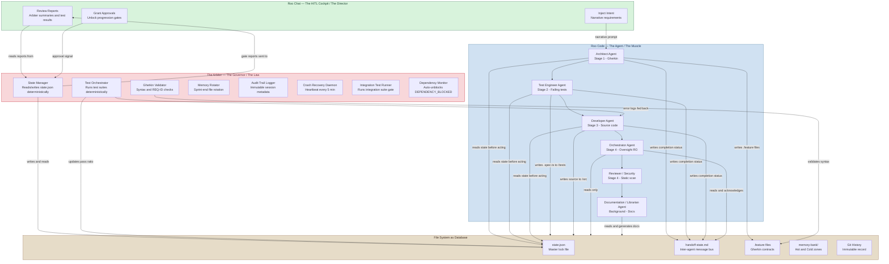
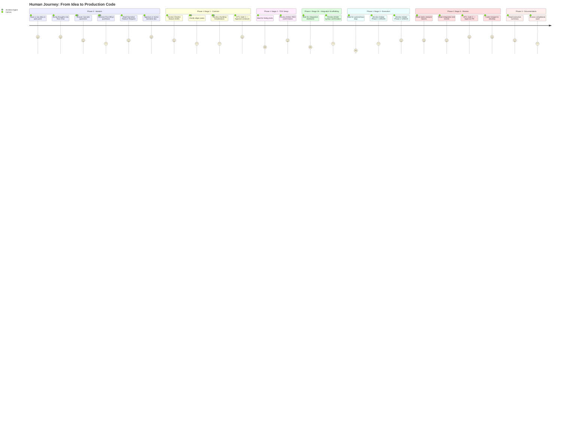

# Agentic Workbench v2 — System Overview Diagrams

**Source:** [`Agentic Workbench v2 - Draft.md`](../Agentic%20Workbench%20v2%20-%20Draft.md)  
**Generated:** 2026-04-12  
**Coverage:** Separation of Powers, Human Journey, Full System Topology

---

## Diagram 1 — Separation of Powers: The Operational Triad

> The constitutional foundation of the workbench. Three distinct entities with strictly separated responsibilities: probabilistic generation, deterministic enforcement, and human governance.



---

## Diagram 2 — Full Human Journey: Ideation to Merged Code

> The complete end-to-end journey of a human operator from a raw idea to validated, merged, documented code. Shows every touchpoint where the human is active vs. waiting.



---

## Diagram 20 — Full System Topology: All Components (from 01-system-overview.md)

> The complete bird's-eye view of every component, file, script, agent, and human touchpoint in the Agentic Workbench v2.0 system.

```mermaid
graph TB
    subgraph HUMAN_LAYER["Human Layer — Roo Chat / HITL Cockpit"]
        H[Human Operator\nProduct Owner / Lead Engineer]
        RC[Roo Chat\nVS Code chat panel\nSingular human interface]
        H <-->|intent and approvals| RC
    end

    subgraph AGENT_LAYER["Agent Layer — Roo Code / The Muscle"]
        direction LR
        AA[Architect Agent\nStage 1\n.feature RW, /src R]
        TEA[Test Engineer Agent\nStage 2\n/tests/unit/ RW, /src R]
        DA[Developer Agent\nStage 3\n/src RW, /tests R]
        OA[Orchestrator Agent\nStage 4 - All Read-Only]
        RSA[Reviewer / Security Agent\nStage 4 - All Read-Only]
        DLA[Documentation / Librarian Agent\nBackground - All Read-Only]
    end

    subgraph ARBITER_LAYER["Arbiter Layer — Python Scripts / The Law"]
        direction LR
        TO[test_orchestrator.py\nTwo-phase runner - Phase 1 and Phase 2]
        ITR[integration_test_runner.py\nIntegration gate - FLOW-NNN]
        DM[dependency_monitor.py\nAuto-unblocks DEPENDENCY_BLOCKED]
        GV[gherkin_validator.py\nSyntax gate - REQ-ID and @depends-on]
        MR[memory_rotator.py\nSprint-end rotation]
        AL[audit_logger.py\nImmutable session logs]
        CR[crash_recovery.py\nHeartbeat daemon 5-min]
    end

    subgraph GIT_LAYER["Git Layer — The Physical Barrier"]
        direction LR
        PC_HOOK[pre-commit hook\nGherkin syntax + Biome lint + file ownership]
        PP_HOOK[pre-push hook\nBlocks RED state and direct main push]
        PT_HOOK[post-tag hook\nRelease tag - compliance snapshot]
        GH[Git History\nImmutable record]
    end

    subgraph FILE_LAYER["File System Layer — Database"]
        direction TB
        SJ[state.json\nMaster lock - Arbiter writes only\nfeature_registry, file_ownership]
        HS_F[handoff-state.md\nInter-agent bus]
        FEAT[features/\nActive Gherkin contracts]
        INBOX[_inbox/\nDraft @draft ideas]
        SRC[src/\nApplication source code]
        TESTS_UNIT[tests/unit/\nUnit and acceptance tests\nREQ-NNN scoped]
        TESTS_INT[tests/integration/\nCross-boundary tests\nFLOW-NNN tagged]
        HOT[memory-bank/hot-context/\nActive memory zone]
        COLD[memory-bank/archive-cold/\nRotated memory zone]
        AUDIT[docs/conversations/\nImmutable audit trail]
        VAULT[compliance-vault/\nRead-only compliance artifacts]
    end

    subgraph ENGINE_FILES["Engine Files — Workbench Owned"]
        direction LR
        CLR[.clinerules\nBehavioral constitution\nINT-1, REG-1, REG-2, DEP-1, DEP-2, DEP-3]
        RMD[.roomodes\nAgent role definitions]
        WBV[.workbench-version\nEngine version]
        BIO[biome.json\nLinting config]
    end

    subgraph CLI_LAYER["CLI Layer — Global Tool"]
        WCLI[workbench-cli.py\nGlobal install\ninit / upgrade / status / rotate]
        TMPL[agentic-workbench-engine\nSource of truth for Engine files]
        WCLI <-->|fetches and injects| TMPL
    end

    RC -->|activates| AA
    RC -->|activates| DA

    AA -->|reads state| SJ
    AA -->|writes| FEAT
    AA -->|writes handoff| HS_F
    TEA -->|reads state| SJ
    TEA -->|writes unit tests| TESTS_UNIT
    TEA -->|writes integration skeletons| TESTS_INT
    TEA -->|writes handoff| HS_F
    DA -->|reads state| SJ
    DA -->|writes| SRC
    DA -->|writes handoff| HS_F
    OA -->|reads| HS_F
    OA -->|reads| SJ
    DLA -->|reads all| FILE_LAYER
    DLA -->|writes docs| VAULT

    TO -->|runs unit tests against| SRC
    TO -->|updates state.json| SJ
    TO -->|Phase 2 - full regression| TESTS_UNIT
    ITR -->|runs integration tests| TESTS_INT
    ITR -->|updates integration_state| SJ
    DM -->|polls feature_registry| SJ
    DM -->|auto-unblocks DEPENDENCY_BLOCKED| SJ
    GV -->|validates| FEAT
    MR -->|rotates| HOT
    MR -->|archives to| COLD
    AL -->|writes| AUDIT
    CR -->|writes heartbeat| HOT

    PC_HOOK -->|validates on commit| FEAT
    PC_HOOK -->|lints on commit| SRC
    PC_HOOK -->|checks file_ownership| SJ
    PP_HOOK -->|reads before push| SJ
    PT_HOOK -->|triggers on release tag| VAULT

    CLR -->|governs| AGENT_LAYER
    RMD -->|constrains file access of| AGENT_LAYER
    WCLI -->|injects| ENGINE_FILES
    WCLI -->|scaffolds| FILE_LAYER

    style HUMAN_LAYER fill:#e8e4f0,color:#2c2c54,stroke:#706fd3
    style AGENT_LAYER fill:#d0e1f2,color:#1d3557,stroke:#457b9d
    style ARBITER_LAYER fill:#f8d7da,color:#6d2b3d,stroke:#c1121f
    style GIT_LAYER fill:#e6dcc8,color:#3d2b1f,stroke:#8b5e3c
    style FILE_LAYER fill:#d0e1f2,color:#1d3557,stroke:#4a4a8a
    style ENGINE_FILES fill:#e6dcc8,color:#3d2b1f,stroke:#8b5e3c
    style CLI_LAYER fill:#d8f3dc,color:#1b4332,stroke:#2d6a4f
