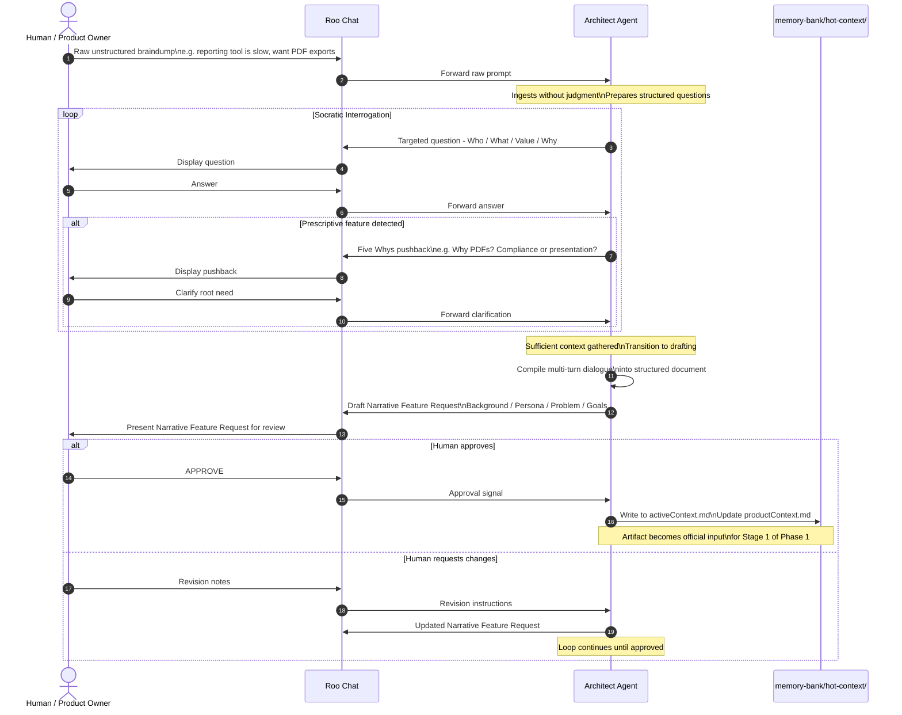

# Agentic Workbench v2 — Phase 0 & Execution Pipeline Diagrams

**Source:** [`Agentic Workbench v2 - Draft.md`](../Agentic%20Workbench%20v2%20-%20Draft.md)  
**Generated:** 2026-04-12  
**Coverage:** Ideation Pipeline, Standard Execution Pipeline Overview, Iterative Chunking Loop

---

## Diagram 3 — Phase 0: Ideation and Discovery Pipeline

> The Socratic interview process where the AI acts as inquisitive interviewer and the human is the subject matter expert. The AI flips the traditional script.



---

## Diagram 4 — Phase 1: Standard Execution Pipeline Overview

> The five-stage pipeline from approved narrative to merged code, showing all actors, gates, and artifacts at a glance.

```mermaid
flowchart TD
    START([Approved Narrative\nFeature Request]) --> S1

    subgraph S1["Stage 1 — Intent to Contract"]
        S1A[Architect Agent\ningests narrative]
        S1B{Iterative\nChunking Loop}
        S1C[Generate Gherkin\n.feature files\nwith REQ-IDs]
        S1D[Package as\nPull Request]
        S1E{HITL Gate 1\nProduct Owner\nApproval}
        S1A --> S1B
        S1B -->|ambiguities found| S1B
        S1B -->|no ambiguities| S1C
        S1C --> S1D
        S1D --> S1E
    end

    subgraph S2["Stage 2 — TDD Setup"]
        S2A[Test Engineer Agent\nwrites failing .spec.ts\nto /tests/unit/]
        S2B[Arbiter Test Orchestrator\nruns unit test suite]
        S2C{Tests\nfail?}
        S2D[Arbiter locks\nstate.json = RED]
        S2A --> S2B
        S2B --> S2C
        S2C -->|yes - confirmed RED| S2D
        S2C -->|no - tests pass prematurely| S2A
    end

    subgraph S2B_SUB["Stage 2b — Integration Contract Scaffolding"]
        S2B1[Test Engineer Agent\nreads feature_registry\nfor MERGED features]
        S2B2[Write integration skeletons\nto /tests/integration/\nFLOW-NNN tagged]
        S2B3[Arbiter runs\nsyntax check only\nnot full execution]
        S2B4{Syntax\nvalid?}
        S2B5[Fix syntax errors]
        S2B1 --> S2B2
        S2B2 --> S2B3
        S2B3 --> S2B4
        S2B4 -->|invalid| S2B5 --> S2B3
        S2B4 -->|valid| S2B_DONE([Integration skeletons\nregistered in state.json])
    end

    subgraph S3["Stage 3 — Autonomous Execution"]
        S3A[Developer Agent\nreads error logs]
        S3B[Developer Agent\nwrites /src code]
        S3C[Arbiter Phase 1\nfeature-scope run\n/tests/unit/REQ-NNN only]
        S3D{Phase 1\npasses?}
        S3E[Arbiter Phase 2\nfull regression run\nall unit + integration]
        S3F{Phase 2\npasses?}
        S3G[state.json = FEATURE_GREEN\nthen REGRESSION_RED\nRegression log is primary input]
        S3H[state.json = GREEN\nAll tests pass\nNo regressions]
        S3I[Stage files\nfor review]
        S3A --> S3B
        S3B --> S3C
        S3C --> S3D
        S3D -->|RED - still failing| S3A
        S3D -->|FEATURE_GREEN| S3E
        S3E --> S3F
        S3F -->|REGRESSION_RED| S3G
        S3G --> S3A
        S3F -->|GREEN - full suite clean| S3H
        S3H --> S3I
    end

    subgraph S4["Stage 4 — Validation and Delivery"]
        S4A[Reviewer / Security Agent\nstatic analysis and security scan]
        S4B[Arbiter Integration Gate\nruns /tests/integration/ suite]
        S4C{Integration\ntests pass?}
        S4D[state.json = INTEGRATION_RED\nDeveloper Agent re-activated]
        S4E[Orchestrator Agent\nread-only oversight]
        S4F[Generate PR with\n.feature + tests + /src\nintegration results + security scan]
        S4G{HITL Gate 2\nLead Engineer\nApproval}
        S4H[Arbiter merges\nto develop branch]
        S4A --> S4B
        S4B --> S4C
        S4C -->|INTEGRATION_RED| S4D
        S4D --> S3A
        S4C -->|INTEGRATION GREEN| S4E
        S4E --> S4F
        S4F --> S4G
        S4G -->|approved| S4H
        S4G -->|rejected - issues found| S3A
    end

    S1E -->|approved - requirements locked| S2A
    S1E -->|rejected| S1A
    S2D --> S2B1
    S2B_DONE --> S3A
    S3I --> S4A
    S4H --> END([state.json = MERGED\nNext feature cycle begins])

    style S1 fill:#d8f3dc,color:#1b4332,stroke:#2d6a4f
    style S2 fill:#f8d7da,color:#6d2b3d,stroke:#c1121f
    style S2B_SUB fill:#e6dcc8,color:#3d2b1f,stroke:#8b5e3c
    style S3 fill:#d0e1f2,color:#1d3557,stroke:#457b9d
    style S4 fill:#e6dcc8,color:#3d2b1f,stroke:#8b5e3c
    style S1E fill:#f4a261,color:#000
    style S4G fill:#f4a261,color:#000
    style S3G fill:#f8d7da,color:#6d2b3d
    style S3H fill:#d8f3dc,color:#1b4332
```



---

## Diagram 5 — Stage 1: Iterative Chunking Loop

> The multi-turn dialogue between the Architect Agent and Product Owner to decompose a narrative into atomic, traceable Gherkin contracts.

```mermaid
sequenceDiagram
    autonumber
    actor PO as Product Owner
    participant RooChat as Roo Chat
    participant ArchAgent as Architect Agent
    participant Arbiter as Arbiter
    participant Features as /features/ directory
    participant StateJSON as state.json

    Note over PO,StateJSON: Precondition: Narrative Feature Request approved\nstate.json = STAGE_1_ACTIVE

    RooChat->>ArchAgent: Activate with approved narrative

    Note over ArchAgent: Phase A - Ingestion
    ArchAgent->>ArchAgent: Parse narrative\nIdentify entities and constraints

    loop Phase B - Interrogation and Chunking
        ArchAgent->>ArchAgent: Scan for missing constraints\nUnhandled edge cases\nLogical gaps
        ArchAgent->>ArchAgent: Propose atomic divisions\nBreak monolithic request

        alt Ambiguities found
            Note over ArchAgent: Phase C - Clarification
            ArchAgent->>RooChat: Clarification question\nwith proposed breakdown
            RooChat->>PO: Display question and breakdown
            PO->>RooChat: Answer and feedback
            RooChat->>ArchAgent: Forward response

            Note over ArchAgent: Phase D - Refinement
            ArchAgent->>ArchAgent: Integrate answer\nRefine breakdown
        end
    end

    Note over ArchAgent: No logical ambiguities remain\nContract Generation begins

    ArchAgent->>ArchAgent: Assign REQ-IDs in format REQ-NNN
    ArchAgent->>Features: Write .feature files\nNaming: REQ-NNN-slug.feature\nTag: @REQ-NNN inside file
    ArchAgent->>Arbiter: Signal: feature files ready for validation

    Arbiter->>Features: Run Gherkin Syntax Check\nValidate Given/When/Then structure\nVerify REQ-ID tags present
    Arbiter->>StateJSON: Write traceability map entry

    alt Syntax valid
        Arbiter->>RooChat: Generate PR with .feature files
        RooChat->>PO: Present PR for review

        alt PO approves
            PO->>RooChat: APPROVE
            RooChat->>Arbiter: Approval signal
            Arbiter->>StateJSON: Write REQUIREMENTS_LOCKED
            Note over Arbiter,StateJSON: Stage 1 complete - Trigger Stage 2
        else PO requests changes
            PO->>RooChat: Change requests
            RooChat->>ArchAgent: Revision instructions
            Note over ArchAgent: Return to chunking loop
        end
    else Syntax invalid
        Arbiter->>ArchAgent: Syntax error report
        Note over ArchAgent: Fix and re-submit
    end
