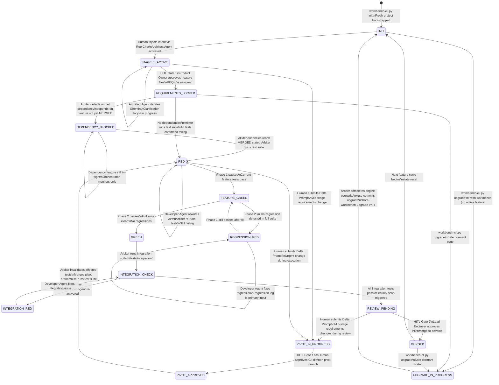

# Agentic Workbench v2 — TDD Loop, State Machine & Memory Rotation Diagrams

**Source:** [`Agentic Workbench v2 - Draft.md`](../Agentic%20Workbench%20v2%20-%20Draft.md)  
**Generated:** 2026-04-12  
**Coverage:** TDD Red/Green Loop, state.json State Machine, Memory Rotation Policy

---

## Diagram 6 — Stage 2 and 3: TDD Red/Green Execution Loop

> The closed-loop TDD cycle: Test Engineer establishes the RED state as mathematical proof of missing implementation, Developer Agent drives to GREEN with two-phase test execution.

```mermaid
flowchart LR
    subgraph STAGE2["Stage 2 — TDD Setup: Establishing RED"]
        direction TB
        S2_IN([.feature files\nREQUIREMENTS_LOCKED]) --> S2_1
        S2_1[Test Engineer Agent\nreads .feature files\nand .clinerules]
        S2_2[Write .spec.ts files\nto /tests/unit/ directory\nOne spec per Gherkin scenario]
        S2_3[Arbiter Test Orchestrator\nexecutes unit test suite]
        S2_4{Tests\nfail?}
        S2_5[Arbiter writes\nstate.json = RED\nGenerates Error Logs]
        S2_6[Update Traceability Map\nLink spec files to REQ-IDs]

        S2_1 --> S2_2
        S2_2 --> S2_3
        S2_3 --> S2_4
        S2_4 -->|NO - tests pass\nspec is wrong| S2_1
        S2_4 -->|YES - confirmed RED| S2_5
        S2_5 --> S2_6
    end

    subgraph STAGE3["Stage 3 — Autonomous Execution: Driving to GREEN"]
        direction TB
        S3_IN([Error Logs\nstate.json = RED]) --> S3_1
        S3_1[Developer Agent\nreads Error Logs\nand existing /src\nand .feature files]
        S3_2[Write or refactor\nfeature source code\nin /src only]
        S3_3[Arbiter Phase 1\nfeature-scope run\n/tests/unit/REQ-NNN only]
        S3_4{Phase 1\npasses?}
        S3_5[state.json = FEATURE_GREEN]
        S3_6[Arbiter Phase 2\nfull regression run\nall unit + integration]
        S3_7{Full suite\npasses?}
        S3_8[state.json = REGRESSION_RED\nRegression log is primary input]
        S3_9[state.json = GREEN\nAll tests pass\nNo regressions]
        S3_10[Stage files for PR\nGit commit with REQ-ID\nfeat-REQ-NNN-slug]
        S3_11[Generate new\nError Logs]

        S3_1 --> S3_2
        S3_2 --> S3_3
        S3_3 --> S3_4
        S3_4 -->|NO - still RED| S3_11
        S3_11 --> S3_1
        S3_4 -->|YES - FEATURE_GREEN| S3_6
        S3_6 --> S3_7
        S3_7 -->|NO - REGRESSION_RED| S3_8
        S3_8 --> S3_1
        S3_7 -->|YES - GREEN| S3_9
        S3_9 --> S3_10
    end

    S2_6 -->|handoff-state.md written| S3_IN

    style STAGE2 fill:#f8d7da,color:#6d2b3d,stroke:#c1121f
    style STAGE3 fill:#d8f3dc,color:#1b4332,stroke:#2d6a4f
    style S2_5 fill:#f8d7da,color:#6d2b3d
    style S3_8 fill:#f8d7da,color:#6d2b3d
    style S3_9 fill:#d8f3dc,color:#1b4332
```



---

## Diagram 7 — state.json State Machine

> The Arbiter is the sole writer of `state.json`. All valid states and transitions are defined here. This is the master lock of the entire system.



> **Note on state.json Field Separation:**
> `state.json` contains three distinct fields:
> - `state`: main state machine (RED, FEATURE_GREEN, GREEN, etc.)
> - `regression_state`: separate field (CLEAN | REGRESSION_RED)
> - `integration_state`: separate field (CHECK | GREEN | RED)

---

## Diagram 19 — Memory Rotation Policy at Cycle End

> The per-file rotation policy applied by the Memory Rotator script when a development cycle ends (feature reaches MERGED). Three distinct policies: Rotate, Persist, Reset.

```mermaid
flowchart TD
    TRIGGER([Feature MERGED\nArbiter triggers\nmemory_rotator.py]) --> SCAN

    SCAN[Scan memory-bank/hot-context/\nfor all tracked files]

    SCAN --> AC[activeContext.md]
    SCAN --> PR[progress.md]
    SCAN --> DL[decisionLog.md]
    SCAN --> SP[systemPatterns.md]
    SCAN --> PC[productContext.md]
    SCAN --> RL[RELEASE.md]
    SCAN --> HS[handoff-state.md]
    SCAN --> SC[session-checkpoint.md]

    subgraph ROTATE_POLICY["ROTATE — Archive then Reset to Template"]
        AC -->|ROTATE| R1[Archive to memory-bank/archive-cold/\nwith timestamp prefix\ne.g. 2026-04-12T13-45-00-activeContext.md]
        PR -->|ROTATE| R2[Archive to memory-bank/archive-cold/\nwith timestamp prefix]
        PC -->|ROTATE| R3[Archive to memory-bank/archive-cold/\nwith timestamp prefix]
        R1 --> T1[Reset hot-context file\nto blank template]
        R2 --> T2[Reset hot-context file\nto blank template]
        R3 --> T3[Reset hot-context file\nto blank template]
    end

    subgraph PERSIST_POLICY["PERSIST — Never Rotated"]
        DL -->|PERSIST| P1[Stays in hot-context/\nAccumulates across development cycles\nADRs are permanent records]
        SP -->|PERSIST| P2[Stays in hot-context/\nAccumulates across development cycles\nConventions are long-lived]
        RL -->|PERSIST| P3[Stays in hot-context/\nAccumulates across development cycles\nSingle source of truth for releases]
    end

    subgraph RESET_POLICY["RESET — Overwrite to Empty Template, Not Archived"]
        HS -->|RESET| RS1[Overwrite to empty template\nNOT archived\nHandoff data is ephemeral]
        SC -->|RESET| RS2[Overwrite to empty template\nNOT archived\nCrash data only valid for current session]
    end

    T1 --> COMMIT
    T2 --> COMMIT
    T3 --> COMMIT
    P1 --> COMMIT
    P2 --> COMMIT
    P3 --> COMMIT
    RS1 --> COMMIT
    RS2 --> COMMIT

    COMMIT[Git commit\ndocs-memory: cycle-end rotation\nAll changes versioned]

    style ROTATE_POLICY fill:#d0e1f2,color:#1d3557,stroke:#457b9d
    style PERSIST_POLICY fill:#d8f3dc,color:#1b4332,stroke:#2d6a4f
    style RESET_POLICY fill:#f8d7da,color:#6d2b3d,stroke:#c1121f
