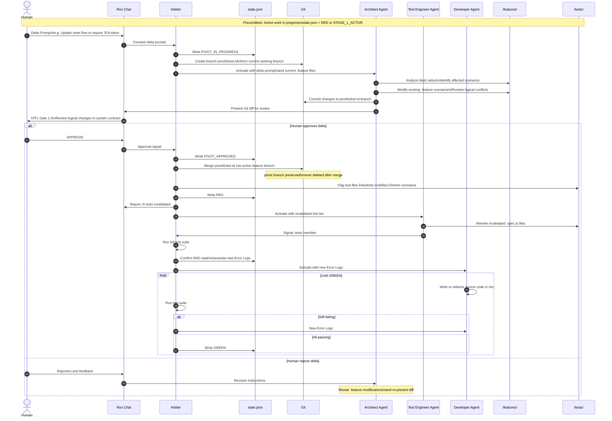
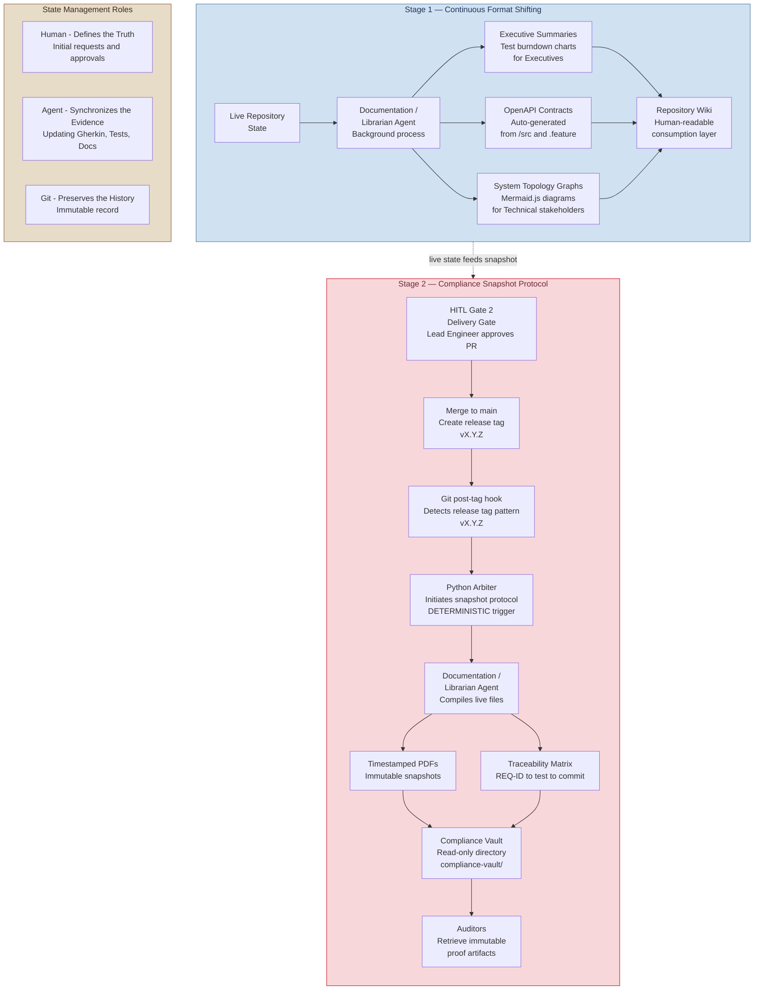

# Agentic Workbench v2 — Ad Hoc Ideas, Pivot, Docs & HITL Gates Diagrams

**Source:** [`Agentic Workbench v2 - Draft.md`](../Agentic%20Workbench%20v2%20-%20Draft.md)  
**Generated:** 2026-04-12  
**Coverage:** Ad Hoc Ideas Pipeline, Pivot Flow, Documentation Engine, Human-in-the-Loop Gates

---

## Diagram 8 — Phase 2: Ad Hoc Ideas Pipeline — Inbox vs Pivot

> Two distinct flows for handling change: non-blocking quarantine for low-priority ideas, and controlled interruption for urgent pivots.

```mermaid
flowchart TD
    IDEA([Human has ad hoc idea
or change request]) --> CLASSIFY{Urgency
assessment}

    CLASSIFY -->|Low priority
non-blocking| INBOX_FLOW
    CLASSIFY -->|Urgent or critical
must alter current work| PIVOT_FLOW

    subgraph INBOX_FLOW["Case A — The Inbox: Non-Blocking Quarantine"]
        direction TB
        IB1[Human submits raw shower thought
via Roo Chat]
        IB2[Architect Agent activated
RW access to _inbox/ ONLY]
        IB3[Lightweight chunking loop
Format into Gherkin syntax]
        IB4[Tag as @draft
NO Traceability ID assigned
Store in _inbox/ directory]
        IB5[Arbiter runs Gherkin Syntax Check
on @draft files
Structural validity only]
        IB6{Syntax
valid?}
        IB7[Fix syntax errors]
        IB8[Active pipeline
UNAFFECTED
Work continues]
        IB9{Backlog Gate
Product Owner
periodic review}
        IB10[PROMOTE: Architect Agent
assigns official REQ-ID
moves to /features/]
        IB11[Arbiter sets
state.json = STAGE_1_ACTIVE
Full pipeline begins]
        IB12[DEFER: Stays in _inbox/
for future review]

        IB1 --> IB2 --> IB3 --> IB4 --> IB5 --> IB6
        IB6 -->|invalid| IB7 --> IB5
        IB6 -->|valid| IB8
        IB8 --> IB9
        IB9 -->|approved| IB10 --> IB11
        IB9 -->|deferred| IB12
    end

    subgraph PIVOT_FLOW["Case B — The Pivot: Mid-Stage Interruption"]
        direction TB
        PV1[Human submits Delta Prompt
e.g. Add 2FA to reset flow]
        PV2[Arbiter sets
state.json = PIVOT_IN_PROGRESS
Creates pivot/ticket-id branch]
        PV3[Architect Agent
analyzes blast radius
Modifies existing .feature files]
        Note over ArchAgent: Rule PVT-2: Only Architect Agent may initiate pivot during Stage 1. Developer Agent may request pivot but requires human approval.
        PV4{HITL Gate 1.5
Human reviews Git diff
on pivot/ branch via Roo Chat}
        PV5{Human
approves?}
        PV6[Arbiter sets
state.json = PIVOT_APPROVED
Merges pivot/ into feature branch]
        PV7[Arbiter flags invalidated
test files linked to modified Gherkin]
        PV8[Arbiter sets
state.json = RED]
        PV9[Test Engineer Agent
rewrites invalidated tests]
        PV10[Developer Agent
refactors source code
until GREEN]

        PV1 --> PV2 --> PV3 --> PV4 --> PV5
        PV5 -->|rejected| PV3
        PV5 -->|approved| PV6 --> PV7 --> PV8 --> PV9 --> PV10
    end

    style INBOX_FLOW fill:#d8f3dc,color:#1b4332,stroke:#2d6a4f
    style PIVOT_FLOW fill:#f8d7da,color:#6d2b3d,stroke:#c1121f
    style IB9 fill:#f4a261,color:#000
    style PV4 fill:#f4a261,color:#000
    style PV5 fill:#f4a261,color:#000
```

---

## Diagram 9 — Phase 2 Case B: The Pivot Flow in Detail

> Detailed sequence showing the exact interactions, branch operations, and state transitions during a mid-stage requirements pivot.



---

## Diagram 10 — Phase 3: Documentation and Compliance Engine

> Continuous background documentation generation and triggered compliance snapshot protocol.



---

## Diagram 18 — HITL Gates: Human Decision Points Journey

> Every point in the system where a human must make a decision. The human is elevated from writing code to directing the pipeline through three executive functions.

```mermaid
flowchart TD
    subgraph HUMAN_ROLE["Human Role: Director of the Pipeline"]
        direction LR
        R1[Inject Intent
Provide narrative requirements
feature ideas, strategic direction]
        R2[Review Reports
Read deterministic summaries
test results, security scans]
        R3[Grant Approvals
Provide final authorization
to unlock progression gates]
    end

    subgraph GATE0["Ideation Gate — Phase 0"]
        G0_IN[Architect Agent presents
Narrative Feature Request]
        G0_DEC{Human reviews
narrative document}
        G0_APP[APPROVED
Becomes official input for Stage 1]
        G0_REJ[REVISED
Agent refines narrative]
        G0_IN --> G0_DEC
        G0_DEC -->|approve| G0_APP
        G0_DEC -->|revise| G0_REJ --> G0_IN
    end

    subgraph GATE1["HITL Gate 1 — Stage 1: Requirements Lock"]
        G1_IN[Architect Agent presents
Gherkin .feature files PR
with REQ-IDs assigned]
        G1_DEC{Product Owner reviews
logical interpretation
vs business intent}
        G1_APP[APPROVED
state.json = REQUIREMENTS_LOCKED
Stage 2 triggered]
        G1_REJ[REJECTED
Agent revises Gherkin
and re-presents]
        G1_IN --> G1_DEC
        G1_DEC -->|approve| G1_APP
        G1_DEC -->|reject| G1_REJ --> G1_IN
    end

    subgraph GATE15["HITL Gate 1.5 — Pivot Approval"]
        G15_IN[Architect Agent presents
Git diff on pivot/ branch
showing .feature modifications]
        G15_DEC{Human reviews
logical changes
to system contract}
        G15_APP[APPROVED
state.json = PIVOT_APPROVED
pivot/ merged into feature branch]
        G15_REJ[REJECTED
Agent revises delta
and re-presents diff]
        G15_IN --> G15_DEC
        G15_DEC -->|approve| G15_APP
        G15_DEC -->|reject| G15_REJ --> G15_IN
    end

    subgraph GATE2["HITL Gate 2 — Stage 4: Delivery"]
        G2_IN[Orchestrator presents full PR
.feature + unit tests + integration tests + /src
plus security scan report]
        G2_DEC{Lead Engineer reviews
PR diffs for systemic context
and non-quantifiable risks}
        G2_APP[APPROVED
state.json = MERGED
Merge to develop branch]
        G2_REJ[REJECTED
Developer Agent refactors
based on review feedback]
        G2_IN --> G2_DEC
        G2_DEC -->|approve| G2_APP
        G2_DEC -->|reject| G2_REJ --> G2_IN
    end

    subgraph BACKLOG_GATE["Backlog Gate — Inbox Promotion"]
        BG_IN[Product Owner reviews
_inbox/ @draft items
asynchronously]
        BG_DEC{Promote to
active pipeline?}
        BG_APP[PROMOTED
REQ-ID assigned
moved to /features/]
        BG_DEF[DEFERRED
Remains in _inbox/]
        BG_IN --> BG_DEC
        BG_DEC -->|promote| BG_APP
        BG_DEC -->|defer| BG_DEF
    end

    GATE0 --> GATE1
    GATE1 --> GATE2
    GATE15 -.->|triggered by Delta Prompt
during active pipeline| GATE1

    style GATE0 fill:#d8f3dc,color:#1b4332,stroke:#2d6a4f
    style GATE1 fill:#d0e1f2,color:#1d3557,stroke:#457b9d
    style GATE15 fill:#f8d7da,color:#6d2b3d,stroke:#c1121f
    style GATE2 fill:#e6dcc8,color:#3d2b1f,stroke:#8b5e3c
    style BACKLOG_GATE fill:#e6dcc8,color:#3d2b1f,stroke:#8b5e3c
    style HUMAN_ROLE fill:#e8e4f0,color:#2c2c54,stroke:#706fd3
