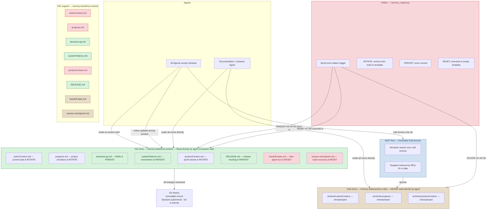
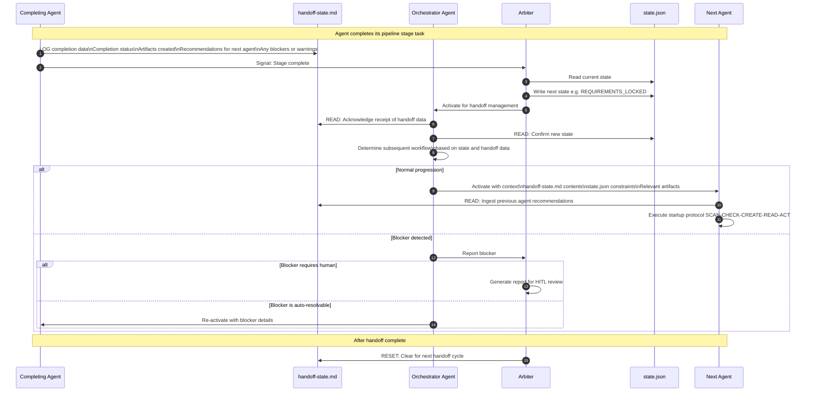
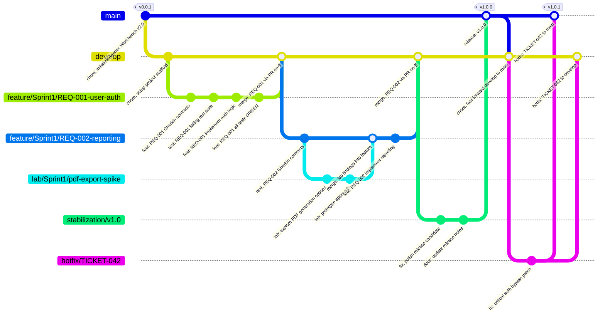
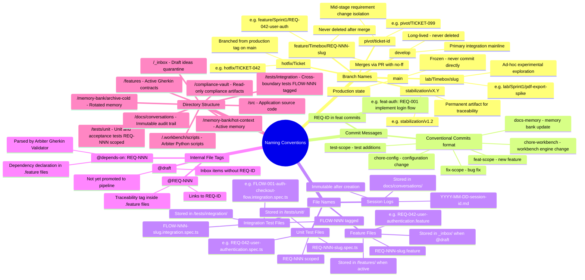
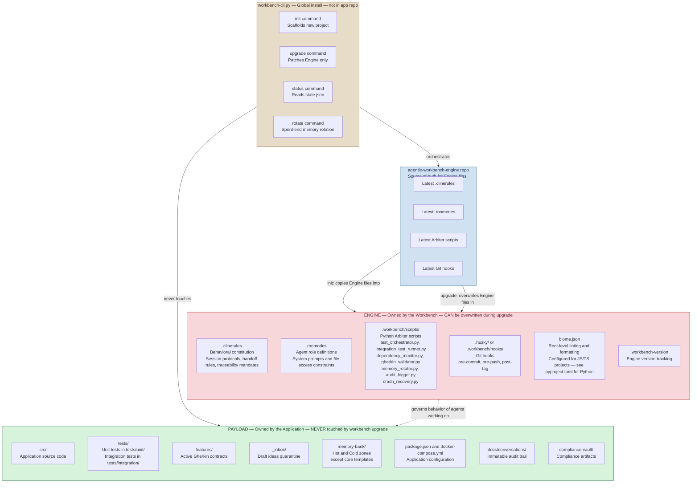

# Agentic Workbench v2 — Memory, Sessions & Infrastructure Diagrams

**Source:** [`Agentic Workbench v2 - Draft.md`](../Agentic%20Workbench%20v2%20-%20Draft.md)  
**Generated:** 2026-04-12  
**Coverage:** Memory Architecture, Session Lifecycle, Inter-Agent Handoff, GitFlow, Naming Conventions, Engine vs Payload, CLI Init/Upgrade

---

## Diagram 11 — Persistent Memory System: Hot/Cold Architecture

> The Hot/Cold memory architecture that counters AI drift and context-window flooding. Git is the single source of truth; every piece of memory is versioned.



---

## Diagram 12 — Session Lifecycle: Startup and Close Protocols

> The mandatory startup sequence and the Close Protocol that every agent must follow, enforced by `.clinerules`.

```mermaid
sequenceDiagram
    autonumber
    participant Agent as Any Agent
    participant HotZone as memory-bank/hot-context/
    participant StateJSON as state.json
    participant Arbiter as Arbiter
    participant Git as Git
    participant Docs as docs/conversations/

    Note over Agent,Docs: STARTUP PROTOCOL —
    SCAN → CHECK → CREATE → READ → ACT

    Agent->>Arbiter: SCAN: Run arbiter_check.py check-session
    alt CRITICAL violation found
        Agent->>Agent: RESOLVE before proceeding
    end

    Agent->>HotZone: CHECK: Does activeContext.md exist?

    alt activeContext.md absent
        Agent->>HotZone: CREATE: Generate from strict template
    end

    Agent->>HotZone: READ: Load activeContext.md
    Agent->>HotZone: READ: Load progress.md
    Agent->>StateJSON: READ: Load state.json and determine operational constraints

    alt session-checkpoint.md status = ACTIVE
        Agent->>Agent: DETECT: Previous session crashed
        Agent->>Agent: Offer to resume from checkpoint\nSession ID, branch, commit hash, task
    end

    Note over Agent,Docs: ACT —
    Agent performs its pipeline stage work

    Agent->>Agent: Execute pipeline stage task

    Note over Agent,Docs: CLOSE PROTOCOL — Before completing task

    Agent->>HotZone: UPDATE activeContext.md\nCurrent task, last result, next steps
    Agent->>HotZone: UPDATE progress.md\nCheckbox state
    Agent->>HotZone: UPDATE handoff-state.md\nCompletion status, artifacts, recommendations
    Agent->>HotZone: UPDATE RELEASE.md if release occurred

    Agent->>Arbiter: Signal: Close Protocol executing
    Arbiter->>Docs: SAVE immutable session metadata\ntimestamped file in docs/conversations/
    Note over Arbiter,Docs: Conversation logs NEVER edited after creation

    Agent->>Git: Commit Hot Zone updates\ndocs-memory: session-close

    Note over Agent,Docs: CRASH RECOVERY — Background daemon

    loop Every 5 minutes during active work
        Arbiter->>HotZone: HEARTBEAT: Write session-checkpoint.md\nSession ID, branch, commit hash, current task
    end
```

---

## Diagram 13 — Inter-Agent Handoff Protocol

> How agents pass the baton between pipeline stages using `handoff-state.md` as the message bus, with the Orchestrator Agent as the traffic controller.



---

## Diagram 14 — GitFlow and Branch Strategy

> The absolute branching strategy. Every branch type, its lifecycle, merge direction, and forbidden actions.



> **Forbidden Actions:** Never commit directly to `main` after a release tag. Never commit on a branch already merged to `main`. Never use `--delete-branch` when merging PRs. All new development must target `develop`, a stabilization branch, or a feature branch.

---

## Diagram 15 — Naming Conventions and File Taxonomy

> Every naming pattern used in the system: branches, commits, files, REQ-IDs, and directories.



---

## Diagram 16 — Separation of Domains: Engine vs Payload

> The rigid boundary between what the Workbench owns and what the Application owns. Engine files can be overwritten during upgrades; Payload files are never touched.



---

## Diagram 17 — workbench-cli.py Init and Upgrade Sequences

> The deterministic bootstrapper sequences. AI must NOT be used for initialization or upgrades — only the Python CLI handles these foundational operations.

```mermaid
sequenceDiagram
    autonumber
    actor Dev as Developer
    participant CLI as workbench-cli.py
    participant Template as agentic-workbench-engine repo
    participant NewRepo as New Application Repository
    participant Arbiter as Arbiter scripts
    participant StateJSON as state.json
    participant Git as Git

    Note over Dev,Git: INIT SEQUENCE — python workbench-cli.py init my-new-app

    Dev->>CLI: python workbench-cli.py init my-new-app

    CLI->>NewRepo: Step 1 - Repository Generation\nCreate target folder\ngit init\nConfigure initial branch to main

    CLI->>NewRepo: Step 2 - Directory Scaffolding\nCreate /src /tests /features /_inbox\nmemory-bank/hot-context/\n.workbench/scripts/\ndocs/conversations/

    CLI->>Template: Fetch latest Engine files
    Template->>CLI: Return .clinerules .roomodes\nArbiter scripts Git hooks biome.json

    CLI->>NewRepo: Step 3 - Engine Injection\nCopy .clinerules .roomodes\nCopy Arbiter scripts to .workbench/scripts/\nCopy Git hooks to .husky/

    CLI->>StateJSON: Step 4 - State Initialization\nGenerate fresh state.json\nstate = INIT, version = 2.0

    CLI->>Git: Step 5 - Initial Commit\nchore-workbench: initialize Agentic Workbench v2.0

    CLI->>Dev: Scaffold complete - Project ready for Phase 0 ideation

    Note over Dev,Git: UPGRADE SEQUENCE — python workbench-cli.py upgrade --version v3.0

    Dev->>CLI: python workbench-cli.py upgrade --version v3.0

    CLI->>Arbiter: Step 1 - Safety Check\nRead state.json and handoff-state.md

    alt State is INIT or MERGED
        Arbiter->>CLI: SAFE: Proceed with upgrade

        CLI->>Template: Fetch v3.0 Engine files
        Template->>CLI: Return updated Engine files

        CLI->>NewRepo: Step 2 - Engine Overwrite\nForce-overwrite .clinerules\nForce-overwrite .roomodes\nForce-overwrite .workbench/scripts/\nForce-overwrite Git hooks

        CLI->>NewRepo: Step 3 - Memory Migration\nProvision new memory templates if required\nDo NOT delete existing memory files

        CLI->>NewRepo: Step 4 - Version Bumping\nUpdate .workbench-version to v3.0

        CLI->>Git: Step 5 - Commit\nchore-workbench: upgrade engine to v3.0

        CLI->>Dev: Upgrade complete

    else State is active
        Arbiter->>CLI: REFUSED: Active development in progress
        CLI->>Dev: ERROR: Cannot upgrade during active development\nComplete or pause current work first
    end
