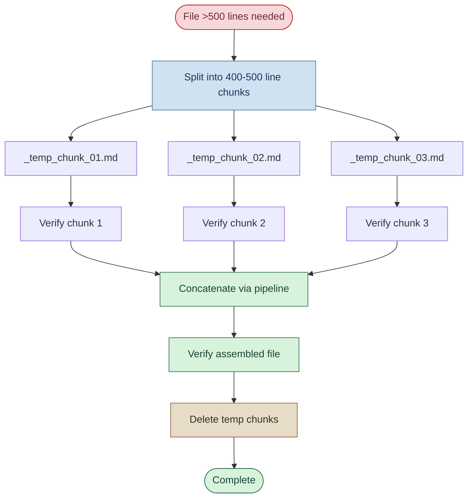

# Agentic Workbench v2 — Large File Generation Chunking Protocol

**Source:** [`Agentic Workbench v2 - Draft.md`](../Agentic%20Workbench%20v2%20-%20Draft.md)  
**Generated:** 2026-04-25  
**Coverage:** Large File Generation Mandatory Chunking Protocol (Rule LGF-1)

---

## Diagram 21 — Large File Generation: Mandatory Chunking Protocol

> When generating files exceeding ~500 lines, the agent MUST use the chunking protocol to guarantee complete and correct file generation. Single write operations on large files frequently fail silently or produce truncated output.



> **Rule LGF-1:** Violation of the chunking protocol when writing files >500 lines constitutes a breach of the workbench contract. Such violations waste tokens through repeated failed writes and produce corrupted or truncated documents.

---

## Chunking Protocol Details

### When This Rule Applies

This rule applies whenever any mode generates or writes a file exceeding approximately **500 lines**.

### Chunking Protocol Steps

1. **Split** the content into logical chunks of 400–500 lines each
2. **Write** each chunk to a numbered temp file: `_temp_chunk_01.md`, `_temp_chunk_02.md`, etc.
3. **Verify** each temp file was written successfully before proceeding
4. **Assemble** the final file using the shell pipeline pattern:

   ```bash
   Get-Content _temp_chunk_01.md, _temp_chunk_02.md, _temp_chunk_03.md | Set-Content target-file.md -Encoding UTF8
   ```

   > **FORBIDDEN:** The inline addition pattern `(Get-Content a) + (Get-Content b)` is **never acceptable** for concatenation.

5. **Verify** the assembled file (line count, spot-check content)
6. **Delete** all temp chunk files:

   ```bash
   Remove-Item _temp_chunk_*.md
   ```

### Why This Protocol Is Mandatory

Single `write_to_file` calls on large files frequently fail silently or produce truncated output. The chunking protocol guarantees complete and correct file generation regardless of file size.

### Exceptions

Chunking is **not required** for:
- Files generated by running existing scripts or build tools (e.g., `pytest --collect-only`, `pip freeze`)
- Output that is streamed incrementally (e.g., long-running dev servers)
- Append operations to existing files (where the target already exists and content is added, not replaced)

Chunking **is required** for:
- Any markdown document written as a new file or complete replacement
- Any configuration file written as a complete replacement
- Any report, plan, or specification document
