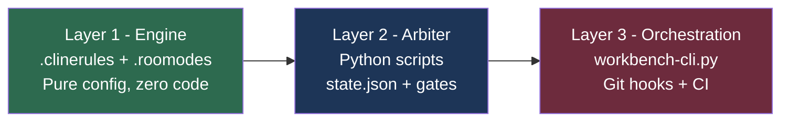

# Agentic Workbench v2.1 — Implementation Strategy

**Author:** Senior Architect (Roo)
**Date:** 2026-04-12 (updated from v2.0)
**Reference Spec:** [`Agentic Workbench v2 - Draft.md`](../Agentic%20Workbench%20v2%20-%20Draft.md) (v2.1)
**Related:** [`Spec_Gap_Fix_Plan_Integration_NonRegression_CrossFeature.md`](./Spec_Gap_Fix_Plan_Integration_NonRegression_CrossFeature.md) — all gap fixes incorporated

---

## Core Principle: Inside-Out, Layer by Layer

Do not attempt to build the entire workbench before using it. The architecture is designed in three separable layers. Build and validate each layer independently, in order of value delivered per effort spent.



**Why this order?**
- Layer 1 is usable in Roo Code today, with zero infrastructure. It immediately enforces agent modes, file access constraints, and session protocols.
- Layer 2 adds deterministic enforcement. Without it, the system relies on agent honor — which is probabilistic. Layer 2 makes the gates real.
- Layer 3 is the distribution and lifecycle mechanism. It is only needed when you want to replicate the workbench across multiple projects or upgrade it.

---

## Recommended Approach: The Template Repository Strategy

Maintain the workbench as a **standalone Git repository** (`agentic-workbench-template`). This is the single source of truth for all Engine files. Application repositories consume it via `workbench-cli.py`.

This approach gives you:
- **Version control** of the workbench itself (separate from any application)
- **Upgrade path** via `workbench-cli.py upgrade`
- **Reusability** across multiple projects without copy-paste drift

---

## Implementation Sequence

### Sprint 0 — Layer 1: The Engine (Start Here, Use Immediately)

**Goal:** A working Roo Code environment that enforces agent modes, file access, and session protocols. No Python required.

**Deliverables:**

1. **Create `agentic-workbench-template` repository**
   - Initialize with `git init`, set default branch to `main`
   - Commit message: `chore(workbench): initialize template repository`

2. **Author `.clinerules`** (the behavioral constitution)
   - Startup Protocol: `CHECK→CREATE→READ→ACT` sequence
   - Close Protocol: Hot Zone update + audit trail save
   - Inter-Agent Handoff: write to `handoff-state.md` on task completion
   - Traceability Mandates: REQ-ID in all filenames and file tags
   - Conventional Commits enforcement
   - `state.json` read-before-act rule

3. **Author `.roomodes`** (the agent role definitions)
   - Define 6 modes with system prompts and file access constraints:
     - `architect` — `.feature` (RW), `/src` (R)
     - `test-engineer` — `/tests/unit/` (RW), `/src` (R); Stage 2b: `/tests/integration/` (RW)
     - `developer` — `/src` (RW), `/tests` (R), `.feature` (R)
     - `orchestrator` — All (Read-Only)
     - `reviewer-security` — All (Read-Only) + static analysis instructions
     - `documentation-librarian` — All (Read-Only) + generation instructions

4. **Create `memory-bank/hot-context/` directory with template files**
   - `activeContext.md` (template)
   - `progress.md` (template)
   - `decisionLog.md` (template)
   - `systemPatterns.md` (template)
   - `productContext.md` (template)
   - `RELEASE.md` (template)
   - `handoff-state.md` (template)
   - `session-checkpoint.md` (template)

5. **Create `state.json` initial schema**
   ```json
   {
     "version": "2.1",
     "state": "INIT",
     "stage": null,
     "active_req_id": null,
     "feature_suite_pass_ratio": null,
     "full_suite_pass_ratio": null,
     "regression_state": "NOT_RUN",
     "regression_failures": [],
     "integration_state": "NOT_RUN",
     "integration_test_pass_ratio": null,
     "feature_registry": {},
     "file_ownership": {},
     "last_updated": null,
     "last_updated_by": "workbench-cli",
     "arbiter_capabilities": {
       "test_orchestrator": false,
       "gherkin_validator": false,
       "memory_rotator": false,
       "audit_logger": false,
       "crash_recovery": false,
       "dependency_monitor": false,
       "integration_test_runner": false,
       "git_hooks": false
     }
   }
   ```
   > **Note:** `arbiter_capabilities` tracks which command domains are owned by the Arbiter. All entries start `false` in Phase A (pre-Arbiter). Each Arbiter script sets its own entry to `true` upon initialization. Roo reads this on every session start — it never writes to it. The schema includes fields for two-phase test execution (`feature_suite_pass_ratio`, `full_suite_pass_ratio`, `regression_state`), integration testing (`integration_state`, `integration_test_pass_ratio`), and cross-feature dependency tracking (`feature_registry`, `file_ownership`).

6. **Create directory scaffold template**
   - `/src/` (empty, with `.gitkeep`)
   - `/tests/unit/` (empty, with `.gitkeep`)
   - `/tests/integration/` (empty, with `.gitkeep`)
   - `/features/` (empty, with `.gitkeep`)
   - `/_inbox/` (empty, with `.gitkeep`)
   - `/.workbench/scripts/` (placeholder for Layer 2)
   - `/docs/conversations/` (audit trail target)
   - `memory-bank/archive-cold/` (empty, with `.gitkeep`)
   - `.roo-settings.json` (Phase A auto-approve configuration — see item 7)

**Validation:** Open a test application repo in VS Code with Roo Code. Verify that:
- Switching to Architect mode enforces `.feature` RW / `/src` R constraints
- The startup protocol fires on session start
- `handoff-state.md` is written on task completion

7. **Author `.roo-settings.json`** (the Phase A auto-approve configuration)
   - Contains `settings.roo-cline.allowedCommands`: string array of exact command strings Roo may execute without human approval during Layer 1 (no regex — exact match only)
   - Contains `settings.roo-cline.deniedCommands`: string array of exact command strings that ALWAYS require human approval
   - Contains `transition_map`: maps each Arbiter script to the exact allowedCommands entry it revokes upon delivery (enables Phase B migration tracking)
   - Import into Roo Code: Command Palette → "Roo Code: Import Settings" → point to `.roo-settings.json`
   - Reference: `.roo-settings.json` in the workbench template root

8. **Update `.clinerules` with mandatory rules**
   - Add Rule **CMD-1 (Phase A):** During pre-Arbiter transition, the Agent MAY auto-execute commands matching `.roo-settings.json` `settings.roo-cline.allowedCommands`. All other commands require human approval.
   - Add Rule **CMD-2 (Phase B/C):** Once an Arbiter script owns a command domain (Arbiter entry in `state.json.arbiter_capabilities` = `true`), the Agent MUST NOT execute the equivalent command directly. All execution for that domain is delegated to the Arbiter script.
   - Add Rule **CMD-TRANSITION:** The Agent MUST read `state.json.arbiter_capabilities` on every session start. For each domain where the value is `true`, treat the corresponding command patterns as permanently forbidden. The Agent never writes to `arbiter_capabilities`.
   - Add Rule **CMD-3 (Forbidden Patterns):** The following commands are permanently forbidden regardless of phase — they require human approval without exception: `^(rm|mv|cp).* -rf .*$`, `^git push.*$`, `^git commit.*$`, `^(sudo|chmod|chown).*$`, `^(kill|killall|pkill).*$`, `^docker .*$`, `^kubectl .*$`, `^terraform .*$`.
   - Add Rule **INT-1:** The Developer Agent MUST NOT self-declare completion until both `state.json.state = GREEN` (unit tests) AND `state.json.integration_state = GREEN` (integration tests). The Arbiter enforces this sequentially.
   - Add Rule **REG-1:** The Arbiter MUST run the full test suite (all features, all integration tests) after every Phase 1 GREEN confirmation. A feature is not `GREEN` until the full suite is clean.
   - Add Rule **REG-2:** When `state.json.regression_state = REGRESSION_RED`, the Developer Agent MUST treat the regression failure log as its primary input — higher priority than the current feature's error log.
   - Add Rule **DEP-1:** Before beginning Stage 3 implementation, the Developer Agent MUST read `state.json.feature_registry` and confirm all entries in `depends_on` have `state = MERGED`. If any dependency is not `MERGED`, the agent MUST halt and report the blocking dependency to `handoff-state.md`.
   - Add Rule **DEP-2:** The Developer Agent MUST NOT import or call live APIs from features whose `state.json.feature_registry` entry is not `MERGED`. Stub interfaces are permitted; live imports are not.
   - Add Rule **DEP-3:** When `state.json.state = DEPENDENCY_BLOCKED`, only the Orchestrator Agent may act — its sole function is dependency monitoring. No other agent is activated while blocked.

**Validation:** Open a test application repo in VS Code with Roo Code. Verify that:
- Commands in `settings.roo-cline.allowedCommands` are auto-approved without prompting (exact string match)
- Commands in `settings.roo-cline.deniedCommands` always trigger approval prompts
- Attempting to run `npm test` triggers a prompt (not in allowedCommands, since test_orchestrator.py is not yet built)
- Running `roo-cline.importSettings` successfully imports the Phase A allowlist

---

### Sprint 1 — Layer 2: The Arbiter (Make the Gates Real)

**Goal:** Replace agent-honor enforcement with deterministic Python scripts. The pipeline gates become mathematically enforced.

> **CMD Permission Revocation:** Each Arbiter script delivered in this sprint permanently revokes a command permission from Roo Code's auto-approve allowlist. When a script is completed and tested, the corresponding `arbiter_capabilities` entry in `state.json` must be set to `true` and the matching pattern removed from `.roo-settings.json` `auto_approve.patterns`. This is the script-by-script handoff contract — the moment the script works, the permission is revoked. See [Cross-Cutting Concern 1.5: The Pre-Arbiter Transitional Mode (Command Delegation Contract)](#cross-cutting-concern-15-the-pre-arbiter-transitional-mode-command-delegation-contract) in the main spec for the full table.

**Deliverables (in `.workbench/scripts/`):**

2. **`test_orchestrator.py`** — The Test Runner
   - Wraps the project's test runner (e.g., `pytest`, `vitest`, `jest`)
   - **Two-phase execution:**
     - **Phase 1 (Feature Scope Run):** `python test_orchestrator.py run --scope feature --req-id REQ-NNN` — runs only `/tests/unit/{REQ-NNN}-*.spec.ts` for fast feedback
     - **Phase 2 (Full Regression Run):** `python test_orchestrator.py run --scope full` — runs ALL `/tests/unit/**/*.spec.ts` + `/tests/integration/**/*.spec.ts` after every Phase 1 GREEN
   - Writes `feature_suite_pass_ratio`, `full_suite_pass_ratio`, and `regression_state` to `state.json`
   - Sets `state.json.state = REGRESSION_RED` when Phase 2 fails (blocking state — pipeline cannot advance to Stage 4)

3. **`integration_test_runner.py`** — The Integration Gate (NEW — Gap 1 Fix)
   - Runs only `*.integration.spec.ts` files in `/tests/integration/`
   - Writes `integration_state` (`NOT_RUN | RED | GREEN`) and `integration_test_pass_ratio` to `state.json`
   - CLI: `python integration_test_runner.py run`
   - Syntax-only check during Stage 2b; full execution during Stage 4

4. **`dependency_monitor.py`** — The Dependency Unblocker (NEW — Gap 3 Fix)
   - Polls `state.json.feature_registry` on every `MERGED` event
   - Automatically unblocks features in `DEPENDENCY_BLOCKED` state when all `depends_on` entries reach `MERGED`
   - CLI: `python dependency_monitor.py check-unblock`
   - Writes dependency unblock report to `handoff-state.md`

5. **`gherkin_validator.py`** — The Syntax Gate
   - Validates `.feature` files for Given/When/Then syntax
   - Checks for REQ-ID tag presence
   - Parses `@depends-on` tag and cross-references REQ-IDs against `state.json.feature_registry`
   - Checks `@draft` files in `_inbox/` for structural validity (without REQ-ID requirement)
   - CLI: `python gherkin_validator.py validate features/`

7. **`memory_rotator.py`** — The Sprint Rotation Script
   - Applies the per-file rotation policy (Rotate / Persist / Reset) from the spec
   - **Rotate** (archive, then reset to template): `activeContext.md`, `progress.md`, `productContext.md`
   - **Persist** (never rotate): `decisionLog.md`, `systemPatterns.md`, `RELEASE.md`
   - **Reset** (overwrite to empty, no archive): `handoff-state.md`, `session-checkpoint.md`
   - Archives rotated files to `memory-bank/archive-cold/` with timestamp prefix
   - CLI: `python memory_rotator.py rotate`

8. **`audit_logger.py`** — The Audit Trail Writer
   - Saves session metadata to `docs/conversations/` as immutable timestamped files
   - Called by the Close Protocol in `.clinerules`
   - CLI: `python audit_logger.py save --session-id {id} --branch {branch}`

9. **`crash_recovery.py`** — The Heartbeat Daemon
   - Writes heartbeat to `session-checkpoint.md` every 5 minutes
   - Detects `ACTIVE` status on startup and offers resume
   - Run as: `python crash_recovery.py start &`

**Validation:** Run a full Stage 1→2→2b→3→4 cycle manually. Verify that:
- `state.json` transitions correctly at each gate (including `FEATURE_GREEN`, `REGRESSION_RED`, `DEPENDENCY_BLOCKED`, `INTEGRATION_RED`)
- Phase 1 tests (feature-scope) must genuinely fail before Stage 3 can begin
- Phase 2 regression run must pass before `GREEN` is confirmed
- All integration tests must pass before Stage 4 can begin
- Human approval is the only way to advance past HITL gates
- Features blocked on dependencies stay in `DEPENDENCY_BLOCKED` until unblocked

---

### Sprint 1b — Layer 2: Stage 2b — Integration Contract Scaffolding

**Goal:** Author integration test skeletons that verify cross-boundary behavior between features. These are contracts, not implementations — intentionally failing until Stage 4.

**Trigger:** Automatic after Stage 2 RED state is confirmed by the Arbiter.

**Deliverable:**

**`stage_2b_integration_scaffold.md` — Integration Contract Template**

| Field | Value |
|---|---|
| **Agent** | Test Engineer Agent |
| **File Access** | `/tests/integration/` (RW), `/features/` (R), `/src` (R) |
| **Input** | All `.feature` files for features in `MERGED` state (read from `state.json.feature_registry`) |
| **Output** | `FLOW-NNN-{slug}.integration.spec.ts` skeleton files in `/tests/integration/` |
| **Arbiter Gate** | Syntax-only validation by `integration_test_runner.py --validate-only` — does NOT execute tests |

**Steps:**
1. Read `state.json.feature_registry` to identify all features in `MERGED` state
2. For the new feature's `.feature` file, identify cross-boundary interactions
3. Write skeleton integration tests asserting cross-boundary contracts — intentionally RED at this stage
4. Tag each file with `FLOW-NNN` ID (distinct from `REQ-NNN`)
5. Arbiter runs syntax-only check via `integration_test_runner.py --validate-only`; if valid, pipeline advances to Stage 3

**If no `/tests/integration/` directory exists yet:** Stage 2b is skipped and the pipeline proceeds directly to Stage 3.

---

### Sprint 2 — Layer 2b: Git Hooks (The Physical Barrier)

**Goal:** Make the Arbiter's rules physically unbypassable via Git hooks.

**Deliverables:**

1. **`pre-commit` hook**
   - Runs `gherkin_validator.py` on staged `.feature` files (REQ-ID + `@depends-on` validation)
   - Runs `biome.json` linting on staged source files
   - Verifies `state.json` was not modified by a non-Arbiter process (rejects direct agent writes)
   - Blocks commit if any check fails

2. **`pre-push` hook**
   - Reads `state.json` — blocks push if state is `RED`, `REGRESSION_RED`, `INTEGRATION_RED`, or `PIVOT_IN_PROGRESS`
   - Blocks direct push to `main` (enforces PR-only merges)
   - If `state.json.file_ownership` shows a modified file is owned by a different in-flight feature (not `MERGED`), writes a `CONFLICT_DETECTED` warning to `handoff-state.md` and notifies the Orchestrator Agent (does NOT hard-block — conflict is flagged for HITL 2 review)

3. **`post-merge` hook**
   - Triggered after a PR merge is completed
   - Runs `dependency_monitor.py check-unblock` to poll `state.json.feature_registry` for any features in `DEPENDENCY_BLOCKED` state
   - Auto-unblocks features whose all `depends_on` entries have reached `MERGED`
   - Writes unblock report to `handoff-state.md`

4. **`post-tag` hook** (for compliance snapshots)
   - Detects release tags (e.g., `v*.*.*`)
   - Triggers `documentation_agent_snapshot.py` to compile timestamped PDFs and Traceability Matrix
   - Deposits output into `compliance-vault/` (read-only directory)

5. **`biome.json`** — Root-level linting and formatting config

**Tooling:** Use [Husky](https://typicode.github.io/husky/) (Node.js projects) or a pure Python `pre-commit` framework for language-agnostic projects. Store hooks in `.husky/` or `.workbench/hooks/`.

**Validation:** Attempt to commit directly to `main`. Verify it is blocked. Attempt to push with `state.json` in `RED`. Verify it is blocked. Create two feature branches modifying the same source file — verify conflict warning is written to `handoff-state.md` on the second branch's pre-push.

---

### Sprint 3 — Layer 3: The CLI Bootstrapper

**Goal:** Make the workbench replicable and upgradeable across projects with a single command.

**Deliverables:**

1. **`workbench-cli.py`** — The Global CLI Tool
   - `init <project-name>`: Creates new application repo with full scaffold
   - `upgrade --version <vX.Y>`: Applies engine overwrite with safety check — **refuses if `state.json.state` is not `INIT` or `MERGED`** (prevents engine overwrite during active development)
   - `status`: Reads and displays `state.json` in human-readable format (including `feature_suite_pass_ratio`, `full_suite_pass_ratio`, `regression_state`, `integration_state`, `feature_registry`)
   - `rotate`: Triggers `memory_rotator.py` for sprint end

2. **PyPI packaging** (optional but recommended)
   - `setup.py` or `pyproject.toml` for `pip install agentic-workbench-cli`
   - Enables `workbench init my-app` as a global command

3. **`.workbench-version` file** — Version tracking at repo root

**Validation:** Run `python workbench-cli.py init test-app` in a clean directory. Verify the full scaffold is created, `state.json` is initialized to `INIT`, and the initial commit is made automatically.

---

## Decision: Which Test Framework to Target First?

The `test_orchestrator.py` script must wrap a specific test runner. Choose based on your primary application language:

| Language | Recommended Test Runner | Arbiter Wrapper Complexity |
|---|---|---|
| Python | `pytest` | Low — native JSON output with `--json-report` |
| TypeScript/Node | `vitest` or `jest` | Low — native JSON reporter |
| Multi-language | `make test` + exit code | Minimal — just check exit code 0/non-0 |

**Recommendation:** Start with exit-code-only detection (pass = 0, fail = non-0). This works for any language and can be refined later.

**Spec version tracking:** The spec document has been updated to v2.1 with the following additions incorporated from [`plans/Spec_Gap_Fix_Plan_Integration_NonRegression_CrossFeature.md`](./Spec_Gap_Fix_Plan_Integration_NonRegression_CrossFeature.md):
- Stage 2b — Integration Contract Scaffolding
- Two-phase test execution (Phase 1: feature-scope, Phase 2: full regression)
- `FEATURE_GREEN` and `REGRESSION_RED` as blocking intermediate states
- `DEPENDENCY_BLOCKED` state for cross-feature dependency management
- `INTEGRATION_CHECK` and `INTEGRATION_RED` states for integration gate
- `feature_registry` and `file_ownership` in `state.json`
- CMD, INT, REG, DEP rule sets for `.clinerules`

---

## Risk Register

| Risk | Likelihood | Impact | Mitigation |
|---|---|---|---|
| `.clinerules` too verbose — agent ignores parts of it | High | High | Keep each rule atomic and short. Use numbered lists. Test each rule in isolation. |
| `state.json` written by agent instead of Arbiter | Medium | Critical | Git hook blocks any commit that modifies `state.json` from a non-Arbiter process. |
| Pivot branch not cleaned up after merge | Medium | Low | Add `post-merge` hook to trigger `dependency_monitor.py check-unblock` and clean up `pivot/` branches. |
| `workbench-cli.py upgrade` run during active development | Low | Critical | Safety check in upgrade command reads `state.json` — refuses if not `INIT` or `MERGED`. |
| Cold Zone accessed directly by agent | Medium | Medium | `.clinerules` rule + file access constraints in `.roomodes` both block direct access. |
| Regression run not executed on every Phase 1 GREEN | High | Critical | Arbiter runs Phase 2 (full regression) only if explicitly commanded — Agent may skip it. | Enforce via `pre-commit` hook: if `state.json.state = FEATURE_GREEN`, block commit until Phase 2 completes. |
| Feature reaches GREEN without integration tests passing | High | Critical | Developer Agent self-declares completion before `integration_state = GREEN`. | Add `INT-1` rule to `.clinerules`; enforce via `pre-commit` hook blocking Stage 4 entry when `integration_state != GREEN`. |

---

## Recommended First Action

**Start with Sprint 0, Layer 1 only.** Author `.clinerules` and `.roomodes` for a real project you are currently working on. Use it for one full feature cycle (Phase 0 → Phase 1 Stages 1–4) with manual gate enforcement (you act as the Arbiter). This will reveal which rules are too vague, which agent modes need refinement, and which gates are most painful to enforce manually — giving you a precise target list for Sprint 1.

The workbench is designed to be adopted incrementally. Layer 1 alone is already a significant improvement over an unstructured agentic workflow.
