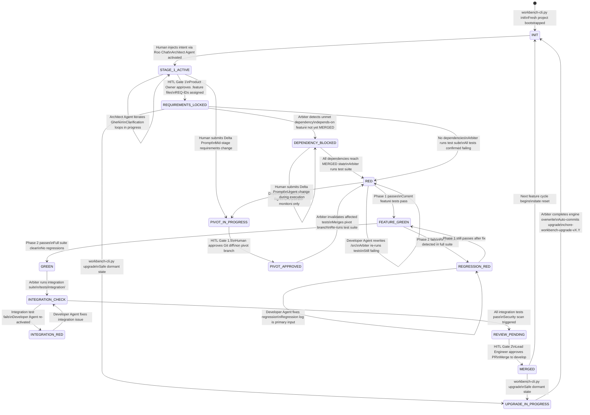

# Diagrams Update Plan — Sync with Latest Draft.md

**Author:** Architect (Roo)  
**Date:** 2026-04-12  
**Reference Spec:** [`Agentic Workbench v2 - Draft.md`](../Agentic%20Workbench%20v2%20-%20Draft.md)  
**Gap Source:** [`Spec_Gap_Fix_Plan_Integration_NonRegression_CrossFeature.md`](Spec_Gap_Fix_Plan_Integration_NonRegression_CrossFeature.md)

---

## Summary of Changes Required

The latest `Draft.md` incorporates three major architectural additions (Integration Tests, Non-Regression Tests, Cross-Feature Dependency Management) that are **not yet reflected** in any diagram file. The following table maps each new concept to the diagram(s) that must be updated.

| New Concept in Draft.md | Affected Diagram File(s) | Diagram # |
|---|---|---|
| Stage 2b — Integration Contract Scaffolding | `02-phase0-and-pipeline.md` | Diagram 4 |
| New states: `FEATURE_GREEN`, `REGRESSION_RED`, `INTEGRATION_CHECK`, `INTEGRATION_RED`, `DEPENDENCY_BLOCKED` | `03-tdd-and-state.md` | Diagram 7 |
| Two-phase test execution in Stage 3 | `03-tdd-and-state.md`, `02-phase0-and-pipeline.md` | Diagrams 6, 4 |
| Cross-feature dependency management | `03-tdd-and-state.md`, `02-phase0-and-pipeline.md` | Diagrams 7, 4 |
| New Arbiter scripts: `integration_test_runner.py`, `dependency_monitor.py` | `01-system-overview.md` | Diagram 20 |
| `/tests/unit/` and `/tests/integration/` directory split | `01-system-overview.md`, `05-memory-sessions-and-infra.md` | Diagrams 20, 15, 16 |
| Updated Stage Execution Matrix (Stage 3 gate) | `02-phase0-and-pipeline.md` | Diagram 4 |
| `feature_registry` and `file_ownership` in `state.json` | `01-system-overview.md` | Diagram 20 |
| Pipeline Parallelism Rule (Stage 1 parallel, 2–4 single-threaded) | `02-phase0-and-pipeline.md` | Diagram 4 |
| `INTEGRATION GREEN` gate before HITL 2 | `02-phase0-and-pipeline.md`, `04-adhoc-and-pivot.md` | Diagrams 4, 18 |

---

## File-by-File Change Specifications

---

### File 1: `diagrams/03-tdd-and-state.md`

**Diagrams affected:** Diagram 7 (state.json State Machine)  
**Diagrams NOT affected:** Diagram 6 (TDD Red/Green Loop), Diagram 19 (Memory Rotation)

#### Diagram 7 — state.json State Machine

**Current state machine** has these states:
`INIT → STAGE_1_ACTIVE → REQUIREMENTS_LOCKED → RED → GREEN → REVIEW_PENDING → MERGED`
Plus: `PIVOT_IN_PROGRESS`, `PIVOT_APPROVED`, `UPGRADE_IN_PROGRESS`

**Required additions** (from Draft.md Section 2, `state.json` State Transition Diagram):

1. Add `DEPENDENCY_BLOCKED` state between `REQUIREMENTS_LOCKED` and `RED`:
   - `REQUIREMENTS_LOCKED --> DEPENDENCY_BLOCKED : Arbiter detects unmet dependency`
   - `DEPENDENCY_BLOCKED --> DEPENDENCY_BLOCKED : Dependency feature still in-flight`
   - `DEPENDENCY_BLOCKED --> RED : All dependencies reach MERGED state`

2. Add `FEATURE_GREEN` and `REGRESSION_RED` between `RED` and `GREEN`:
   - `RED --> FEATURE_GREEN : Phase 1 passes - current feature tests pass`
   - `FEATURE_GREEN --> REGRESSION_RED : Phase 2 fails - regression detected`
   - `REGRESSION_RED --> REGRESSION_RED : Developer Agent fixes regression`
   - `REGRESSION_RED --> FEATURE_GREEN : Phase 1 still passes after fix`
   - `FEATURE_GREEN --> GREEN : Phase 2 passes - full suite clean`

3. Add `INTEGRATION_CHECK` and `INTEGRATION_RED` between `GREEN` and `REVIEW_PENDING`:
   - `GREEN --> INTEGRATION_CHECK : Arbiter runs integration suite`
   - `INTEGRATION_CHECK --> INTEGRATION_RED : Integration test fails`
   - `INTEGRATION_RED --> INTEGRATION_CHECK : Developer Agent fixes integration issue`
   - `INTEGRATION_CHECK --> REVIEW_PENDING : All integration tests pass`

4. Remove the old direct transition:
   - ~~`GREEN --> REVIEW_PENDING : Arbiter stages PR for human review Security scan triggered`~~

**Mermaid-safe rules:**
- All transition labels use plain text only — no special characters, no parentheses inside `[]`
- Colons in labels are fine in `stateDiagram-v2`
- Keep existing `PIVOT_IN_PROGRESS`, `PIVOT_APPROVED`, `UPGRADE_IN_PROGRESS` transitions unchanged

**Full replacement for Diagram 7 Mermaid block:**



---

### File 2: `diagrams/02-phase0-and-pipeline.md`

**Diagrams affected:** Diagram 4 (Standard Execution Pipeline Overview)  
**Diagrams NOT affected:** Diagram 3 (Phase 0 Ideation), Diagram 5 (Iterative Chunking Loop)

#### Diagram 4 — Phase 1: Standard Execution Pipeline Overview

**Current Stage 2** shows a simple RED confirmation loop.  
**Current Stage 3** shows a simple RED→GREEN loop with no two-phase distinction.  
**Current Stage 4** shows a direct path from `S3F` (Stage files) to `S4A` (Reviewer).

**Required changes:**

1. **Add Stage 2b subgraph** between S2 and S3:
   - Test Engineer Agent writes integration skeletons to `/tests/integration/`
   - Arbiter runs syntax-only check (not full execution)
   - Auto-skipped if no integration directory exists yet

2. **Rewrite Stage 3 subgraph** to show two-phase execution:
   - Phase 1: feature-scope run (`/tests/unit/REQ-NNN-*.spec.ts`)
   - Phase 2: full regression run (all unit + integration)
   - New intermediate states: `FEATURE_GREEN`, `REGRESSION_RED`
   - Developer Agent treats regression log as primary input when `REGRESSION_RED`

3. **Add Integration Gate in Stage 4** before HITL Gate 2:
   - Arbiter runs full `/tests/integration/` suite
   - `INTEGRATION_RED` → Developer Agent re-activated
   - Only after `INTEGRATION GREEN` does PR become eligible for HITL 2

4. **Update Stage 3 gate label** in the `S1E` → `S2A` connection to reflect `REQUIREMENTS_LOCKED`

5. **Update the END node** to reflect `state.json = MERGED`

**Mermaid-safe rules for flowchart TD:**
- Node labels with newlines use `\n` inside `[]` — this is valid in flowchart
- Subgraph labels must not contain `"` or `()` inside `[]`
- Decision diamonds `{}` must not contain `"` or `()`
- Arrow labels `-->|text|` must not contain `"` — use plain text

**Full replacement for Diagram 4 Mermaid block:**

```mermaid
flowchart TD
    START([Approved Narrative\nFeature Request]) --> S1

    subgraph S1["Stage 1 — Intent to Contract"]
        S1A[Architect Agent\ningests narrative]
        S1B{Iterative\nChunking Loop}
        S1C[Generate Gherkin\n.feature files\nwith REQ-IDs]
        S1D[Package as\nPull Request]
        S1E{HITL Gate 1\nProduct Owner\nApproval}
        S1A --> S1B
        S1B -->|ambiguities found| S1B
        S1B -->|no ambiguities| S1C
        S1C --> S1D
        S1D --> S1E
    end

    subgraph S2["Stage 2 — TDD Setup"]
        S2A[Test Engineer Agent\nwrites failing .spec.ts\nto /tests/unit/]
        S2B[Arbiter Test Orchestrator\nruns unit test suite]
        S2C{Tests\nfail?}
        S2D[Arbiter locks\nstate.json = RED]
        S2A --> S2B
        S2B --> S2C
        S2C -->|yes - confirmed RED| S2D
        S2C -->|no - tests pass prematurely| S2A
    end

    subgraph S2B_SUB["Stage 2b — Integration Contract Scaffolding"]
        S2B1[Test Engineer Agent\nreads feature_registry\nfor MERGED features]
        S2B2[Write integration skeletons\nto /tests/integration/\nFLOW-NNN tagged]
        S2B3[Arbiter runs\nsyntax check only\nnot full execution]
        S2B4{Syntax\nvalid?}
        S2B5[Fix syntax errors]
        S2B1 --> S2B2
        S2B2 --> S2B3
        S2B3 --> S2B4
        S2B4 -->|invalid| S2B5 --> S2B3
        S2B4 -->|valid| S2B_DONE([Integration skeletons\nregistered in state.json])
    end

    subgraph S3["Stage 3 — Autonomous Execution"]
        S3A[Developer Agent\nreads error logs]
        S3B[Developer Agent\nwrites /src code]
        S3C[Arbiter Phase 1\nfeature-scope run\n/tests/unit/REQ-NNN only]
        S3D{Phase 1\npasses?}
        S3E[Arbiter Phase 2\nfull regression run\nall unit + integration]
        S3F{Phase 2\npasses?}
        S3G[state.json = FEATURE_GREEN\nthen REGRESSION_RED\nRegression log is primary input]
        S3H[state.json = GREEN\nAll tests pass\nNo regressions]
        S3I[Stage files\nfor review]
        S3A --> S3B
        S3B --> S3C
        S3C --> S3D
        S3D -->|RED - still failing| S3A
        S3D -->|FEATURE_GREEN| S3E
        S3E --> S3F
        S3F -->|REGRESSION_RED| S3G
        S3G --> S3A
        S3F -->|GREEN - full suite clean| S3H
        S3H --> S3I
    end

    subgraph S4["Stage 4 — Validation and Delivery"]
        S4A[Reviewer / Security Agent\nstatic analysis and security scan]
        S4B[Arbiter Integration Gate\nruns /tests/integration/ suite]
        S4C{Integration\ntests pass?}
        S4D[state.json = INTEGRATION_RED\nDeveloper Agent re-activated]
        S4E[Orchestrator Agent\nread-only oversight]
        S4F[Generate PR with\n.feature + tests + /src\n+ integration results]
        S4G{HITL Gate 2\nLead Engineer\nApproval}
        S4H[Arbiter merges\nto develop branch]
        S4A --> S4B
        S4B --> S4C
        S4C -->|INTEGRATION_RED| S4D
        S4D --> S3A
        S4C -->|INTEGRATION GREEN| S4E
        S4E --> S4F
        S4F --> S4G
        S4G -->|approved| S4H
        S4G -->|rejected - issues found| S3A
    end

    S1E -->|approved - requirements locked| S2A
    S1E -->|rejected| S1A
    S2D --> S2B1
    S2B_DONE --> S3A
    S3I --> S4A
    S4H --> END([state.json = MERGED\nNext feature cycle begins])

    style S1 fill:#d8f3dc,color:#1b4332,stroke:#2d6a4f
    style S2 fill:#f8d7da,color:#6d2b3d,stroke:#c1121f
    style S2B_SUB fill:#e6dcc8,color:#3d2b1f,stroke:#8b5e3c
    style S3 fill:#d0e1f2,color:#1d3557,stroke:#457b9d
    style S4 fill:#e6dcc8,color:#3d2b1f,stroke:#8b5e3c
    style S1E fill:#f4a261,color:#000
    style S4G fill:#f4a261,color:#000
    style S3G fill:#f8d7da,color:#6d2b3d
    style S3H fill:#d8f3dc,color:#1b4332
```



---

### File 3: `diagrams/01-system-overview.md`

**Diagrams affected:** Diagram 20 (Full System Topology)  
**Diagrams NOT affected:** Diagram 1 (Separation of Powers), Diagram 2 (Human Journey)

#### Diagram 20 — Full System Topology: All Components

**Current ARBITER_LAYER** lists 6 scripts:
`state_manager.py`, `test_orchestrator.py`, `gherkin_validator.py`, `memory_rotator.py`, `audit_logger.py`, `crash_recovery.py`

**Required additions:**
1. Add `integration_test_runner.py` to `ARBITER_LAYER`
2. Add `dependency_monitor.py` to `ARBITER_LAYER`

**Current FILE_LAYER** has `TESTS[tests/\nTest specification files]`

**Required change:**
- Split `TESTS` into `TESTS_UNIT[tests/unit/\nUnit and acceptance tests\nREQ-NNN scoped]` and `TESTS_INT[tests/integration/\nCross-boundary tests\nFLOW-NNN tagged]`

**Current connections** reference `SRC` and `TESTS` generically.

**Required connection updates:**
- `TO -->|runs unit tests against| SRC` (was `TO -->|runs tests against| SRC`)
- Add `ITR[integration_test_runner.py\nIntegration gate - FLOW-NNN]` node
- Add `DM[dependency_monitor.py\nAuto-unblocks DEPENDENCY_BLOCKED]` node
- `ITR -->|runs integration tests| TESTS_INT`
- `ITR -->|updates integration_state| SJ`
- `DM -->|polls and updates| SJ`
- `TEA -->|writes unit tests| TESTS_UNIT`
- `TEA -->|writes integration skeletons| TESTS_INT`
- `DA -->|writes| SRC` (unchanged)

**Mermaid-safe rules for graph TB:**
- Node labels with newlines use `\n` inside `[]`
- Subgraph IDs must be simple identifiers
- Arrow labels `-->|text|` must not contain `"`

**Specific changes to Diagram 20:**

In `ARBITER_LAYER` subgraph, add after `CR[crash_recovery.py...]`:
```
ITR[integration_test_runner.py\nIntegration gate - FLOW-NNN]
DM[dependency_monitor.py\nAuto-unblocks DEPENDENCY_BLOCKED]
```

In `FILE_LAYER` subgraph, replace:
```
TESTS[tests/\nTest specification files]
```
with:
```
TESTS_UNIT[tests/unit/\nUnit and acceptance tests\nREQ-NNN scoped]
TESTS_INT[tests/integration/\nCross-boundary tests\nFLOW-NNN tagged]
```

In connections section, replace:
```
TO -->|runs tests against| SRC
```
with:
```
TO -->|runs unit tests against| SRC
ITR -->|runs integration tests| TESTS_INT
ITR -->|updates integration_state| SJ
DM -->|polls and updates| SJ
```

Replace:
```
TEA -->|writes| TESTS
```
with:
```
TEA -->|writes unit tests| TESTS_UNIT
TEA -->|writes integration skeletons| TESTS_INT
```

---

### File 4: `diagrams/05-memory-sessions-and-infra.md`

**Diagrams affected:** Diagram 15 (Naming Conventions), Diagram 16 (Engine vs Payload)  
**Diagrams NOT affected:** Diagrams 11, 12, 13, 14, 17

#### Diagram 15 — Naming Conventions and File Taxonomy (mindmap)

**Current `Directory Structure` branch** lists `/tests - Test specification files`

**Required change:** Split into two entries:
- `/tests/unit - Unit and acceptance tests REQ-NNN scoped`
- `/tests/integration - Cross-boundary tests FLOW-NNN tagged`

Also add under `Internal File Tags`:
- `@depends-on: REQ-NNN` — Dependency declaration in .feature files

Also add under `File Names` a new branch for `Integration Test Files`:
- `FLOW-NNN-slug.integration.spec.ts`
- `e.g. FLOW-001-auth-checkout-flow.integration.spec.ts`
- `Stored in /tests/integration/`

**Mermaid-safe rules for mindmap:**
- No `"` characters anywhere in mindmap
- No `()` inside node text
- Indentation is significant — use consistent 2-space or 4-space indent
- Node text is plain text only

**Specific changes to Diagram 15 mindmap:**

Under `File Names`, after `Session Logs` block, add:
```
      Integration Test Files
        FLOW-NNN-slug.integration.spec.ts
        e.g. FLOW-001-auth-checkout-flow.integration.spec.ts
        Stored in /tests/integration/
```

Under `Internal File Tags`, after `@draft` block, add:
```
      @depends-on: REQ-NNN
        Dependency declaration in .feature files
        Parsed by Arbiter Gherkin Validator
```

Under `Directory Structure`, replace:
```
      /tests - Test specification files
```
with:
```
      /tests/unit - Unit and acceptance tests REQ-NNN scoped
      /tests/integration - Cross-boundary tests FLOW-NNN tagged
```

#### Diagram 16 — Separation of Domains: Engine vs Payload (graph TB)

**Current ENGINE subgraph** lists 6 Arbiter scripts in `E3`:
`state_manager.py, test_orchestrator.py, gherkin_validator.py, memory_rotator.py, audit_logger.py, crash_recovery.py`

**Required change:** Add `integration_test_runner.py` and `dependency_monitor.py` to the script list in `E3`.

**Current PAYLOAD subgraph** has `P2[tests/\nTest specification files]`

**Required change:** Update to reflect the split:
`P2[tests/\nUnit tests in tests/unit/\nIntegration tests in tests/integration/]`

**Specific changes to Diagram 16:**

Replace in `E3` node label:
```
state_manager.py, test_orchestrator.py
gherkin_validator.py, memory_rotator.py
audit_logger.py, crash_recovery.py
```
with:
```
state_manager.py, test_orchestrator.py
integration_test_runner.py, dependency_monitor.py
gherkin_validator.py, memory_rotator.py
audit_logger.py, crash_recovery.py
```

Replace `P2` node:
```
P2[tests/
Test specification files]
```
with:
```
P2[tests/
Unit tests in tests/unit/
Integration tests in tests/integration/]
```

---

### File 5: `diagrams/04-adhoc-and-pivot.md`

**Diagrams affected:** Diagram 18 (HITL Gates)  
**Diagrams NOT affected:** Diagrams 8, 9, 10

#### Diagram 18 — HITL Gates: Human Decision Points Journey

**Current GATE2 subgraph** shows:
`G2_IN[Orchestrator presents full PR\n.feature + tests + /src\nplus security scan report]`

**Required change:** Update to reflect that integration test results are also included in the PR:
`G2_IN[Orchestrator presents full PR\n.feature + tests + /src\nintegration results + security scan]`

Also update `G2_APP` to reflect the new state path:
`G2_APP[APPROVED\nstate.json = MERGED\nMerge to develop branch]` — this is unchanged, no edit needed.

**Specific change to Diagram 18:**

Replace in `GATE2` subgraph:
```
        G2_IN[Orchestrator presents full PR
.feature + tests + /src
plus security scan report]
```
with:
```
        G2_IN[Orchestrator presents full PR
.feature + unit tests + integration tests + /src
plus security scan report]
```

---

### File 6: `diagrams/README.md`

**No structural changes needed** — the diagram index and file structure remain the same. The README does not need updating since no new diagram files are being added and no diagram numbers are changing.

However, the `Generated` date in each diagram file header should be updated from `2026-04-12` to reflect the update. Since the date is already `2026-04-12` and we are updating on the same date, no change is needed.

---

## Mermaid Syntax Safety Checklist

Before implementing, verify these rules for each diagram type:

### `stateDiagram-v2` (Diagram 7)
- ✅ Transition labels use `:` separator — valid
- ✅ `\n` for newlines in labels — valid
- ✅ State names are `UPPER_SNAKE_CASE` — valid
- ✅ No `"` or `()` inside state names
- ✅ `[*]` for start/end — valid

### `flowchart TD` (Diagrams 4, 18)
- ✅ Node IDs are alphanumeric with underscores — valid
- ✅ `\n` for newlines inside `[]` node labels — valid
- ✅ Arrow labels `-->|text|` use plain text — valid
- ✅ Subgraph IDs are simple identifiers — valid
- ⚠️ Subgraph display names in `["..."]` must not contain `"` inside — use `—` not `--` for em-dash
- ✅ `{...}` for diamond decisions — valid
- ✅ `([...])` for rounded rectangles — valid

### `graph TB` (Diagrams 1, 20)
- ✅ Same rules as `flowchart TD`
- ✅ `direction LR` inside subgraphs — valid
- ✅ `style` statements at end — valid

### `mindmap` (Diagram 15)
- ✅ No `"` characters anywhere
- ✅ No `()` in node text
- ✅ Consistent indentation (2 spaces per level)
- ✅ Root node uses `((...))` syntax

---

## Implementation Order

Execute in this order to minimize risk:

1. **`diagrams/03-tdd-and-state.md`** — Diagram 7 only (state machine is self-contained)
2. **`diagrams/02-phase0-and-pipeline.md`** — Diagram 4 only (pipeline overview)
3. **`diagrams/01-system-overview.md`** — Diagram 20 only (topology additions)
4. **`diagrams/05-memory-sessions-and-infra.md`** — Diagrams 15 and 16 (naming + engine/payload)
5. **`diagrams/04-adhoc-and-pivot.md`** — Diagram 18 only (minor HITL gate update)
6. **`diagrams/README.md`** — No changes needed

---

## What Is NOT Changing

The following diagrams are **correct as-is** and require no updates:

| Diagram | File | Reason |
|---|---|---|
| Diagram 1 — Separation of Powers | `01-system-overview.md` | Triad structure unchanged |
| Diagram 2 — Human Journey | `01-system-overview.md` | Journey touchpoints unchanged |
| Diagram 3 — Phase 0 Ideation | `02-phase0-and-pipeline.md` | Socratic interview unchanged |
| Diagram 5 — Iterative Chunking Loop | `02-phase0-and-pipeline.md` | Stage 1 process unchanged |
| Diagram 6 — TDD Red/Green Loop | `03-tdd-and-state.md` | Conceptually still valid; two-phase detail is in Diagram 4 |
| Diagram 8 — Ad Hoc Ideas Pipeline | `04-adhoc-and-pivot.md` | Inbox/Pivot flows unchanged |
| Diagram 9 — Pivot Flow in Detail | `04-adhoc-and-pivot.md` | Pivot sequence unchanged |
| Diagram 10 — Documentation Engine | `04-adhoc-and-pivot.md` | Compliance engine unchanged |
| Diagram 11 — Hot/Cold Memory | `05-memory-sessions-and-infra.md` | Memory architecture unchanged |
| Diagram 12 — Session Lifecycle | `05-memory-sessions-and-infra.md` | Startup/close protocol unchanged |
| Diagram 13 — Inter-Agent Handoff | `05-memory-sessions-and-infra.md` | Handoff protocol unchanged |
| Diagram 14 — GitFlow | `05-memory-sessions-and-infra.md` | Branch strategy unchanged |
| Diagram 17 — CLI Init/Upgrade | `05-memory-sessions-and-infra.md` | CLI sequences unchanged |
| Diagram 19 — Memory Rotation | `03-tdd-and-state.md` | Rotation policy unchanged |
