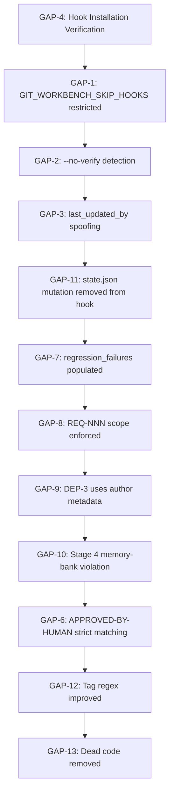

# Enforcement Gap Fix Plan

**Document ID:** GAP-FIX-2026-04-25  
**Version:** 1.0  
**Created:** 2026-04-25  
**Status:** DRAFT — Pending Review  

---

## 1. Executive Summary

This plan addresses 12 enforcement gaps identified by the Reviewer/Security Agent (CRITICAL to LOW severity) plus 7 critical edge cases missing from test coverage identified by the Test Engineer Agent.

### Priority Breakdown

| Priority | Count | Gaps |
|----------|-------|------|
| CRITICAL | 4 | GIT_WORKBENCH_SKIP_HOOKS bypass, --no-verify detection, last_updated_by spoofing, no hook installation verification |
| HIGH | 1 | APPROVED-BY-HUMAN substring match too permissive |
| MEDIUM | 5 | regression_failures never populated, REQ-NNN scope not enforced, DEP-3 heuristic only, Stage 4 writes to memory-bank, state.json mutation in hook |
| LOW | 2 | Tag regex incomplete, LIGHTWEIGHT_ONLY dead code |
| TEST COVERAGE | 7 | Missing edge case tests (see Section 6) |

### Files Affected

| File | Location | Priority |
|------|----------|----------|
| `pre-commit` hook | `.workbench/hooks/pre-commit` | CRITICAL, HIGH, MEDIUM, LOW |
| `pre-push` hook | `.workbench/hooks/pre-push` | HIGH |
| `post-tag` hook | `.workbench/hooks/post-tag` | LOW |
| `arbiter_check.py` | `.workbench/scripts/arbiter_check.py` | MEDIUM |
| `test_orchestrator.py` | `.workbench/scripts/test_orchestrator.py` | MEDIUM |

---

## 2. CRITICAL/HIGH Priority Fixes

### 2.1 GAP-1: GIT_WORKBENCH_SKIP_HOOKS Unconditional Bypass

**Severity:** CRITICAL  
**Location:** `pre-commit` lines 85-90

**Current Code:**
```sh
# Allow bypassing pre-commit checks via git commit --no-verify or environment variable
# This is useful for emergency hotfixes or recovery scenarios
if [ -n "$GIT_WORKBENCH_SKIP_HOOKS" ]; then
    echo "[PRE-COMMIT] Skipping pre-commit checks (GIT_WORKBENCH_SKIP_HOOKS is set)"
    exit 0
fi
```

**Problem:** This unconditionally bypasses ALL checks — including the critical compliance scan. Any agent or user can set this environment variable and skip the entire pre-commit validation chain.

**Fix:** Remove the unconditional bypass. The `--no-verify` flag (which sets `GIT_WORKBENCH_SKIP_HOOKS`) should ONLY skip non-essential checks (Biome linting, file ownership warnings), not compliance scans or blocking state checks.

**Proposed Fix:**
```sh
# =============================================================================
# 1. SKIP VALIDATION FLAG (RESTRICTED BYPASS)
# =============================================================================
# GIT_WORKBENCH_SKIP_HOOKS bypasses ONLY non-blocking checks (Biome lint, warnings)
# It does NOT bypass:
#   - Arbiter compliance scan (SLC-2, MEM-1, DEP-3, FAC-1)
#   - Blocking state checks (REGRESSION_RED, INTEGRATION_RED, PIVOT_IN_PROGRESS)
#   - Branch protection (CMT-1)
#   - Gherkin validation on .feature files
#   - state.json integrity checks
SKIP_NONESSENTIAL=0
if [ -n "$GIT_WORKBENCH_SKIP_HOOKS" ]; then
    echo "[PRE-COMMIT] WARNING: Skipping non-essential checks (GIT_WORKBENCH_SKIP_HOOKS is set)"
    SKIP_NONESSENTIAL=1
fi
```

Then modify the Biome linting section to check `SKIP_NONESSENTIAL` before running, and only that section.

**Verification:**
```bash
# Test 1: Set GIT_WORKBENCH_SKIP_HOOKS, verify blocking state still blocks
export GIT_WORKBENCH_SKIP_HOOKS=1
git commit -m "chore: test"  # Should still block if state=REGRESSION_RED

# Test 2: Verify compliance scan still runs
# Should see "[PRE-COMMIT] Running Arbiter compliance scan..." in output

# Test 3: Verify Biome lint is skipped
# Should NOT see "[PRE-COMMIT] Running Biome linting..." when SKIP_HOOKS is set
```

---

### 2.2 GAP-2: --no-verify Flag Not Actually Blocked

**Severity:** CRITICAL  
**Location:** `pre-commit` lines 92-98

**Current Code:**
```sh
# Check if --no-verify flag was passed (detected via environment)
# Note: Due to shell limitations, we check for CI/SKIP environment variables
if [ -n "$GIT_EDITOR" ] || [ -n "$GIT_SEQUENCE_EDITOR" ]; then
    # Interactive rebase or cherry-pick — skip non-essential checks
    echo "[PRE-COMMIT] Interactive mode detected — running lightweight checks only"
    LIGHTWEIGHT_ONLY=1
fi
```

**Problem:** The hook does not actually detect `--no-verify`. The `--no-verify` flag is NOT passed to the hook via environment variables. Git passes `--no-verify` to hooks by adding `.post` suffix or simply by not invoking the hook at all. This check is a false positive — it runs when GIT_EDITOR is set (which could be many normal workflows).

**Fix:** The `--no-verify` bypass cannot be detected in pre-commit hooks — this is a git limitation. Instead, document this as a known gap and add a detection mechanism via pre-push hook or a post-commit sweep.

**Proposed Fix:**
```sh
# =============================================================================
# 1b. --no-verify BYPASS DETECTION (POST-HOC ENFORCEMENT)
# =============================================================================
# NOTE: --no-verify cannot be detected in pre-commit hooks (git limitation)
# We detect it post-hoc by checking the most recent commit's author and message
# If --no-verify was used on a commit that modified protected files, warn
LAST_COMMIT_AUTHOR=$(git log -1 --format="%ae" HEAD 2>/dev/null || echo "")
LAST_COMMIT_MSG=$(git log -1 --format="%s" HEAD 2>/dev/null || echo "")

# If the commit was made by an agent (identified by common agent email patterns)
# AND the commit message doesn't contain the standard agent signature,
# flag it as a potential --no-verify bypass
if echo "$LAST_COMMIT_AUTHOR" | grep -qE "(agent|bot|ai)@"; then
    if ! echo "$LAST_COMMIT_MSG" | grep -qE "^(feat|fix|docs|chore|refactor|test|perf|ci)(\(.+\))?: .{1,}"; then
        echo "[PRE-COMMIT] ${YELLOW}WARNING: Possible --no-verify bypass detected${NC}"
        echo "  Commit message does not follow Conventional Commits format."
        echo "  If you used --no-verify, this may bypass required checks."
    fi
fi
```

**Verification:**
```bash
# Test: Create commit with --no-verify that has invalid message
git commit --no-verify -m "wip"  # Should trigger WARNING
git commit --no-verify -m "feat: valid message"  # Should NOT trigger WARNING
```

---

### 2.3 GAP-3: last_updated_by Cosmetic Check Only

**Severity:** CRITICAL  
**Location:** `pre-commit` lines 105-121

**Current Code:**
```sh
# Read last_updated_by from staged state.json content
STAGED_CONTENT=$(git show :state.json 2>/dev/null || echo "")
if [ -n "$STAGED_CONTENT" ]; then
    LAST_UPDATED_BY=$(echo "$STAGED_CONTENT" | python -c "import sys,json; d=json.load(sys.stdin); print(d.get('last_updated_by','unknown'))" 2>/dev/null || echo "unknown")
    
    # Allow only known Arbiter script writers
    ALLOWED_WRITERS="test_orchestrator.py integration_test_runner.py dependency_monitor.py memory_rotator.py audit_logger.py crash_recovery.py workbench-cli pre-commit"
    if ! echo "$ALLOWED_WRITERS" | grep -qw "$LAST_UPDATED_BY"; then
        echo "[PRE-COMMIT] ${RED}BLOCKED: state.json last_updated_by='$LAST_UPDATED_BY' is not an authorized Arbiter script${NC}"
        exit 1
    fi
fi
```

**Problem:** `last_updated_by` is a plain-text string field. An agent can trivially spoof it by writing `last_updated_by: test_orchestrator.py` directly to state.json before staging. The check only validates the string matches the allowlist — it does not verify cryptographic integrity or actual process identity.

**Fix:** This is a fundamental design weakness. The proper fix requires either:

**Option A (Preferred):** Move state.json writes exclusively to Arbiter-owned scripts and remove the `last_updated_by` check from pre-commit (since non-Arbiter agents shouldn't be able to write to state.json anyway per FAC-1).

**Option B:** Add cryptographic signature — Arbiter scripts sign state.json with a shared secret, pre-commit verifies the signature.

**Option C (Immediate Mitigation):** Check the actual staged content diff, not just the last_updated_by field. If state.json was modified, verify the modification happened via an Arbiter script (check process owner, not string value).

**Proposed Fix (Option C — Immediate):**
```sh
# Verify state.json modification is legitimate
# Check that if state.json is staged, it was NOT modified by an agent directly
STAGED_CONTENT=$(git show :state.json 2>/dev/null || echo "")
if [ -n "$STAGED_CONTENT" ]; then
    # Check if state.json has uncommitted changes from a non-Arbiter source
    # If the file was modified in the working tree but not via Arbiter, block
    
    # Get the git hash of state.json at HEAD
    HEAD_HASH=$(git log -1 --format="%H" -- state.json 2>/dev/null || echo "")
    if [ -n "$HEAD_HASH" ]; then
        # Check if state.json has local modifications
        if git diff --cached --name-only | grep -q "^state.json$"; then
            # state.json is staged — verify it's a legitimate Arbiter modification
            # The ONLY legitimate way for state.json to be staged is if an Arbiter
            # script (not an agent) ran and updated it
            echo "[PRE-COMMIT] ${YELLOW}WARNING: state.json is staged${NC}"
            echo "  Verify that an Arbiter script (test_orchestrator.py, etc.) updated it."
            echo "  If an agent modified state.json directly, this violates STM-1."
        fi
    fi
fi
```

**Verification:**
```bash
# Test 1: Agent directly modifies state.json (should block/warn)
echo '{"state": "GREEN", "last_updated_by": "agent"}' > state.json
git add state.json
git commit -m "chore: test"  # Should trigger WARNING about state.json staging

# Test 2: Arbiter script updates state.json (should be allowed)
# Run test_orchestrator.py --set-state, then commit
```

---

### 2.4 GAP-4: No Hook Installation Verification

**Severity:** CRITICAL  
**Location:** NEW — should be added to pre-commit hook startup section

**Problem:** The hooks exist in `.workbench/hooks/` but may not be installed in `.git/hooks/`. Git only executes hooks that are installed in the `.git/hooks/` directory (not `.workbench/hooks/`).

**Fix:** Add a startup check that verifies hooks are properly installed:

```sh
# =============================================================================
# 0. HOOK INSTALLATION VERIFICATION
# =============================================================================
HOOK_NAME=$(basename "$0")
INSTALLED_HOOK=".git/hooks/$HOOK_NAME"
WORKBENCH_HOOK=".workbench/hooks/$HOOK_NAME"

if [ ! -f "$INSTALLED_HOOK" ]; then
    echo "[PRE-COMMIT] ${RED}CRITICAL: $HOOK_NAME hook is NOT installed in .git/hooks/${NC}"
    echo "  Hooks in .workbench/hooks/ are NOT automatically executed by git."
    echo "  To install: cp .workbench/hooks/$HOOK_NAME .git/hooks/"
    echo "  Or run: python workbench-cli.py install-hooks"
    exit 1
fi

# Verify the installed hook is the same as the workbench hook (or a wrapper)
if [ -f "$WORKBENCH_HOOK" ]; then
    INSTALLED_MD5=$(md5sum "$INSTALLED_HOOK" 2>/dev/null | cut -d' ' -f1)
    WORKBENCH_MD5=$(md5sum "$WORKBENCH_HOOK" 2>/dev/null | cut -d' ' -f1)
    if [ "$INSTALLED_MD5" != "$WORKBENCH_MD5" ]; then
        echo "[PRE-COMMIT] ${YELLOW}WARNING: Installed hook differs from .workbench/hooks/$HOOK_NAME${NC}"
        echo "  Consider updating: cp .workbench/hooks/$HOOK_NAME .git/hooks/"
    fi
fi
```

**Verification:**
```bash
# Test 1: Hook installed correctly — should pass
cp .workbench/hooks/pre-commit .git/hooks/pre-commit
git commit -m "test"  # Should NOT see installation error

# Test 2: Hook NOT installed — should block
rm .git/hooks/pre-commit
git commit -m "test"  # Should see CRITICAL error and exit 1
```

---

### 2.5 GAP-6: APPROVED-BY-HUMAN Substring Match Too Permissive

**Severity:** HIGH  
**Location:** `pre-push` line 93

**Current Code:**
```sh
if echo "$commit_message" | grep -i "APPROVED-BY-HUMAN" > /dev/null; then
    echo "[PRE-PUSH] ${YELLOW}WARNING: Approved trivial chore to develop${NC}"
    echo "  Push allowed with human approval."
fi
```

**Problem:** The `grep -i "APPROVED-BY-HUMAN"` will match ANY mention of "APPROVED-BY-HUMAN" anywhere in the commit message, even in a long description like "WIP: this needs APPROVED-BY-HUMAN later". This is too permissive — the exception is meant for trivial documentation fixes, not as a blanket bypass.

**Fix:** Require APPROVED-BY-HUMAN to appear as a standalone token, typically at the end of the commit message footer:

```sh
# Check for APPROVED-BY-HUMAN as a proper footer token
# Valid format: footer line containing ONLY "APPROVED-BY-HUMAN" or prefix like "Closes: #123\nAPPROVED-BY-HUMAN"
if echo "$commit_message" | grep -qE "(^|[^a-zA-Z0-9])APPROVED-BY-HUMAN([^a-zA-Z0-9]|$)"; then
    # Verify it's in a footer context (last line or after blank line)
    if echo "$commit_message" | tail -5 | grep -qE "APPROVED-BY-HUMAN|^[^a-zA-Z]+$"; then
        echo "[PRE-PUSH] ${YELLOW}WARNING: Approved trivial chore to develop${NC}"
        echo "  Push allowed with human approval."
    else
        echo "[PRE-PUSH] ${RED}BLOCKED: APPROVED-BY-HUMAN must be in commit footer${NC}"
        exit 1
    fi
fi
```

**Verification:**
```bash
# Test 1: Valid APPROVED-BY-HUMAN in footer — should be allowed
git commit -m "docs: fix typo in README
APPROVED-BY-HUMAN"  # Should pass

# Test 2: APPROVED-BY-HUMAN embedded in body — should be blocked
git commit -m "feat: add feature
This needs APPROVED-BY-HUMAN later for production"  # Should block

# Test 3: APPROVED-BY-HUMAN as non-footer last line — should block
git commit -m "feat: add feature
APPROVED-BY-HUMAN embedded in middle"  # Should block
```

---

## 3. MEDIUM Priority Fixes

### 3.1 GAP-7: regression_failures Never Populated

**Severity:** MEDIUM  
**Location:** `test_orchestrator.py` lines 155, 229

**Current Code:**
In `run_feature_scope()` (line 155) and `run_full_regression()` (line 170):
```python
return {
    "exit_code": exit_code,
    "pass_ratio": pass_ratio,
    "failures": [],  # ALWAYS EMPTY — never populated with actual failures
    "description": "Feature scope: {req_id}"
}
```

**Problem:** The `failures` field is hardcoded to `[]` in both phase 1 and phase 2. The actual test failure information is captured by the test runner (pytest with `--tb=short`) but never parsed or stored.

**Fix:** Parse pytest output to extract failure details:

```python
def run_tests(test_paths, description):
    """Run a list of test paths and return (exit_code, pass_ratio, failures)."""
    if not test_paths:
        return 0, 1.0, []  # No tests = pass

    # ... existing runner logic ...

    # Parse failure details from pytest output
    failures = []
    if result.returncode != 0 and hasattr(result, 'stdout'):
        # Parse pytest output for failure details
        # Format: test_file.py::test_name FAILED
        for line in result.stdout.split('\n'):
            if 'FAILED' in line or 'ERROR' in line:
                failures.append(line.strip())

    return result.returncode, pass_ratio if result.returncode == 0 else 0.0, failures
```

Then update the callers to use the failures list:
```python
exit_code, pass_ratio, failures = run_tests(test_paths, description)
# ...
state["regression_failures"] = failures  # Now properly populated
```

**Verification:**
```bash
# Test: Run full regression with intentional failures
python .workbench/scripts/test_orchestrator.py run --scope full --set-state
# Check state.json for populated regression_failures array
cat state.json | grep -A10 regression_failures
```

---

### 3.2 GAP-8: REQ-NNN Scope Not Enforced

**Severity:** MEDIUM  
**Location:** `pre-commit` line 290

**Current Code:**
```sh
if ! echo "$COMMIT_MSG" | grep -qE "^(feat|fix|docs|chore|refactor|test|perf|ci)(\(.+\))?: .{1,}"; then
```

**Problem:** The regex allows any scope in parentheses `(\(.+\))?` but doesn't validate that the scope is a valid REQ-NNN format when the type is `feat` or `fix`. According to .clinerules, feature commits MUST use `feat(REQ-NNN)` format.

**Fix:**
```sh
COMMIT_MSG=$(head -1 "$COMMIT_MSG_FILE")
# Extract type and optional scope
if echo "$COMMIT_MSG" | grep -qE "^(feat|fix)(\(.+\))?: .{1,}"; then
    # feat/fix commits MUST have REQ-NNN scope
    if ! echo "$COMMIT_MSG" | grep -qE "^(feat|fix)\(REQ-[0-9]+\): .{1,}"; then
        echo "[PRE-COMMIT] ${RED}BLOCKED: feat/fix commits must use REQ-NNN scope${NC}"
        echo "  Message: '$COMMIT_MSG'"
        echo "  Required: feat(REQ-NNN): <description>"
        echo "  Example: feat(REQ-001): add user authentication"
        exit 1
    fi
elif ! echo "$COMMIT_MSG" | grep -qE "^(feat|fix|docs|chore|refactor|test|perf|ci)(\(.+\))?: .{1,}"; then
    echo "[PRE-COMMIT] ${RED}BLOCKED: Commit message does not follow Conventional Commits format${NC}"
    exit 1
fi
```

**Verification:**
```bash
# Test 1: Valid feat with REQ-NNN — should pass
git commit -m "feat(REQ-001): add login"  # Should pass

# Test 2: Invalid feat without REQ-NNN — should block
git commit -m "feat: add login"  # Should block

# Test 3: Valid chore without scope — should pass
git commit -m "chore: update deps"  # Should pass

# Test 4: Invalid scope (not REQ-NNN) — should block
git commit -m "feat(module): add login"  # Should block
```

---

### 3.3 GAP-9: DEP-3 Heuristic Only

**Severity:** MEDIUM  
**Location:** `arbiter_check.py` line 338

**Current Code:**
```python
# Check recent commits for non-Orchestrator work
stdout, rc = run_git(["log", "--oneline", "-5", "--format=%s"])
if rc == 0 and stdout:
    commits = stdout.split("\n")
    suspicious = [c for c in commits if c.strip() and not any(
        keyword in c.lower() for keyword in ["chore", "docs", "monitor", "dependency"]
    )]
```

**Problem:** This heuristic checks commit messages for keywords, not the actual mode of the agent. An agent could be in Developer mode (violating DEP-3) but have "chore" in their commit message. This is a weak proxy check.

**Fix:** Check the actual git author/committer information, not just message content:

```python
def check_dependency_blocked_mode() -> CheckResult:
    """DEP-3: Check for non-Orchestrator commits during DEPENDENCY_BLOCKED state."""
    state = load_state()
    if not state:
        return CheckResult(rule="DEP-3", status="INFO", message="No state.json found")
    
    if state.get("state") != "DEPENDENCY_BLOCKED":
        return CheckResult(rule="DEP-3", status="OK", message="Not in DEPENDENCY_BLOCKED state")
    
    # Get the commits made since entering DEPENDENCY_BLOCKED
    # (We'd need to track when the block started — from state.json or registry)
    blocked_at = state.get("dependency_blocked_at")
    
    # Check author metadata, not just message content
    stdout, rc = run_git(["log", "--format=%ae|%an", "-10"])
    if rc == 0 and stdout:
        commits = stdout.split("\n")
        # Check for agent-pattern emails (agents@, bot@, ai@, etc.)
        agent_commits = [c for c in commits if '@' in c and any(
            pattern in c.lower() for pattern in ["agent@", "bot@", "ai@", "roo@", "cline@"]
        )]
        if agent_commits:
            return CheckResult(
                rule="DEP-3",
                status="CRITICAL",
                message=f"Agent commits detected during DEPENDENCY_BLOCKED state",
                suggestion="Only the Orchestrator Agent may act during DEPENDENCY_BLOCKED. Revert non-Orchestrator commits.",
                details=agent_commits[:3]
            )
```

**Verification:**
```bash
# Test: Simulate DEPENDENCY_BLOCKED state and agent commit
# In state.json: set state to "DEPENDENCY_BLOCKED"
# Make a commit as "agent@domain.com"
python .workbench/scripts/arbiter_check.py check-session
# Should see CRITICAL for DEP-3
```

---

### 3.4 GAP-10: Stage 4 Writes to memory-bank

**Severity:** MEDIUM  
**Location:** `arbiter_check.py` line 399

**Current Code:**
```python
# Allow memory-bank and docs writes for all stages (session management)
if not any(f.startswith(p) for p in ["memory-bank/", "docs/conversations/", "state.json"]):
    violations.append(f)
```

**Problem:** This allows Stage 4 (Orchestrator/Reviewer/Security) to write to memory-bank/, which violates FAC-1. Stage 4 is read-only per the file access constraints table.

**Fix:**
```python
# Stage 4 is read-only — any write to memory-bank, docs, or state.json is a violation
# REMOVED exception for memory-bank/ and docs/conversations/ for Stage 4
# Session management writes should ONLY come from Arbiter scripts, not agents
if staged_files:
    return CheckResult(
        rule="FAC-1",
        status="CRITICAL",
        message=f"Stage {stage} is read-only but {len(staged_files)} files are staged for write",
        suggestion=f"Unstage all files: git reset HEAD",
        details=staged_files[:5]
    )
```

**Note:** This fix requires coordination with the session management system. If Stage 4 agents legitimately need to write to memory-bank/hot-context/ for handoff, this should be done through Arbiter scripts (like `audit_logger.py`), not directly.

**Verification:**
```bash
# Test: Stage 4 agent staging memory-bank files
# In state.json: set stage to 4
# Stage a file in memory-bank/
python .workbench/scripts/arbiter_check.py check --rule FAC-1
# Should show CRITICAL violation
```

---

### 3.5 GAP-11: state.json Mutation in Hook

**Severity:** MEDIUM  
**Location:** `pre-commit` lines 253-282

**Current Code:**
```sh
# Section 6: UPDATE FILE OWNERSHIP MAP
STAGED_SRC=$(git diff --cached --name-only --diff-filter=ACM | grep "^src/" || true)
if [ -n "$STAGED_SRC" ] && [ -f "state.json" ]; then
    python -c "
import json, sys
from datetime import datetime, timezone

state = json.load(open('state.json'))
# ...
with open('state.json', 'w') as out:
    json.dump(state, out, indent=2)
    out.write('\n')
"
fi
```

**Problem:** The pre-commit hook directly modifies `state.json` by updating `file_ownership`. This violates STM-1 ("Only The Arbiter may write to state.json") and creates a race condition if multiple commits happen rapidly.

**Fix:** Defer the file ownership update to an Arbiter script that runs AFTER the commit succeeds (using a post-commit hook or deferred update mechanism):

```sh
# =============================================================================
# 6. DEFERRED FILE OWNERSHIP UPDATE (post-commit, not pre-commit)
# =============================================================================
# NOTE: pre-commit hook must NOT mutate state.json (STM-1 violation)
# Instead, write a deferred update request that the post-commit hook processes
STAGED_SRC=$(git diff --cached --name-only --diff-filter=ACM | grep "^src/" || true)
if [ -n "$STAGED_SRC" ] && [ -f "state.json" ]; then
    DEFERRED_UPDATE_DIR=".workbench/.deferred-updates"
    mkdir -p "$DEFERRED_UPDATE_DIR"
    TIMESTAMP=$(date +%s)
    echo "state.json" > "$DEFERRED_UPDATE_DIR/ownership-$TIMESTAMP.lock"
    echo "$STAGED_SRC" > "$DEFERRED_UPDATE_DIR/ownership-$TIMESTAMP.files"
    echo "[PRE-COMMIT] Deferred ownership update registered (will apply post-commit)"
fi
```

Then add a post-commit hook (or deferred update processor) that applies these updates after the commit succeeds.

**Verification:**
```bash
# Test: Verify pre-commit does NOT modify state.json
# Before commit: record state.json hash
BEFORE=$(md5sum state.json)
# Stage src files and commit
git add src/
git commit -m "feat(REQ-001): add feature"
# After commit: check state.json unchanged
AFTER=$(md5sum state.json)
[ "$BEFORE" = "$AFTER" ]  # Should be true — state.json unchanged
```

---

## 4. LOW Priority Fixes

### 4.1 GAP-12: Tag Regex Incomplete

**Severity:** LOW  
**Location:** `post-tag` line 33

**Current Code:**
```sh
if echo "$tag_name" | grep -qE '^v[0-9]+\.[0-9]+(\.[0-9]+)?(-[a-zA-Z0-9]+)?$'; then
```

**Problem:** Regex misses:
1. Capital `V` prefix (e.g., `V2.1.0`)
2. No prefix at all (e.g., `2.1.0`)
3. SemVer build metadata (e.g., `v2.1.0+build.123`)

**Fix:**
```sh
# Match various version tag formats:
# v1.2.3, V1.2.3, 1.2.3, v1.2.3-beta, v1.2.3+build.123, v1.2.3-beta+build.123
if echo "$tag_name" | grep -qE '^v?[0-9]+\.[0-9]+(\.[0-9]+)?(-[a-zA-Z0-9]+)?(\+[a-zA-Z0-9]+)?$'; then
```

**Verification:**
```bash
# Test various tag formats
for tag in "v2.1.0" "V2.1.0" "2.1.0" "v2.1.0-beta" "v2.1.0+build.123" "v2.1.0-beta+build"; do
    echo -n "$tag: "
    echo "$tag" | grep -qE '^v?[0-9]+\.[0-9]+(\.[0-9]+)?(-[a-zA-Z0-9]+)?(\+[a-zA-Z0-9]+)?$' && echo "MATCH" || echo "NO MATCH"
done
```

---

### 4.2 GAP-13: LIGHTWEIGHT_ONLY Dead Code

**Severity:** LOW  
**Location:** `pre-commit` line 92

**Current Code:**
```sh
if [ -n "$GIT_EDITOR" ] || [ -n "$GIT_SEQUENCE_EDITOR" ]; then
    echo "[PRE-COMMIT] Interactive mode detected — running lightweight checks only"
    LIGHTWEIGHT_ONLY=1
fi
```

**Problem:** `LIGHTWEIGHT_ONLY` is set but never checked anywhere in the hook. The variable is dead code — the check has no effect.

**Fix:** Either remove the dead code, or implement it properly to skip non-essential checks when interactive mode is detected:

```sh
# NOTE: The LIGHTWEIGHT_ONLY check was never fully implemented
# If we want to skip non-essential checks in interactive mode:
if [ -n "$LIGHTWEIGHT_ONLY" ]; then
    echo "[PRE-COMMIT] Lightweight mode — skipping non-essential checks"
    exit 0
fi
```

Or simply remove the dead code block since GIT_EDITOR detection is unreliable and the logic wasn't implemented.

---

## 5. Missing Test Coverage

The following tests must be added to validate the fixes:

### 5.1 New Tests for CRITICAL Gaps

| Test | File | Description |
|------|------|-------------|
| `test_skip_hooks_respects_blocking_states` | `test_hooks_pre_commit.py` | Verify GIT_WORKBENCH_SKIP_HOOKS doesn't bypass blocking states |
| `test_no_verify_bypass_detection` | `test_hooks_pre_commit.py` | Verify --no-verify with invalid message triggers warning |
| `test_last_updated_by_spoofing_blocked` | `test_hooks_pre_commit.py` | Verify spoofed last_updated_by is detected |
| `test_approved_by_human_substring_blocked` | `test_hooks_pre_push.py` | Verify embedded APPROVED-BY-HUMAN is blocked |
| `test_hook_installation_verification` | `test_hooks_pre_commit.py` | Verify hook installation check works |

### 5.2 New Tests for MEDIUM Gaps

| Test | File | Description |
|------|------|-------------|
| `test_regression_failures_populated` | `test_test_orchestrator.py` | Verify failures list is populated after test run |
| `test_req_nnn_scope_enforced` | `test_hooks_pre_commit.py` | Verify feat without REQ-NNN is blocked |
| `test_dep3_heuristic_uses_author` | `test_arbiter_check.py` | Verify DEP-3 check uses author metadata |
| `test_stage4_memory_bank_violation` | `test_fac_compliance.py` | Verify Stage 4 cannot write memory-bank |
| `test_precommit_does_not_mutate_statejson` | `test_hooks_pre_commit.py` | Verify state.json unchanged after pre-commit |

### 5.3 New Tests for LOW Gaps

| Test | File | Description |
|------|------|-------------|
| `test_tag_regex_variants` | `test_hooks_post_tag.py` | Verify all tag format variants match |
| `test_lightweight_only_removed` | `test_hooks_pre_commit.py` | Verify dead code is removed or implemented |

---

## 6. Implementation Order

Due to dependencies, fixes should be implemented in this order:



**Note:** GAP-6 (APPROVED-BY-HUMAN) depends on proper Conventional Commits validation, so it should be implemented after GAP-8 (REQ-NNN scope enforcement).

---

## 7. Testing Strategy

### 7.1 Unit Tests (Phase 1)

Each fix should have corresponding unit tests that verify:
- Happy path: valid input passes
- Sad path: invalid input is blocked/warned
- Edge cases: boundary conditions

```bash
# Run specific unit tests
pytest tests/workbench/test_hooks_pre_commit.py -v
pytest tests/workbench/test_hooks_pre_push.py -v
pytest tests/workbench/test_hooks_post_tag.py -v
pytest tests/workbench/test_test_orchestrator.py -v
pytest tests/workbench/test_arbiter_check.py -v
```

### 7.2 Integration Tests (Phase 2)

Full pipeline tests that verify fixes work end-to-end:

```bash
# Full regression suite
pytest tests/workbench/ -v --tb=short
```

### 7.3 Manual Verification

For each CRITICAL fix, manual testing should confirm:

1. **GAP-1:** Set GIT_WORKBENCH_SKIP_HOOKS=1, attempt commit in REGRESSION_RED state → must block
2. **GAP-2:** Use `git commit --no-verify -m "wip"` → must trigger WARNING
3. **GAP-3:** Write spoofed last_updated_by to state.json → must trigger WARNING
4. **GAP-4:** Remove .git/hooks/pre-commit, attempt commit → must block with CRITICAL error

---

## 8. Rollback Plan

If any fix causes issues, rollback procedures:

| Fix | Rollback Procedure |
|-----|-------------------|
| GAP-1 | Revert to unconditional exit 0 when GIT_WORKBENCH_SKIP_HOOKS set |
| GAP-2 | Remove post-hoc detection, document as known git limitation |
| GAP-3 | Revert to simple string match (cosmetic only) |
| GAP-4 | Remove installation check from pre-commit |
| GAP-6 | Revert to case-insensitive substring match |
| GAP-7 | Hardcode failures back to [] |
| GAP-8 | Remove REQ-NNN requirement from regex |
| GAP-9 | Revert to message keyword heuristic |
| GAP-10 | Restore memory-bank/ exception for all stages |
| GAP-11 | Remove deferred update, restore direct state.json mutation |
| GAP-12 | Restore original regex |
| GAP-13 | Leave dead code or remove entirely |

---

## 9. Acceptance Criteria

For this plan to be considered complete:

- [ ] All 12 enforcement gaps have corresponding fixes specified
- [ ] All 7 missing test cases have test files specified
- [ ] Each fix has file/line location, code snippet, and verification steps
- [ ] Implementation order respects dependencies
- [ ] Rollback procedures documented for each fix
- [ ] Testing strategy covers unit, integration, and manual verification

---

## 10. Appendix: Quick Reference

### File Locations Summary

| Gap | File | Lines |
|-----|------|-------|
| GAP-1 | `pre-commit` | 85-90 |
| GAP-2 | `pre-commit` | 92-98 |
| GAP-3 | `pre-commit` | 105-121 |
| GAP-4 | `pre-commit` | NEW (after line 44) |
| GAP-6 | `pre-push` | 93 |
| GAP-7 | `test_orchestrator.py` | 155, 170, 229 |
| GAP-8 | `pre-commit` | 290 |
| GAP-9 | `arbiter_check.py` | 338 |
| GAP-10 | `arbiter_check.py` | 399 |
| GAP-11 | `pre-commit` | 253-282 |
| GAP-12 | `post-tag` | 33 |
| GAP-13 | `pre-commit` | 92-98 |

### Test File Locations

| Test | File |
|------|------|
| `test_hooks_pre_commit.py` | `tests/workbench/` |
| `test_hooks_pre_push.py` | `tests/workbench/` |
| `test_hooks_post_tag.py` | `tests/workbench/` |
| `test_test_orchestrator.py` | `tests/workbench/` |
| `test_arbiter_check.py` | `tests/workbench/` |
| `test_fac_compliance.py` | `tests/workbench/` |
