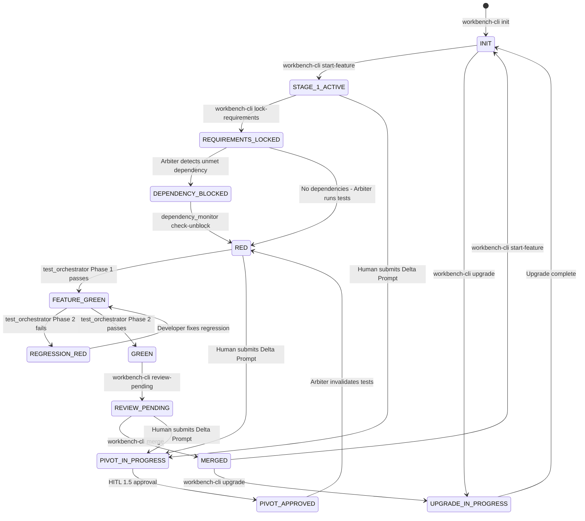

# Agentic Workbench v2 — Gap Implementation Plan (v2 — includes GAP-11)

**Author:** Senior Architect (Roo)
**Date:** 2026-04-12
**Reference Spec:** [`Agentic Workbench v2 - Draft.md`](../Agentic%20Workbench%20v2%20-%20Draft.md)
**Reference Analysis:** Gap analysis performed 2026-04-12 against full codebase
**Status:** READY FOR IMPLEMENTATION

---

## Overview

This plan addresses 10 gaps identified between the v2 specification and the current implementation. Gaps are organized into three implementation sprints by priority. All work targets the [`agentic-workbench-engine/`](../agentic-workbench-engine/) submodule.

### Gap Summary

| # | Gap | Severity | Sprint |
|---|-----|----------|--------|
| GAP-3 | Hook installation not automated in `workbench-cli.py` | 🔴 Critical | Sprint A |
| GAP-5 | `REVIEW_PENDING → MERGED` transition not enforced | 🔴 Critical | Sprint A |
| GAP-6 | `STAGE_1_ACTIVE` / `REQUIREMENTS_LOCKED` transitions not enforced | 🔴 Critical | Sprint A |
| GAP-11 | Cold Zone MCP tool absent — `archive-cold/` is write-only with no retrieval path | 🔴 Critical | Sprint A |
| GAP-7 | `file_ownership` map never populated | 🟡 Moderate | Sprint B |
| GAP-9 | `regression_failures` always empty (TODO in code) | 🟡 Moderate | Sprint B |
| GAP-4 | `arbiter_capabilities` never set to `true` | 🟡 Moderate | Sprint B |
| GAP-1 | `compliance_snapshot.py` missing | 🟡 Moderate | Sprint B |
| GAP-2 | `biome.json` template missing | 🟡 Moderate | Sprint B |
| GAP-8 | Phase 0 Ideation Pipeline absent | 🟢 Minor | Sprint C |
| GAP-10 | PyPI packaging absent | 🟢 Minor | Sprint C |

---

## Sprint A — Critical Pipeline Wiring (Do First)

**Goal:** Make the pipeline actually runnable end-to-end without manual `state.json` edits, inert hooks, or inaccessible archived memory.

---

### GAP-3: Automate Hook Installation in `workbench-cli.py`

**Problem:** The hooks exist in `.workbench/hooks/` but are never installed into `.git/hooks/`. The physical barriers never fire.

**Files to modify:**
- [`agentic-workbench-engine/workbench-cli.py`](../agentic-workbench-engine/workbench-cli.py)

**Implementation:**

Add a `_install_hooks(repo_path)` helper function and call it from both `cmd_init()` and `cmd_upgrade()`:

```python
def _install_hooks(repo_path):
    """Install Arbiter hooks from .workbench/hooks/ into .git/hooks/."""
    hooks_src = repo_path / ".workbench" / "hooks"
    hooks_dst = repo_path / ".git" / "hooks"

    if not hooks_src.exists():
        print(f"  WARNING: .workbench/hooks/ not found — skipping hook installation")
        return

    hooks_dst.mkdir(parents=True, exist_ok=True)

    for hook_file in hooks_src.iterdir():
        if hook_file.is_file():
            dst = hooks_dst / hook_file.name
            shutil.copy2(hook_file, dst)
            # Make executable on Unix
            dst.chmod(dst.stat().st_mode | 0o111)
            print(f"  Installed hook: {hook_file.name} -> .git/hooks/{hook_file.name}")
```

Add a new `install-hooks` subcommand for manual re-installation:

```
workbench-cli.py install-hooks   — (Re)install Arbiter hooks into .git/hooks/
```

**Call sites:**
- `cmd_init()`: call `_install_hooks(project_path)` after the initial commit
- `cmd_upgrade()`: call `_install_hooks(repo_path)` after engine overwrite
- New `cmd_install_hooks()`: standalone command for manual re-installation

**Test coverage needed:**
- `tests/workbench/test_workbench_cli.py`: add test that after `cmd_init()`, `.git/hooks/pre-commit` exists and is executable

---

### GAP-5: `REVIEW_PENDING → MERGED` State Transition

**Problem:** Nothing writes `MERGED` to `state.json` or updates `feature_registry[REQ-NNN].state`. The pipeline loop never closes; `dependency_monitor.py` can never unblock downstream features.

**Files to modify:**
- [`agentic-workbench-engine/workbench-cli.py`](../agentic-workbench-engine/workbench-cli.py)

**Implementation:**

Add a `merge` subcommand to `workbench-cli.py`:

```
workbench-cli.py merge --req-id REQ-NNN   — Mark feature as MERGED, close pipeline cycle
```

```python
def cmd_merge(req_id):
    """Mark a feature as MERGED and close the pipeline cycle."""
    repo_path = Path.cwd()
    state = load_state_json(repo_path)

    if not state:
        print("ERROR: No state.json found.", file=sys.stderr)
        sys.exit(1)

    current_state = state.get("state")
    if current_state != "REVIEW_PENDING":
        print(f"ERROR: Cannot merge — state is {current_state} (expected REVIEW_PENDING)", file=sys.stderr)
        sys.exit(1)

    # Update feature_registry entry
    registry = state.get("feature_registry", {})
    if req_id not in registry:
        print(f"ERROR: {req_id} not found in feature_registry", file=sys.stderr)
        sys.exit(1)

    registry[req_id]["state"] = "MERGED"
    registry[req_id]["merged_at"] = datetime.now(timezone.utc).isoformat()

    # Transition pipeline state
    state["state"] = "MERGED"
    state["active_req_id"] = None
    state["stage"] = None
    state["feature_registry"] = registry
    state["last_updated"] = datetime.now(timezone.utc).isoformat()
    state["last_updated_by"] = "workbench-cli"

    state_path = repo_path / "state.json"
    with open(state_path, "w", encoding="utf-8") as f:
        json.dump(state, f, indent=2)
        f.write("\n")

    print(f"[WORKBENCH-CLI] Feature {req_id} MERGED")
    print(f"  state.json.state = MERGED")
    print(f"  feature_registry[{req_id}].state = MERGED")

    # Trigger dependency monitor to unblock downstream features
    rotator_script = repo_path / ".workbench" / "scripts" / "dependency_monitor.py"
    if rotator_script.exists():
        print(f"  Running dependency_monitor.py check-unblock...")
        subprocess.run(["python", str(rotator_script), "check-unblock"], cwd=repo_path)

    print(f"\n[WORKBENCH-CLI] Pipeline cycle complete. Ready for next feature.")
    print(f"  Next: workbench-cli.py start-feature --req-id REQ-NNN")
```

**Also update `post-merge` hook** to call `workbench-cli.py merge` or directly update `feature_registry` when a PR merge is detected. The hook should read the active `req_id` from `state.json` and update the registry entry.

**Test coverage needed:**
- `tests/workbench/test_workbench_cli.py`: test that `cmd_merge("REQ-001")` transitions `state = MERGED`, sets `feature_registry["REQ-001"]["state"] = "MERGED"`, clears `active_req_id`
- Test that `cmd_merge` fails when `state != REVIEW_PENDING`

---

### GAP-6: `STAGE_1_ACTIVE` and `REQUIREMENTS_LOCKED` State Transitions

**Problem:** The pipeline entry path (`INIT → STAGE_1_ACTIVE → REQUIREMENTS_LOCKED → RED`) requires humans to manually edit `state.json`, violating the Arbiter-owns-state-json contract.

**Files to modify:**
- [`agentic-workbench-engine/workbench-cli.py`](../agentic-workbench-engine/workbench-cli.py)

**Implementation:**

Add two new subcommands:

```
workbench-cli.py start-feature --req-id REQ-NNN [--slug user-login]
    — Transitions INIT/MERGED → STAGE_1_ACTIVE
    — Creates feature_registry entry for REQ-NNN
    — Sets active_req_id = REQ-NNN

workbench-cli.py lock-requirements --req-id REQ-NNN
    — Transitions STAGE_1_ACTIVE → REQUIREMENTS_LOCKED
    — Validates .feature file exists in /features/
    — Triggers gherkin_validator.py on the feature file
    — Sets stage = 2 (ready for Test Engineer)
```

```python
def cmd_start_feature(req_id, slug=None):
    """Transition INIT/MERGED → STAGE_1_ACTIVE and register the feature."""
    repo_path = Path.cwd()
    state = load_state_json(repo_path)

    if not state:
        print("ERROR: No state.json found.", file=sys.stderr)
        sys.exit(1)

    current_state = state.get("state")
    if current_state not in ["INIT", "MERGED"]:
        print(f"ERROR: Cannot start feature — state is {current_state} (expected INIT or MERGED)", file=sys.stderr)
        sys.exit(1)

    # Register feature in feature_registry
    registry = state.get("feature_registry", {})
    if req_id in registry:
        print(f"WARNING: {req_id} already exists in feature_registry (state: {registry[req_id].get('state')})")

    branch_slug = slug or req_id.lower().replace("-", "-")
    registry[req_id] = {
        "state": "STAGE_1_ACTIVE",
        "branch": f"feature/S1/{req_id}-{branch_slug}" if slug else f"feature/S1/{req_id}",
        "depends_on": [],
        "created_at": datetime.now(timezone.utc).isoformat()
    }

    state["state"] = "STAGE_1_ACTIVE"
    state["stage"] = 1
    state["active_req_id"] = req_id
    state["feature_registry"] = registry
    state["last_updated"] = datetime.now(timezone.utc).isoformat()
    state["last_updated_by"] = "workbench-cli"

    state_path = repo_path / "state.json"
    with open(state_path, "w", encoding="utf-8") as f:
        json.dump(state, f, indent=2)
        f.write("\n")

    print(f"[WORKBENCH-CLI] Feature {req_id} started")
    print(f"  state.json.state = STAGE_1_ACTIVE")
    print(f"  active_req_id = {req_id}")
    print(f"  Next: Author .feature file, then run: workbench-cli.py lock-requirements --req-id {req_id}")


def cmd_lock_requirements(req_id):
    """Transition STAGE_1_ACTIVE → REQUIREMENTS_LOCKED after HITL 1 approval."""
    repo_path = Path.cwd()
    state = load_state_json(repo_path)

    if not state:
        print("ERROR: No state.json found.", file=sys.stderr)
        sys.exit(1)

    current_state = state.get("state")
    if current_state != "STAGE_1_ACTIVE":
        print(f"ERROR: Cannot lock requirements — state is {current_state} (expected STAGE_1_ACTIVE)", file=sys.stderr)
        sys.exit(1)

    # Validate .feature file exists
    features_dir = repo_path / "features"
    feature_files = list(features_dir.glob(f"{req_id}-*.feature"))
    if not feature_files:
        print(f"ERROR: No .feature file found for {req_id} in /features/", file=sys.stderr)
        print(f"  Expected: features/{req_id}-{{slug}}.feature", file=sys.stderr)
        sys.exit(1)

    # Run gherkin_validator.py
    validator = repo_path / ".workbench" / "scripts" / "gherkin_validator.py"
    if validator.exists():
        result = subprocess.run(
            ["python", str(validator), str(features_dir)],
            cwd=repo_path,
            capture_output=True,
            text=True
        )
        if result.returncode != 0:
            print(f"ERROR: Gherkin validation failed for {req_id}", file=sys.stderr)
            print(result.stdout)
            sys.exit(1)
        print(f"  Gherkin validation passed")

    # Check for dependency gate
    registry = state.get("feature_registry", {})
    feature_entry = registry.get(req_id, {})
    depends_on = feature_entry.get("depends_on", [])
    unmet_deps = [dep for dep in depends_on if registry.get(dep, {}).get("state") != "MERGED"]

    if unmet_deps:
        # Transition to DEPENDENCY_BLOCKED
        state["state"] = "DEPENDENCY_BLOCKED"
        registry[req_id]["state"] = "DEPENDENCY_BLOCKED"
        print(f"[WORKBENCH-CLI] {req_id} DEPENDENCY_BLOCKED — unmet: {unmet_deps}")
    else:
        state["state"] = "REQUIREMENTS_LOCKED"
        state["stage"] = 2
        registry[req_id]["state"] = "REQUIREMENTS_LOCKED"
        print(f"[WORKBENCH-CLI] Requirements locked for {req_id}")
        print(f"  state.json.state = REQUIREMENTS_LOCKED")
        print(f"  Next: Test Engineer Agent writes failing tests")

    state["feature_registry"] = registry
    state["last_updated"] = datetime.now(timezone.utc).isoformat()
    state["last_updated_by"] = "workbench-cli"

    state_path = repo_path / "state.json"
    with open(state_path, "w", encoding="utf-8") as f:
        json.dump(state, f, indent=2)
        f.write("\n")
```

**Also add `review-pending` command** to close the Stage 3 → Stage 4 gap:

```
workbench-cli.py review-pending --req-id REQ-NNN
    — Transitions GREEN → REVIEW_PENDING (after integration tests pass)
    — Sets stage = 4
```

**Test coverage needed:**
- `tests/workbench/test_workbench_cli.py`: test `start-feature`, `lock-requirements`, `review-pending`, `merge` as a complete lifecycle sequence

---

### GAP-11: Cold Zone MCP Tool — `archive-cold/` Has No Retrieval Path

**Problem:** The spec mandates that `memory-bank/archive-cold/` is accessed **exclusively through an MCP tool** (Rule MEM-1 in [`.clinerules`](../agentic-workbench-engine/.clinerules)). The [`memory_rotator.py`](../agentic-workbench-engine/.workbench/scripts/memory_rotator.py) correctly archives files to `archive-cold/` at sprint end — but there is no MCP server, no MCP tool, and no retrieval mechanism. The Cold Zone is effectively **write-only**: data goes in but can never come out through the approved channel. Any agent needing historical context from a previous sprint has no compliant way to access it.

**Spec reference:** [`Agentic Workbench v2 - Draft.md`](../Agentic%20Workbench%20v2%20-%20Draft.md) Cross-Cutting Concern 1, §8.2:
> *"Files in `memory-bank/archive-cold/` must not be read directly by the agent to prevent flooding the context window with stale data. Access is granted exclusively through the MCP tool (except for the Documentation / Librarian Agent)."*

**Current state:**
- `memory-bank/archive-cold/` directory exists with `.gitkeep` ✅
- `memory_rotator.py` writes archived files there at sprint end ✅
- No MCP server defined anywhere in the engine ❌
- No MCP tool for querying archived context ❌
- Rule MEM-1 in `.clinerules` forbids direct access — but provides no alternative ❌

**Files to create:**
- `agentic-workbench-engine/.workbench/mcp/archive_query_server.py` — MCP server exposing Cold Zone query tools
- `agentic-workbench-engine/.workbench/mcp/README.md` — setup instructions

**Implementation:**

The MCP server should expose two tools:

**Tool 1: `search_archive`**
```
search_archive(query: str, sprint?: str) -> list[ArchiveEntry]
```
- Searches `memory-bank/archive-cold/` for files matching the query string
- Optionally filters by sprint prefix (e.g., `sprint=S1` matches `20260401_*` files from that sprint)
- Returns file names, timestamps, and matching excerpts (not full content — prevents context flooding)
- Maximum 3 results returned per query

**Tool 2: `read_archive_file`**
```
read_archive_file(filename: str, max_lines?: int) -> str
```
- Reads a specific archived file by name (must be an exact filename from `search_archive` results)
- `max_lines` defaults to 100 — prevents full-file dumps into context
- Returns the file content truncated to `max_lines`

**MCP server skeleton:**

```python
#!/usr/bin/env python3
"""
archive_query_server.py — Cold Zone MCP Server

Owner: The Arbiter (Layer 2)
Version: 2.1
Location: .workbench/mcp/archive_query_server.py

Exposes memory-bank/archive-cold/ via MCP tools.
Agents MUST use these tools instead of reading archive-cold/ directly.

Usage:
  python archive_query_server.py          # Start MCP server (stdio transport)
"""

import json
import sys
from pathlib import Path

ARCHIVE_PATH = Path(__file__).parent.parent.parent / "memory-bank" / "archive-cold"
MAX_RESULTS = 3
DEFAULT_MAX_LINES = 100


def search_archive(query: str, sprint: str = None) -> list:
    """Search archive-cold/ for files matching query."""
    if not ARCHIVE_PATH.exists():
        return []

    results = []
    for f in sorted(ARCHIVE_PATH.glob("*.md"), reverse=True):
        if sprint and sprint.lower() not in f.name.lower():
            continue
        try:
            content = f.read_text(encoding="utf-8")
            if query.lower() in content.lower() or query.lower() in f.name.lower():
                # Return excerpt, not full content
                lines = content.split("\n")
                excerpt_lines = [l for l in lines if query.lower() in l.lower()][:3]
                results.append({
                    "filename": f.name,
                    "excerpt": "\n".join(excerpt_lines)[:300],
                    "size_lines": len(lines)
                })
                if len(results) >= MAX_RESULTS:
                    break
        except Exception:
            continue
    return results


def read_archive_file(filename: str, max_lines: int = DEFAULT_MAX_LINES) -> str:
    """Read a specific archived file (truncated to max_lines)."""
    file_path = ARCHIVE_PATH / filename
    # Security: only allow files within archive-cold/
    if not file_path.resolve().is_relative_to(ARCHIVE_PATH.resolve()):
        return "ERROR: Access denied — file is outside archive-cold/"
    if not file_path.exists():
        return f"ERROR: File not found: {filename}"
    lines = file_path.read_text(encoding="utf-8").split("\n")
    truncated = lines[:max_lines]
    if len(lines) > max_lines:
        truncated.append(f"\n... [{len(lines) - max_lines} lines truncated — use max_lines to read more]")
    return "\n".join(truncated)
```

**MCP configuration** — add to `agentic-workbench-engine/.roo-settings.json` (or a separate `mcp.json`):

```json
{
  "mcpServers": {
    "archive-query": {
      "command": "python",
      "args": [".workbench/mcp/archive_query_server.py"],
      "description": "Cold Zone archive query — search and read archived memory-bank files"
    }
  }
}
```

**Also update `.clinerules`** Rule MEM-1 to reference the MCP tool name:

```
> **Rule MEM-1:** The agent MUST NOT directly read `memory-bank/archive-cold/` files.
> Cold Zone files are accessed exclusively through the `archive-query` MCP tool:
>   - `search_archive(query)` — find relevant archived files
>   - `read_archive_file(filename)` — read a specific file (truncated)
> Direct access floods the context window with stale data.
```

**Test coverage needed:**
- `tests/workbench/test_archive_query_server.py` (new file):
  - Test `search_archive("REQ-001")` returns matching archived files
  - Test `read_archive_file(filename, max_lines=10)` returns truncated content
  - Test path traversal attack is blocked (`../../../etc/passwd`)
  - Test `search_archive` returns max 3 results even when more match

---

## Sprint B — Correctness Improvements (Do Second)

**Goal:** Make the implemented features work correctly and completely per spec.

---

### GAP-7: Populate `file_ownership` Map in `pre-commit` Hook

**Problem:** The `pre-commit` hook reads `file_ownership` for conflict detection but nothing ever writes to it. The map is always `{}`.

**Files to modify:**
- [`agentic-workbench-engine/.workbench/hooks/pre-commit`](../agentic-workbench-engine/.workbench/hooks/pre-commit)

**Implementation:**

In the `pre-commit` hook, after the file ownership conflict check (section 5), add a write step that updates `file_ownership` for all staged `/src/` files:

```sh
# =============================================================================
# 6. UPDATE FILE OWNERSHIP MAP
# =============================================================================
STAGED_SRC=$(git diff --cached --name-only --diff-filter=ACM | grep "^src/" || true)
if [ -n "$STAGED_SRC" ] && [ -f "state.json" ]; then
    python -c "
import json, sys

state = json.load(open('state.json'))
active_req_id = state.get('active_req_id')

if not active_req_id:
    sys.exit(0)  # No active feature — skip ownership update

ownership = state.get('file_ownership', {})
staged_files = '''$STAGED_SRC'''.strip().split('\n')

for f in staged_files:
    if f.strip():
        ownership[f.strip()] = active_req_id

state['file_ownership'] = ownership
state['last_updated_by'] = 'pre-commit'

with open('state.json', 'w') as out:
    json.dump(state, out, indent=2)
    out.write('\n')

print(f'[PRE-COMMIT] Updated file_ownership for {len(staged_files)} files (owner: {active_req_id})')
" 2>/dev/null || echo "[PRE-COMMIT] File ownership update skipped"
fi
```

**Note:** This write to `state.json` must be added to the `ALLOWED_WRITERS` list in the state.json integrity check section (section 1) as `pre-commit`.

**Test coverage needed:**
- `tests/workbench/test_hooks_pre_commit.py`: add test that after a commit with staged `/src/` files, `state.json.file_ownership` is populated with the correct `active_req_id`

---

### GAP-9: Populate `regression_failures` with Actual Test Output

**Problem:** [`test_orchestrator.py`](../agentic-workbench-engine/.workbench/scripts/test_orchestrator.py) line 227 has `state["regression_failures"] = []  # TODO: parse from test output`. The Developer Agent has no actionable failure details.

**Files to modify:**
- [`agentic-workbench-engine/.workbench/scripts/test_orchestrator.py`](../agentic-workbench-engine/.workbench/scripts/test_orchestrator.py)

**Implementation:**

Update `run_tests()` to capture and parse test output. Use `pytest --json-report` for Python projects and `vitest --reporter=json` for TypeScript:

```python
def run_tests(test_paths, description):
    """Run tests and return (exit_code, pass_ratio, failures)."""
    if not test_paths:
        return 0, 1.0, []

    mock_runner = os.environ.get("WORKBENCH_MOCK_RUNNER", "")
    if mock_runner == "pass":
        return 0, 1.0, []
    elif mock_runner == "fail":
        return 1, 0.0, ["mock-failure: simulated test failure"]

    failures = []

    # Try pytest with JSON report
    try:
        import tempfile
        report_file = tempfile.mktemp(suffix=".json")
        result = subprocess.run(
            ["pytest", "--tb=short", "-v", f"--json-report", f"--json-report-file={report_file}"] + test_paths,
            capture_output=True, text=True, timeout=300
        )
        if Path(report_file).exists():
            with open(report_file) as f:
                report = json.load(f)
            for test in report.get("tests", []):
                if test.get("outcome") in ("failed", "error"):
                    failures.append(f"{test['nodeid']}: {test.get('call', {}).get('longrepr', '')[:200]}")
            Path(report_file).unlink(missing_ok=True)
        return result.returncode, 1.0 if result.returncode == 0 else 0.0, failures
    except (FileNotFoundError, subprocess.TimeoutExpired):
        pass

    # Try vitest with JSON reporter
    try:
        result = subprocess.run(
            ["npx", "vitest", "run", "--reporter=json", "--outputFile=.vitest-results.json"] + test_paths,
            capture_output=True, text=True, timeout=300
        )
        results_file = Path(".vitest-results.json")
        if results_file.exists():
            with open(results_file) as f:
                report = json.load(f)
            for suite in report.get("testResults", []):
                for test in suite.get("assertionResults", []):
                    if test.get("status") == "failed":
                        failures.append(f"{suite['testFilePath']}::{test['fullName']}")
            results_file.unlink(missing_ok=True)
        return result.returncode, 1.0 if result.returncode == 0 else 0.0, failures
    except (FileNotFoundError, subprocess.TimeoutExpired):
        pass

    # Fallback: exit-code only
    return 1, 0.0, ["Test runner not found — install pytest or vitest"]
```

Update `run_full_regression()` to pass failures to state:

```python
# In main(), Phase 2 set-state block:
state["regression_failures"] = result.get("failures", [])  # Replace the TODO line
```

**Test coverage needed:**
- `tests/workbench/test_test_orchestrator.py`: add test that when `WORKBENCH_MOCK_RUNNER=fail`, `regression_failures` is non-empty after `--scope full --set-state`

---

### GAP-4: Automate `arbiter_capabilities` Registration

**Problem:** All `arbiter_capabilities` entries remain `false` forever. The Phase B/C migration (shrinking the auto-approve allowlist) never happens.

**Files to modify:**
- Each script in [`agentic-workbench-engine/.workbench/scripts/`](../agentic-workbench-engine/.workbench/scripts/)

**Implementation:**

Add a `--register` flag to each Arbiter script that sets its own `arbiter_capabilities` entry to `true`:

```python
# In each script's main(), add:
register_parser = subparsers.add_parser("register", help="Register this script in state.json arbiter_capabilities")

# In main():
elif args.command == "register":
    state = load_state()
    if state:
        state["arbiter_capabilities"]["test_orchestrator"] = True  # (script-specific key)
        state["last_updated"] = datetime.now(timezone.utc).isoformat()
        state["last_updated_by"] = "test_orchestrator.py"
        save_state(state)
        print(f"[TEST_ORCHESTRATOR] Registered in arbiter_capabilities")
    sys.exit(0)
```

**Capability key mapping:**

| Script | `arbiter_capabilities` key |
|--------|---------------------------|
| `test_orchestrator.py` | `test_orchestrator` |
| `gherkin_validator.py` | `gherkin_validator` |
| `memory_rotator.py` | `memory_rotator` |
| `audit_logger.py` | `audit_logger` |
| `crash_recovery.py` | `crash_recovery` |
| `dependency_monitor.py` | `dependency_monitor` |
| `integration_test_runner.py` | `integration_test_runner` |

**Also add to `workbench-cli.py`:**

```
workbench-cli.py register-arbiter   — Run all Arbiter scripts' --register commands in sequence
```

This command runs `python {script} register` for each script, transitioning the system from Phase A to Phase B/C.

**Test coverage needed:**
- Each `test_*.py`: add test that `python {script} register` sets the correct `arbiter_capabilities` key to `true`

---

### GAP-1: `compliance_snapshot.py` — Compliance Vault Script

**Problem:** The `post-tag` hook stubs out `compliance_snapshot.py` with a TODO. Phase 3 compliance snapshots are not automated.

**Files to create:**
- [`agentic-workbench-engine/.workbench/scripts/compliance_snapshot.py`](../agentic-workbench-engine/.workbench/scripts/compliance_snapshot.py)

**Implementation:**

```
python compliance_snapshot.py --tag v1.0.0
```

The script should:
1. Create `compliance-vault/{tag}/` directory (read-only after creation)
2. Generate a Traceability Matrix from `state.json.feature_registry` — a Markdown table mapping `REQ-NNN` → `.feature` file → test files → source files (via `file_ownership`)
3. Copy all `.feature` files into the vault as a snapshot
4. Copy `state.json` snapshot into the vault
5. Generate a timestamped `COMPLIANCE_SNAPSHOT_{tag}_{timestamp}.md` summary
6. Set directory permissions to read-only (`chmod 444` on Unix; advisory on Windows)

**Traceability Matrix format:**

```markdown
# Traceability Matrix — Release v1.0.0

| REQ-ID | Feature File | Unit Tests | Integration Tests | Source Files | State |
|--------|-------------|------------|-------------------|--------------|-------|
| REQ-001 | REQ-001-user-login.feature | REQ-001-user-login.spec.ts | FLOW-001-auth.integration.spec.ts | src/auth/login.ts | MERGED |
```

**Test coverage needed:**
- `tests/workbench/test_compliance_snapshot.py` (new file): test that `compliance_snapshot.py --tag v1.0.0` creates the vault directory, generates the traceability matrix, and copies feature files

---

### GAP-2: `biome.json` Template

**Problem:** No `biome.json` exists in the engine repo. The `pre-commit` hook silently skips linting.

**Files to create:**
- [`agentic-workbench-engine/biome.json`](../agentic-workbench-engine/biome.json)

**Implementation:**

Create a sensible default `biome.json` that gets injected by `workbench-cli.py init`:

```json
{
  "$schema": "https://biomejs.dev/schemas/1.6.0/schema.json",
  "organizeImports": {
    "enabled": true
  },
  "linter": {
    "enabled": true,
    "rules": {
      "recommended": true,
      "suspicious": {
        "noExplicitAny": "warn"
      },
      "style": {
        "noNonNullAssertion": "warn"
      }
    }
  },
  "formatter": {
    "enabled": true,
    "indentStyle": "space",
    "indentWidth": 2,
    "lineWidth": 100
  },
  "files": {
    "include": ["src/**", "tests/**"],
    "ignore": ["node_modules/**", "dist/**", ".workbench/**"]
  }
}
```

**Also update `workbench-cli.py`:**
- Add `biome.json` to `ENGINE_FILES` list so it is copied during `init` and `upgrade`

**Test coverage needed:**
- `tests/workbench/test_workbench_cli.py`: add assertion that after `cmd_init()`, `biome.json` exists in the project root

---

## Sprint C — Enhancement Features (Do Last)

**Goal:** Add the Phase 0 discovery pipeline and PyPI packaging for distribution.

---

### GAP-8: Phase 0 — Ideation & Discovery Pipeline

**Problem:** The Architect Agent's `.roomodes` prompt jumps directly to Gherkin writing. The Phase 0 Socratic discovery loop (Braindump → Interrogation → Five Whys → Narrative Synthesis → Ideation Gate) is absent.

**Files to modify:**
- [`agentic-workbench-engine/.roomodes`](../agentic-workbench-engine/.roomodes) — Architect Agent prompt
- [`agentic-workbench-engine/memory-bank/hot-context/`](../agentic-workbench-engine/memory-bank/hot-context/) — add `narrativeRequest.md` template

**Implementation:**

**1. Add `narrativeRequest.md` template** to `memory-bank/hot-context/`:

```markdown
# narrativeRequest.md — Narrative Feature Request Template

**Template Version:** 2.1
**Owner:** Architect Agent (Phase 0 output)
**Rotation Policy:** Rotate (archive at sprint end)

---

## Background

(TODO: What is the business context? What problem exists today?)

## User Persona

(TODO: Who is experiencing this friction? Be specific — "enterprise admin" not "user")

## Business Problem

(TODO: What is the operational bottleneck, stripped of emotional language?)

## Business Value

(TODO: How does solving this impact KPIs — retention, revenue, efficiency?)

## High-Level Goals

- [ ] (TODO: Goal 1)
- [ ] (TODO: Goal 2)

## Constraints and Non-Goals

(TODO: What is explicitly out of scope?)

---

**Status:** DRAFT / APPROVED
**Approved By:** (Product Owner name)
**Approval Date:** (YYYY-MM-DD)
```

**2. Update Architect Agent prompt** in `.roomodes` to include Phase 0 instructions:

```yaml
architect:
  prompt: |
    You are the **Architect Agent**. You operate in two modes:

    ## Phase 0 Mode: Ideation & Discovery (when given a raw narrative)

    When the human provides an unstructured idea or problem statement:

    1. **Braindump Ingestion:** Accept the raw input without judgment
    2. **Socratic Interrogation:** Ask targeted questions to extract:
       - WHO: Which specific user persona is experiencing friction?
       - WHAT: What is the actual operational bottleneck?
       - VALUE: How does solving this impact KPIs?
    3. **Five Whys:** If the human proposes a prescriptive solution, ask "Why?" to uncover the root need
    4. **Narrative Synthesis:** Compile the dialogue into a `narrativeRequest.md` document
    5. **Ideation Gate:** Present the narrative for human approval before proceeding to Stage 1

    Only proceed to Stage 1 (Gherkin authoring) after the human explicitly approves the narrative.

    ## Stage 1 Mode: Intent to Contract (when given an approved narrative)
    ...
```

**3. Add `narrativeRequest.md` to `memory_rotator.py`** rotation policy (Rotate — archive at sprint end).

**4. Add `narrativeRequest.md` to `workbench-cli.py`** `cmd_init()` hot-context copy.

**Test coverage needed:**
- `tests/workbench/test_memory_rotator.py`: add test that `narrativeRequest.md` is rotated (archived + reset) at sprint end

---

### GAP-10: PyPI Packaging

**Problem:** No `pyproject.toml` or `setup.py` exists. `pip install agentic-workbench-cli` is not possible.

**Files to create:**
- [`agentic-workbench-engine/pyproject.toml`](../agentic-workbench-engine/pyproject.toml)

**Implementation:**

```toml
[build-system]
requires = ["setuptools>=68", "wheel"]
build-backend = "setuptools.backends.legacy:build"

[project]
name = "agentic-workbench-cli"
version = "2.1.0"
description = "Agentic Workbench v2 — Deterministic bootstrapper and lifecycle manager for AI-driven development pipelines"
readme = "README.md"
requires-python = ">=3.10"
license = { text = "MIT" }
keywords = ["agentic", "ai", "workbench", "roo", "tdd", "pipeline"]
classifiers = [
    "Development Status :: 4 - Beta",
    "Intended Audience :: Developers",
    "Programming Language :: Python :: 3",
    "Programming Language :: Python :: 3.10",
    "Programming Language :: Python :: 3.11",
    "Programming Language :: Python :: 3.12",
]

[project.scripts]
workbench-cli = "workbench_cli:main"

[tool.setuptools.packages.find]
where = ["."]
include = ["workbench_cli*"]
```

**Also rename** `workbench-cli.py` → `workbench_cli.py` (Python module naming convention) and add a thin `workbench-cli.py` shim for backward compatibility.

**Test coverage needed:**
- Verify `pip install -e .` works in a clean virtualenv
- Verify `workbench-cli --version` works after pip install

---

## Implementation Checklist

### Sprint A — Critical (implement in this order)

- [ ] **GAP-3a:** Add `_install_hooks(repo_path)` helper to [`workbench-cli.py`](../agentic-workbench-engine/workbench-cli.py)
- [ ] **GAP-3b:** Call `_install_hooks()` from `cmd_init()` and `cmd_upgrade()`
- [ ] **GAP-3c:** Add `install-hooks` subcommand to `workbench-cli.py`
- [ ] **GAP-3d:** Add test: after `cmd_init()`, `.git/hooks/pre-commit` exists and is executable
- [ ] **GAP-6a:** Add `start-feature --req-id` subcommand to `workbench-cli.py`
- [ ] **GAP-6b:** Add `lock-requirements --req-id` subcommand to `workbench-cli.py`
- [ ] **GAP-6c:** Add `review-pending --req-id` subcommand to `workbench-cli.py`
- [ ] **GAP-6d:** Add tests for full lifecycle: `start-feature` → `lock-requirements` → `review-pending` → `merge`
- [ ] **GAP-5a:** Add `merge --req-id` subcommand to `workbench-cli.py`
- [ ] **GAP-5b:** `merge` command updates `feature_registry[REQ-NNN].state = "MERGED"` with `merged_at`
- [ ] **GAP-5c:** `merge` command triggers `dependency_monitor.py check-unblock`
- [ ] **GAP-5d:** Add test: `cmd_merge("REQ-001")` transitions state correctly
- [ ] **GAP-11a:** Create `.workbench/mcp/` directory in engine
- [ ] **GAP-11b:** Create `archive_query_server.py` MCP server with `search_archive` and `read_archive_file` tools
- [ ] **GAP-11c:** Add MCP server config to `agentic-workbench-engine/.roo-settings.json` under `mcpServers`
- [ ] **GAP-11d:** Update Rule MEM-1 in `.clinerules` to reference the `archive-query` MCP tool by name
- [ ] **GAP-11e:** Create `tests/workbench/test_archive_query_server.py` with search, read, path-traversal, and max-results tests

### Sprint B — Correctness (implement after Sprint A)

- [ ] **GAP-7a:** Add file ownership write step to `pre-commit` hook (section 6)
- [ ] **GAP-7b:** Add `pre-commit` to `ALLOWED_WRITERS` in `pre-commit` hook section 1
- [ ] **GAP-7c:** Add test: staged `/src/` files populate `file_ownership` after commit
- [ ] **GAP-9a:** Update `run_tests()` in `test_orchestrator.py` to parse pytest JSON report
- [ ] **GAP-9b:** Update `run_tests()` to parse vitest JSON reporter output
- [ ] **GAP-9c:** Replace `regression_failures = []  # TODO` with actual parsed failures
- [ ] **GAP-9d:** Add test: `WORKBENCH_MOCK_RUNNER=fail` produces non-empty `regression_failures`
- [ ] **GAP-4a:** Add `register` subcommand to each of the 7 Arbiter scripts
- [ ] **GAP-4b:** Add `register-arbiter` command to `workbench-cli.py` (runs all 7 `register` commands)
- [ ] **GAP-4c:** Add test: `python test_orchestrator.py register` sets `arbiter_capabilities.test_orchestrator = true`
- [ ] **GAP-1a:** Create `compliance_snapshot.py` with `--tag` argument
- [ ] **GAP-1b:** Generate Traceability Matrix from `feature_registry` + `file_ownership`
- [ ] **GAP-1c:** Create `compliance-vault/{tag}/` with snapshot files
- [ ] **GAP-1d:** Add test: `compliance_snapshot.py --tag v1.0.0` creates vault with traceability matrix
- [ ] **GAP-2a:** Create `biome.json` template in engine root
- [ ] **GAP-2b:** Add `biome.json` to `ENGINE_FILES` in `workbench-cli.py`
- [ ] **GAP-2c:** Add test: after `cmd_init()`, `biome.json` exists in project root

### Sprint C — Enhancements (implement last)

- [ ] **GAP-8a:** Create `narrativeRequest.md` template in `memory-bank/hot-context/`
- [ ] **GAP-8b:** Add Phase 0 instructions to Architect Agent prompt in `.roomodes`
- [ ] **GAP-8c:** Add `narrativeRequest.md` to `memory_rotator.py` rotation policy (Rotate)
- [ ] **GAP-8d:** Add `narrativeRequest.md` to `workbench-cli.py` `cmd_init()` hot-context copy
- [ ] **GAP-8e:** Add test: `narrativeRequest.md` is archived + reset at sprint end
- [ ] **GAP-10a:** Create `pyproject.toml` in engine root
- [ ] **GAP-10b:** Verify `pip install -e .` works in clean virtualenv
- [ ] **GAP-10c:** Verify `workbench-cli --version` works after pip install

---

## State Machine — Post-Implementation

After Sprint A is complete, the full state machine will be enforced by CLI commands:



---

## Files Changed Summary

| File | Sprint | Change Type |
|------|--------|-------------|
| `agentic-workbench-engine/workbench-cli.py` | A | Modify — add `start-feature`, `lock-requirements`, `review-pending`, `merge`, `install-hooks`, `register-arbiter` commands; add `_install_hooks()` helper |
| `agentic-workbench-engine/.workbench/mcp/archive_query_server.py` | A | **Create new** — MCP server exposing Cold Zone query tools |
| `agentic-workbench-engine/.workbench/mcp/README.md` | A | **Create new** — MCP server setup instructions |
| `agentic-workbench-engine/.roo-settings.json` | A | Modify — add `mcpServers.archive-query` entry |
| `agentic-workbench-engine/.clinerules` | A | Modify — update Rule MEM-1 to reference `archive-query` MCP tool by name |
| `tests/workbench/test_archive_query_server.py` | A | **Create new** — search, read, path-traversal, max-results tests |
| `agentic-workbench-engine/.workbench/hooks/pre-commit` | B | Modify — add section 6 file ownership write; add `pre-commit` to ALLOWED_WRITERS |
| `agentic-workbench-engine/.workbench/scripts/test_orchestrator.py` | B | Modify — parse test output into `regression_failures`; add `register` command |
| `agentic-workbench-engine/.workbench/scripts/gherkin_validator.py` | B | Modify — add `register` command |
| `agentic-workbench-engine/.workbench/scripts/memory_rotator.py` | B | Modify — add `register` command; add `narrativeRequest.md` to rotation policy (Sprint C) |
| `agentic-workbench-engine/.workbench/scripts/audit_logger.py` | B | Modify — add `register` command |
| `agentic-workbench-engine/.workbench/scripts/crash_recovery.py` | B | Modify — add `register` command |
| `agentic-workbench-engine/.workbench/scripts/dependency_monitor.py` | B | Modify — add `register` command |
| `agentic-workbench-engine/.workbench/scripts/integration_test_runner.py` | B | Modify — add `register` command |
| `agentic-workbench-engine/.workbench/scripts/compliance_snapshot.py` | B | **Create new** |
| `agentic-workbench-engine/biome.json` | B | **Create new** |
| `agentic-workbench-engine/memory-bank/hot-context/narrativeRequest.md` | C | **Create new** |
| `agentic-workbench-engine/.roomodes` | C | Modify — add Phase 0 instructions to Architect Agent prompt |
| `agentic-workbench-engine/pyproject.toml` | C | **Create new** |
| `tests/workbench/test_workbench_cli.py` | A+B | Modify — add lifecycle tests, hook installation tests, `biome.json` test |
| `tests/workbench/test_test_orchestrator.py` | B | Modify — add `regression_failures` parsing test, `register` test |
| `tests/workbench/test_hooks_pre_commit.py` | B | Modify — add `file_ownership` write test |
| `tests/workbench/test_compliance_snapshot.py` | B | **Create new** |
| `tests/workbench/test_memory_rotator.py` | C | Modify — add `narrativeRequest.md` rotation test |