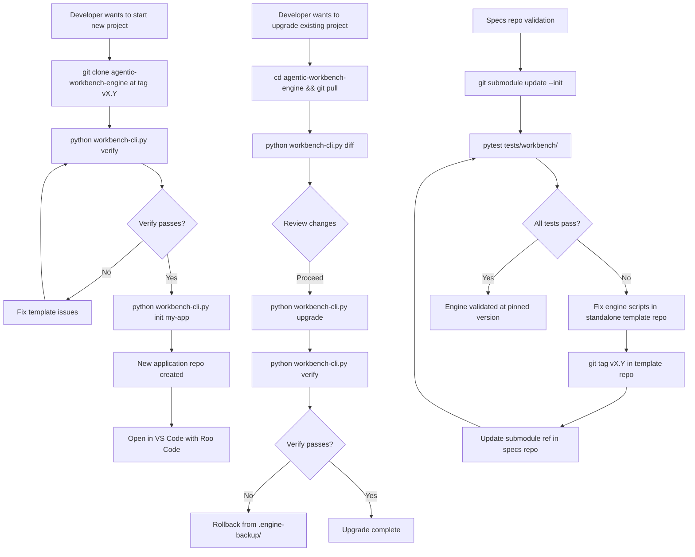

# Agentic Workbench v2 — Repository Cleanup & Deployment Strategy

**Plan Version:** 1.1
**Date:** 2026-04-12
**Author:** Architect Agent
**Status:** APPROVED — Ready for Implementation

## Confirmed Decisions (Human-Approved)

| Decision | Choice |
|---|---|
| **Sync strategy** | Git submodule — zero drift, explicit version pinning |
| **Cleanup scope** | Remove runtime artifacts completely — no empty dirs with .gitkeep |
| **CLI scope** | Full scope — all enhancements including `diff` and `--dry-run` |
| **Repo naming** | `agentic-workbench-lab` (specs + design + validation) + `agentic-workbench-engine` (injected runtime engine) |

---

---

## 1. Problem Statement

The workbench ecosystem currently has three concerns tangled together:

| Concern | Where it lives | Problem |
|---|---|---|
| **Specs & Validation** | `agentic-workbench-lab/` (this repo) | Contains execution artifacts (state.json, memory-bank/, src/, tests/unit/, tests/integration/, features/) that belong to application repos, not a specs repo |
| **Canonical Engine Template** | `agentic-workbench-lab/agentic-workbench-engine/` (embedded copy) | Duplicates the standalone repo at `C:\...\agentic-workbench-engine` with no sync enforcement — silent drift risk |
| **Standalone Template Repo** | `C:\Users\nghia\AGENTIC_DEVELOPMENT_PROJECTS\agentic-workbench-engine` | The true canonical source, but tests in the specs repo point to the embedded copy, not this one |

### 1.1 Specific Risks

1. **Silent drift**: A change to `agentic-workbench-engine/.workbench/scripts/audit_logger.py` in the standalone repo is NOT automatically reflected in the embedded copy. The test suite validates the embedded copy — so tests can pass while the canonical source has diverged.

2. **Artifact pollution**: The specs repo contains `state.json`, `memory-bank/`, `src/`, `tests/unit/`, `tests/integration/`, `features/` — these are workbench runtime artifacts that belong in application repos, not in a specs/validation repo. They create confusion about what this repo's purpose is.

3. **Empty `.workbench/scripts/`**: The specs repo has `.workbench/scripts/.gitkeep` (empty) while the embedded template has all Arbiter scripts. This is inconsistent and confusing.

4. **No deployment process clarity**: The `workbench-cli.py init` command works, but there is no documented, enforced process for keeping the standalone template repo as the single source of truth before running `init`.

5. **No update process robustness**: The `workbench-cli.py upgrade` command exists but requires the user to manually `git pull` the template repo first. There is no version pinning, no changelog diff, and no rollback mechanism.

---

## 2. Current Repository Anatomy

### 2.1 `agentic-workbench-lab` (this repo)

```
agentic-workbench-lab/
├── .clinerules                    ← ENGINE FILE (should only live in template)
├── .roo-settings.json             ← ENGINE FILE (should only live in template)
├── .roomodes                      ← ENGINE FILE (should only live in template)
├── .workbench-version             ← ENGINE FILE (should only live in template)
├── state.json                     ← RUNTIME ARTIFACT (belongs in app repos)
├── Agentic Workbench v2 - Draft.md ← CANONICAL SPEC ✓
├── Canonical_Naming_Conventions.md ← CANONICAL SPEC ✓
├── _inbox/                        ← RUNTIME ARTIFACT (belongs in app repos)
├── .workbench/scripts/.gitkeep    ← EMPTY — inconsistent with template
├── agentic-workbench-engine/      ← EMBEDDED COPY (drift risk)
├── diagrams/                      ← CANONICAL SPEC ✓
├── docs/                          ← CANONICAL SPEC ✓
├── features/.gitkeep              ← RUNTIME ARTIFACT (belongs in app repos)
├── memory-bank/                   ← RUNTIME ARTIFACT (belongs in app repos)
├── plans/                         ← CANONICAL SPEC ✓
├── src/.gitkeep                   ← RUNTIME ARTIFACT (belongs in app repos)
├── tests/unit/.gitkeep            ← RUNTIME ARTIFACT (belongs in app repos)
├── tests/integration/.gitkeep     ← RUNTIME ARTIFACT (belongs in app repos)
└── tests/workbench/               ← VALIDATION SUITE ✓ (belongs here)
```

### 2.2 `agentic-workbench-engine` (standalone canonical repo)

```
agentic-workbench-engine/
├── .clinerules                    ← ENGINE FILE ✓
├── .roo-settings.json             ← ENGINE FILE ✓
├── .roomodes                      ← ENGINE FILE ✓
├── .workbench-version             ← ENGINE FILE ✓
├── state.json                     ← TEMPLATE STATE ✓
├── workbench-cli.py               ← CLI BOOTSTRAPPER ✓
├── .workbench/
│   ├── hooks/                     ← GIT HOOKS ✓
│   └── scripts/                   ← ARBITER SCRIPTS ✓
└── memory-bank/hot-context/       ← MEMORY TEMPLATES ✓
```

---

## 3. Target Architecture

### 3.1 Principle: Two Repos, Two Purposes, One Source of Truth

```
┌─────────────────────────────────────────────────────────────────┐
│  agentic-workbench-engine  (CANONICAL ENGINE REPO)            │
│  C:\...\AGENTIC_DEVELOPMENT_PROJECTS\agentic-workbench-engine  │
│                                                                  │
│  Contains: .clinerules, .roomodes, .roo-settings.json,          │
│            .workbench-version, workbench-cli.py,                 │
│            .workbench/scripts/, .workbench/hooks/,              │
│            memory-bank/hot-context/ (templates),                │
│            state.json (template)                                 │
│                                                                  │
│  Versioned by: git tags (v2.1, v2.2, ...)                       │
│  Consumed by: workbench-cli.py init / upgrade                   │
└──────────────────────────┬──────────────────────────────────────┘
                           │  git submodule OR sync script
                           ▼
┌─────────────────────────────────────────────────────────────────┐
│  agentic-workbench-lab  (SPECS & VALIDATION REPO)              │
│  C:\...\AGENTIC_DEVELOPMENT_PROJECTS\agentic-workbench-lab     │
│                                                                  │
│  Contains: Agentic Workbench v2 - Draft.md,                     │
│            Canonical_Naming_Conventions.md,                     │
│            diagrams/, docs/, plans/,                            │
│            tests/workbench/ (validation suite),                 │
│            agentic-workbench-engine/ (as git submodule)         │
│                                                                  │
│  Purpose: Human-readable specs + CI validation of the engine    │
└──────────────────────────┬──────────────────────────────────────┘
                           │  workbench-cli.py init
                           ▼
┌─────────────────────────────────────────────────────────────────┐
│  my-application-repo  (APPLICATION REPO)                        │
│                                                                  │
│  Contains: src/, tests/unit/, tests/integration/, features/,    │
│            memory-bank/, state.json, _inbox/,                   │
│            docs/conversations/                                   │
│            + injected engine files from template                │
└─────────────────────────────────────────────────────────────────┘
```

### 3.2 The Git Submodule Strategy (Recommended)

Replace the embedded `agentic-workbench-engine/` folder with a **git submodule** pointing to the canonical standalone repo. This eliminates drift by making the embedded copy a pinned reference to a specific commit of the canonical repo.

**Benefits:**
- Single source of truth: the standalone repo
- Pinned version: the specs repo always tests a specific, known commit
- Explicit upgrade: updating the submodule is a deliberate, tracked action
- CI-safe: `git submodule update --init` in CI always gets the right version

**Submodule workflow:**
```bash
# In agentic-workbench-lab:
git submodule add ../agentic-workbench-engine agentic-workbench-engine
git submodule update --init --recursive

# To update to latest canonical template:
cd agentic-workbench-engine
git pull origin main
cd ..
git add agentic-workbench-engine
git commit -m "chore: update template submodule to v2.2"
```

### 3.3 Alternative: Sync Script Strategy

If git submodules are too complex for the workflow, a simpler alternative is a `sync-template.py` script that:
1. Reads the canonical template path from a config file (`.workbench-sync.json`)
2. Copies engine files from the standalone repo to the embedded copy
3. Verifies checksums match
4. Fails loudly if drift is detected

This is less robust than submodules but easier to understand.

---

## 4. Specs Repo Cleanup Plan

### 4.1 Files/Directories to REMOVE from `agentic-workbench-lab`

These are runtime artifacts that belong in application repos, not in a specs/validation repo:

| Path | Reason for Removal |
|---|---|
| `state.json` | Runtime artifact — belongs in app repos only |
| `_inbox/` | Runtime artifact — belongs in app repos only |
| `features/.gitkeep` | Runtime artifact — belongs in app repos only |
| `src/.gitkeep` | Runtime artifact — belongs in app repos only |
| `tests/unit/.gitkeep` | Runtime artifact — belongs in app repos only |
| `tests/integration/.gitkeep` | Runtime artifact — belongs in app repos only |
| `.workbench/scripts/.gitkeep` | Empty/inconsistent — the real scripts live in the template |
| `memory-bank/archive-cold/.gitkeep` | Runtime artifact |

**Note:** `memory-bank/hot-context/` files should be KEPT — they serve as the active context for the specs repo's own agent sessions (Architect mode working on specs).

### 4.2 Files to KEEP in `agentic-workbench-lab`

| Path | Reason to Keep |
|---|---|
| `.clinerules` | Governs agent behavior in THIS repo (specs work) |
| `.roo-settings.json` | Governs Roo Code permissions in THIS repo |
| `.roomodes` | Defines agent modes for THIS repo |
| `.workbench-version` | Tracks which engine version this specs repo targets |
| `memory-bank/hot-context/` | Active context for specs/planning sessions |
| `Agentic Workbench v2 - Draft.md` | Canonical spec document |
| `Canonical_Naming_Conventions.md` | Canonical naming reference |
| `diagrams/` | Architecture diagrams |
| `docs/` | Documentation including Beginners_Guide.md |
| `plans/` | Implementation plans |
| `tests/workbench/` | Validation test suite |
| `agentic-workbench-engine/` | Template (as submodule or synced copy) |

### 4.3 `.workbench/` in the Specs Repo

The `.workbench/scripts/` directory in the specs repo is currently empty. Two options:

**Option A (Recommended):** Remove `.workbench/` entirely from the specs repo. The specs repo is not an application repo — it doesn't need Arbiter scripts running against it. The validation suite (`tests/workbench/`) tests the template's scripts, not scripts in the specs repo itself.

**Option B:** Keep `.workbench/` but populate it with a single `sync-template.py` script that enforces template sync. This is the "sync script" alternative to submodules.

---

## 5. Deployment Process (New Application Projects)

### 5.1 Current Process (Gaps Identified)

```
User clones template → manually adds to PATH → runs workbench-cli.py init
```

**Gaps:**
- No version pinning: user gets whatever is on `main` at clone time
- No verification that the template is up-to-date before `init`
- No post-init checklist to verify the scaffold is correct
- `workbench-cli.py` has no `--version` flag (the Beginners_Guide.md says `python workbench-cli.py --version` but this doesn't exist)

### 5.2 Improved Deployment Process

```
Step 1: Clone canonical template at a specific version tag
        git clone --branch v2.1 https://github.com/org/agentic-workbench-engine

Step 2: Verify template integrity
        python workbench-cli.py verify  ← NEW COMMAND

Step 3: Initialize new project
        python workbench-cli.py init my-app

Step 4: Verify scaffold
        python workbench-cli.py status  ← already exists
```

**New `verify` command** should check:
- All ENGINE_FILES exist in the template
- All ENGINE_DIRS exist and are non-empty
- `.workbench-version` matches expected version
- All Arbiter scripts are present in `.workbench/scripts/`
- All memory-bank templates are present

### 5.3 `workbench-cli.py` Enhancements Needed

| Enhancement | Priority | Description |
|---|---|---|
| Add `--version` flag | HIGH | `workbench-cli.py --version` prints version (Beginners_Guide.md references this but it doesn't exist) |
| Add `verify` command | HIGH | Validates template integrity before init/upgrade |
| Add `diff` command | MEDIUM | Shows what would change in an upgrade without applying it |
| Add `--dry-run` to upgrade | MEDIUM | Preview upgrade changes without applying |
| Add rollback on upgrade failure | MEDIUM | If upgrade fails mid-way, restore from backup |
| Add `memory-bank/archive-cold/` to init scaffold | LOW | Currently missing from init scaffold |

---

## 6. Update Process (Existing Application Projects)

### 6.1 Current Process (Gaps Identified)

```
User manually git pulls template → runs workbench-cli.py upgrade --version vX.Y
```

**Gaps:**
- No changelog: user doesn't know what changed between versions
- No diff preview: upgrade is applied blindly
- No rollback: if upgrade breaks something, only `state.json.bak` is preserved (not engine files)
- No version compatibility check: upgrading from v2.0 to v2.3 might skip breaking changes
- The `--version` flag is a string the user types manually — it's not read from the template

### 6.2 Improved Update Process

```
Step 1: Pull latest template
        cd ~/agentic-workbench-engine && git pull origin main

Step 2: Preview the upgrade (NEW)
        cd ~/my-app && python ~/agentic-workbench-engine/workbench-cli.py diff

Step 3: Apply the upgrade
        python ~/agentic-workbench-engine/workbench-cli.py upgrade

Step 4: Verify the upgrade
        python ~/agentic-workbench-engine/workbench-cli.py verify
```

**Key change:** `upgrade` should read the version from the template's `.workbench-version` automatically — the user should NOT have to type `--version v2.1` manually. The version comes from the template.

### 6.3 Engine File Backup Strategy

Currently only `state.json` is backed up before upgrade. The improved strategy:

```
Before upgrade:
  .engine-backup/
  ├── .clinerules.bak
  ├── .roomodes.bak
  ├── .roo-settings.json.bak
  ├── .workbench-version.bak
  └── .workbench/scripts/*.py.bak

After successful upgrade:
  Remove .engine-backup/

On upgrade failure:
  Restore from .engine-backup/
  Report failure with diff of what was attempted
```

---

## 7. Sync Enforcement Between Embedded Copy and Standalone Repo

### 7.1 Recommended: Git Submodule

Convert `agentic-workbench-engine/` in the specs repo to a git submodule:

```bash
# One-time setup (in agentic-workbench-lab):
git rm -r agentic-workbench-engine/
git submodule add \
  C:/Users/nghia/AGENTIC_DEVELOPMENT_PROJECTS/agentic-workbench-engine \
  agentic-workbench-engine
git commit -m "chore: convert template to git submodule"
```

This creates a `.gitmodules` file and pins the embedded copy to a specific commit SHA of the standalone repo. Drift becomes impossible — the embedded copy IS the standalone repo at a specific commit.

### 7.2 Alternative: Sync Script + CI Check

If submodules are not desired, add a `sync-template.py` script to the specs repo:

```python
# .workbench/scripts/sync-template.py
# Compares embedded agentic-workbench-engine/ with standalone repo
# Fails with diff output if any ENGINE_FILES or ENGINE_DIRS differ
```

This script would be run:
- Manually before running tests
- As a pre-commit hook in the specs repo
- In CI before the test suite runs

### 7.3 Drift Detection in CI

Add a GitHub Actions workflow (or equivalent) to the specs repo that:
1. Checks out both repos
2. Runs `sync-template.py --check` (dry-run mode)
3. Fails the build if drift is detected

---

## 8. Proposed Clean Repository Structure

### 8.1 `agentic-workbench-lab` (after cleanup)

```
agentic-workbench-lab/
├── .clinerules                         ← Engine rules for THIS repo's agent sessions
├── .roo-settings.json                  ← Roo Code settings for THIS repo
├── .roomodes                           ← Agent modes for THIS repo
├── .workbench-version                  ← Version of engine this specs repo targets
├── .gitmodules                         ← Submodule config (NEW)
├── Agentic Workbench v2 - Draft.md     ← Master spec document
├── Canonical_Naming_Conventions.md     ← Naming reference
├── agentic-workbench-engine/           ← Git submodule (pinned to canonical repo)
├── diagrams/                           ← Architecture diagrams
│   ├── 01-system-overview.md
│   ├── 02-phase0-and-pipeline.md
│   ├── 03-tdd-and-state.md
│   ├── 04-adhoc-and-pivot.md
│   ├── 05-memory-sessions-and-infra.md
│   └── README.md
├── docs/                               ← Human-readable documentation
│   ├── Beginners_Guide.md
│   └── conversations/                  ← Audit trail for specs sessions
├── memory-bank/                        ← Active context for specs/planning sessions
│   ├── hot-context/
│   │   ├── activeContext.md
│   │   ├── decisionLog.md
│   │   ├── handoff-state.md
│   │   ├── productContext.md
│   │   ├── progress.md
│   │   ├── RELEASE.md
│   │   ├── session-checkpoint.md
│   │   └── systemPatterns.md
│   └── archive-cold/
├── plans/                              ← Implementation plans (this file lives here)
└── tests/
    └── workbench/                      ← Validation test suite for the engine
        ├── __init__.py
        ├── conftest.py
        ├── helpers.py
        ├── test_audit_logger.py
        ├── test_crash_recovery.py
        ├── test_dependency_monitor.py
        ├── test_e2e_pipeline.py
        ├── test_gherkin_validator.py
        ├── test_hooks_pre_commit.py
        ├── test_hooks_pre_push.py
        ├── test_integration_runner.py
        ├── test_memory_rotator.py
        ├── test_state_machine.py
        ├── test_test_orchestrator.py
        └── test_workbench_cli.py
```

**Removed from specs repo:**
- `state.json` — runtime artifact
- `_inbox/` — runtime artifact
- `features/` — runtime artifact
- `src/` — runtime artifact
- `tests/unit/` — runtime artifact
- `tests/integration/` — runtime artifact
- `.workbench/` — empty/inconsistent; scripts live in template
- `memory-bank/archive-cold/` — runtime artifact (keep the directory, remove `.gitkeep` confusion)

---

## 9. Implementation Plan (Ordered Steps)

### Phase 1: Specs Repo Cleanup (Low Risk)

- [ ] **Step 1.1** — Remove runtime artifacts from specs repo root:
  - Delete `state.json`
  - Delete `_inbox/` directory
  - Delete `features/` directory (or keep with clear README explaining it's empty by design)
  - Delete `src/` directory
  - Delete `tests/unit/` directory
  - Delete `tests/integration/` directory
  - Delete `.workbench/` directory (empty scripts folder)

- [ ] **Step 1.2** — Add a `README.md` to the specs repo root explaining:
  - This is the specs/validation repo, NOT an application repo
  - The `agentic-workbench-engine/` subfolder is the engine template
  - The `tests/workbench/` suite validates the engine
  - How to run the validation suite

- [ ] **Step 1.3** — Add a `pytest.ini` or `pyproject.toml` to configure the test suite properly (currently no pytest config exists at repo root)

### Phase 2: Sync Strategy (Medium Risk)

- [ ] **Step 2.1** — Decision: Submodule vs. Sync Script
  - **Recommended:** Convert `agentic-workbench-engine/` to a git submodule
  - **Alternative:** Add `sync-template.py` to `.workbench/scripts/`

- [ ] **Step 2.2** — If submodule chosen:
  - Remove embedded `agentic-workbench-engine/` directory
  - Run `git submodule add` pointing to standalone repo
  - Update `tests/workbench/conftest.py` and `helpers.py` — `TEMPLATE_ROOT` path remains the same, submodule resolves transparently

- [ ] **Step 2.3** — If sync script chosen:
  - Create `.workbench/scripts/sync-template.py`
  - Create `.workbench-sync.json` with standalone repo path
  - Add pre-commit hook to specs repo that runs sync check
  - Document in README

### Phase 3: CLI Enhancements (Medium Risk)

- [ ] **Step 3.1** — Add `--version` flag to `workbench-cli.py` (fix Beginners_Guide.md reference)

- [ ] **Step 3.2** — Add `verify` command to `workbench-cli.py`:
  - Checks all ENGINE_FILES exist
  - Checks all ENGINE_DIRS exist and are non-empty
  - Checks all Arbiter scripts present
  - Checks all memory-bank templates present

- [ ] **Step 3.3** — Fix `upgrade` command to auto-read version from template's `.workbench-version` (remove need for `--version` flag)

- [ ] **Step 3.4** — Add engine file backup/restore to `upgrade` command

- [ ] **Step 3.5** — Add `diff` command (preview upgrade changes)

### Phase 4: Documentation Updates (Low Risk)

- [ ] **Step 4.1** — Update `docs/Beginners_Guide.md`:
  - Fix `--version` flag reference (currently broken)
  - Add `verify` command to workflow
  - Add submodule update instructions (if submodule strategy chosen)
  - Clarify that `upgrade` reads version from template automatically

- [ ] **Step 4.2** — Add ADR to `memory-bank/hot-context/decisionLog.md`:
  - ADR-004: Submodule vs. Sync Script decision
  - ADR-005: Specs repo cleanup — what belongs and what doesn't

- [ ] **Step 4.3** — Update `memory-bank/hot-context/systemPatterns.md` with:
  - Canonical file ownership table
  - Deployment process steps
  - Update process steps

---

## 10. Decision Points Requiring Human Input

Before implementation begins, the following decisions need to be made:

### Decision 1: Sync Strategy
**Question:** Should `agentic-workbench-engine/` in the specs repo become a git submodule, or should we use a sync script?

| Option | Pros | Cons |
|---|---|---|
| **Git Submodule** | Zero drift possible; explicit version pinning; standard Git tooling | Slightly more complex `git clone` (need `--recurse-submodules`); submodule UX can confuse beginners |
| **Sync Script** | Simpler mental model; no submodule complexity | Drift still possible if script not run; requires discipline |

**Recommendation:** Git Submodule — it makes drift structurally impossible.

### Decision 2: Scope of Cleanup
**Question:** Should `features/`, `src/`, `tests/unit/`, `tests/integration/` be completely removed, or kept as empty directories with a `README.md` explaining they're intentionally empty?

**Recommendation:** Remove completely. The specs repo is not an application repo. Keeping empty directories with `.gitkeep` perpetuates the confusion.

### Decision 3: `.workbench/` in Specs Repo
**Question:** Should `.workbench/` be removed entirely, or repurposed to hold specs-repo-specific scripts (like `sync-template.py`)?

**Recommendation:** If submodule strategy is chosen → remove `.workbench/` entirely. If sync script strategy → repurpose `.workbench/scripts/` to hold `sync-template.py`.

### Decision 4: CLI Enhancement Scope
**Question:** Which CLI enhancements should be implemented now vs. deferred?

**Recommendation for now:** `--version` flag (fixes broken docs), `verify` command (critical for deployment confidence), auto-read version in `upgrade`. Defer `diff` and `--dry-run` to a future sprint.

---

## 11. Mermaid Diagram: Target Workflow



---

## 12. Summary of Changes

| Category | Action | Files Affected |
|---|---|---|
| **Specs Repo Cleanup** | Remove runtime artifacts | `state.json`, `_inbox/`, `features/`, `src/`, `tests/unit/`, `tests/integration/`, `.workbench/` |
| **Sync Strategy** | Convert to git submodule | `agentic-workbench-engine/` → `.gitmodules` |
| **CLI Fix** | Add `--version` flag | `agentic-workbench-engine/workbench-cli.py` |
| **CLI Enhancement** | Add `verify` command | `agentic-workbench-engine/workbench-cli.py` |
| **CLI Enhancement** | Auto-read version in `upgrade` | `agentic-workbench-engine/workbench-cli.py` |
| **CLI Enhancement** | Engine file backup/restore | `agentic-workbench-engine/workbench-cli.py` |
| **Documentation** | Fix Beginners_Guide.md | `docs/Beginners_Guide.md` |
| **Documentation** | Add README.md to specs repo | `README.md` (new) |
| **Documentation** | Add ADRs | `memory-bank/hot-context/decisionLog.md` |
| **Test Config** | Add pytest.ini | `pytest.ini` (new) |
