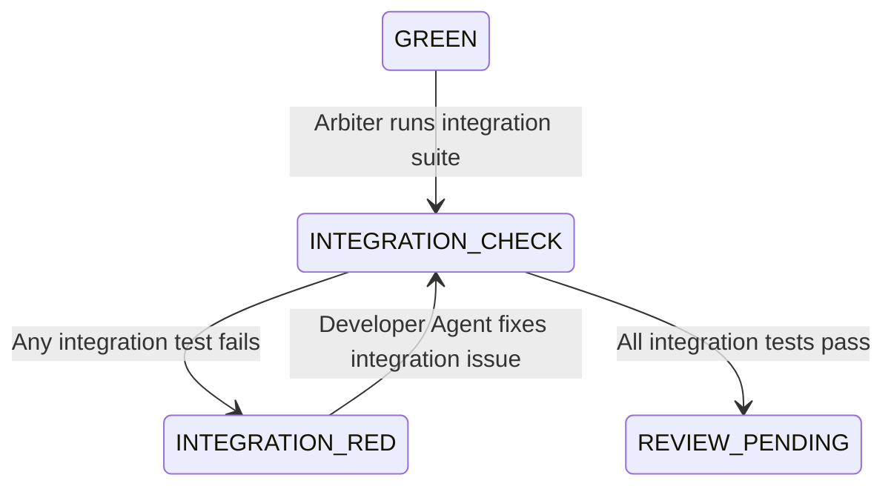
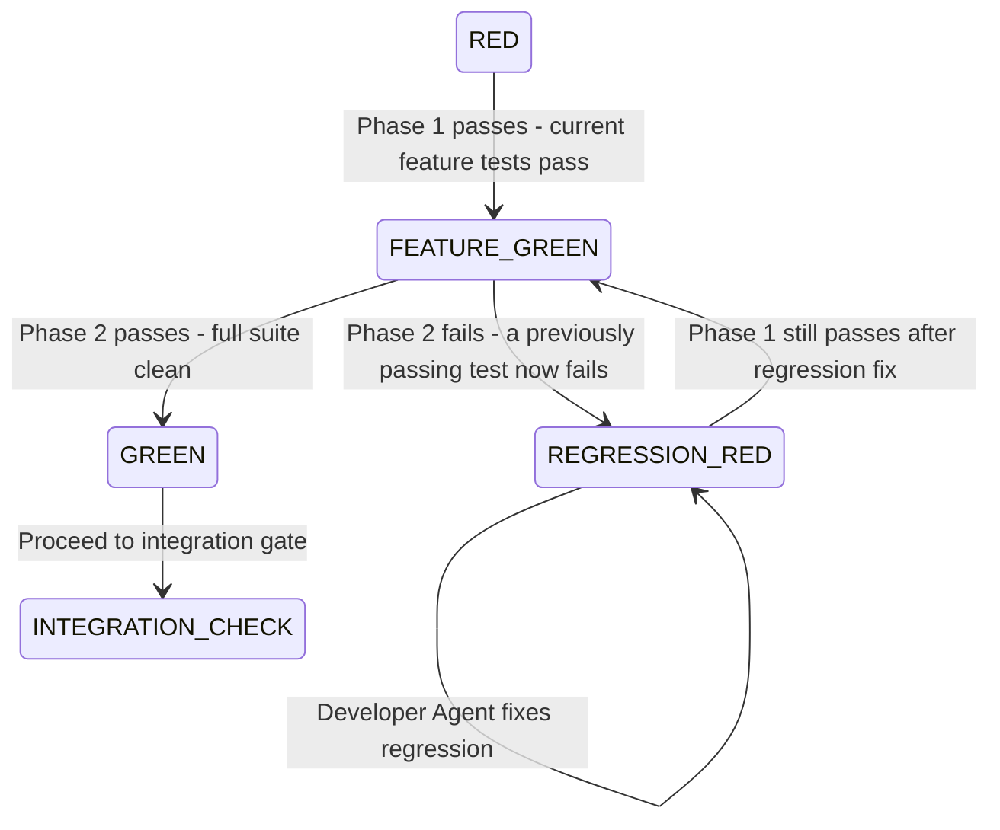
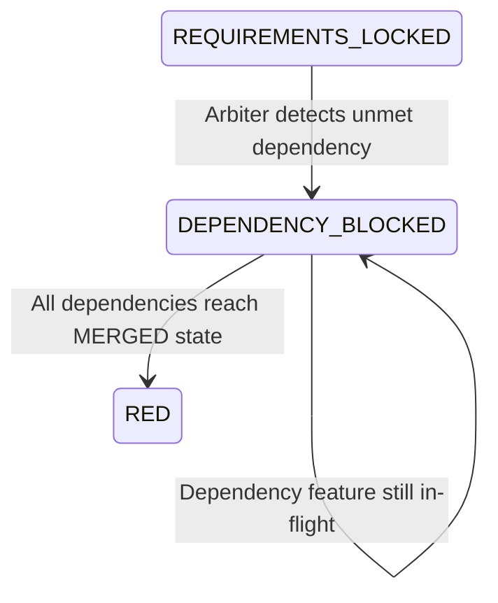
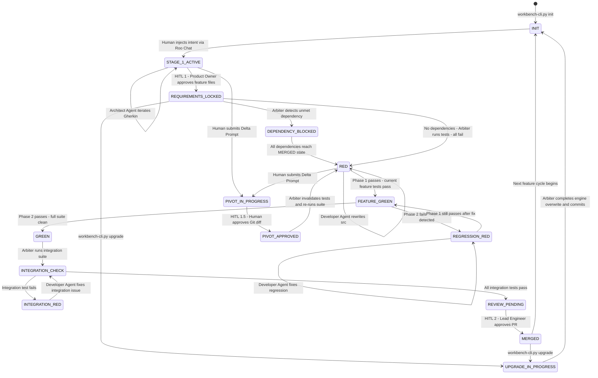

# Spec Gap Fix Plan: Integration Tests, Non-Regression Tests & Cross-Feature Dependency Management

**Author:** Senior Architect (Roo)
**Date:** 2026-04-12
**Reference Spec:** [`Agentic Workbench v2 - Draft.md`](../Agentic%20Workbench%20v2%20-%20Draft.md)
**Status:** APPROVED — All architectural decisions locked

## Locked Architectural Decisions

| # | Question | Decision |
|---|---|---|
| Q1 | Integration test ownership | **Option A** — Reuse Test Engineer Agent. Arbiter controls scope via directory unlock. |
| Q2 | Regression run frequency | **Option A** — Phase 2 runs after every Phase 1 GREEN. Fail fast, smallest blast radius. |
| Q3 | Dependency blocking strictness | **Option A** — Hard block at Stage 3 entry. No code written until all `@depends-on` features are `MERGED`. |
| Q4 | Parallel feature development | **Option C** — Stage 1 is parallel (multiple Gherkin contracts in-flight). Stages 2–4 are single-threaded (one active execution pipeline). |

---

## Executive Summary

Three structural gaps exist in the current spec that leave the pipeline mathematically incomplete:

| Gap | Severity | Root Cause in Spec |
|---|---|---|
| **Integration Tests** | 🔴 Critical | Spec only defines per-feature unit tests. No cross-boundary test layer exists. |
| **Non-Regression Tests** | 🔴 Critical | RED→GREEN gate only validates the *current* feature's tests. Full suite re-run is never mandated. |
| **Cross-Feature Dependency Management** | 🟡 Moderate | Each feature cycle is treated as isolated. No mechanism to declare or enforce inter-feature dependencies. |

Each gap requires additions to: the spec narrative, the `state.json` schema, the Arbiter scripts, the `.clinerules` guardrails, and the Feature Stage Execution Matrix.

---

## Gap 1: Integration Tests — Not Defined in Spec

### Current State

The spec defines a single test layer: **unit/acceptance tests** written by the Test Engineer Agent as `.spec.ts` files in `/tests/`. These tests are scoped to a single feature's Gherkin scenarios. The Arbiter's `test_orchestrator.py` runs this suite and sets `state.json` to `RED` or `GREEN`.

There is **no second test layer** that verifies features working together across system boundaries (e.g., API endpoint → service layer → database, or Feature A's output feeding Feature B's input).

### What Is Missing

1. A **defined test layer** for integration tests with its own directory, naming convention, and ownership.
2. A **pipeline stage** (or sub-stage) where integration tests are authored and executed.
3. An **Arbiter gate** that enforces integration test passage before a PR can be raised.
4. **Agent role clarity**: who writes integration tests — the Test Engineer Agent, or a separate Integration Test Agent?
5. **Scope definition**: what counts as an integration test vs. a unit test in this system.

### Proposed Spec Addition

#### A. Directory & Naming Convention

```
/tests/
  unit/          ← existing: per-feature .spec.ts files (REQ-NNN scoped)
  integration/   ← NEW: cross-boundary test files
    {FLOW-NNN}-{slug}.integration.spec.ts
```

Integration test files use a `FLOW-NNN` ID (distinct from `REQ-NNN`) to signal they test a *flow* across multiple requirements, not a single requirement.

#### B. New Sub-Stage: Stage 2b — Integration Contract Definition

Insert between Stage 2 (TDD Setup) and Stage 3 (Autonomous Execution) a lightweight sub-stage:

| Sub-Stage | Agent | File Access | Arbiter Gate | Trigger |
|---|---|---|---|---|
| **Stage 2b: Integration Scaffolding** | Test Engineer Agent | `/tests/integration/` (RW), `/features/` (R), `/src` (R) | Integration Skeleton Syntax Check | Automatic after Stage 2 RED confirmed |

**Rules for Stage 2b:**
- The Test Engineer Agent reads all `.feature` files currently in `MERGED` state (from `state.json` dependency map — see Gap 3).
- It identifies boundary interactions implied by the new feature's Gherkin (e.g., "Given a user exists" implies a dependency on the User feature's API).
- It writes **skeleton integration tests** that assert the cross-boundary contract. These tests are intentionally failing (RED) at this point.
- The Arbiter runs a **syntax check only** (not a full execution) on the integration skeletons and confirms their structure is valid.
- Integration tests are **not** required to pass before Stage 3 begins — they are authored as contracts and validated at Stage 4.

#### C. Stage 4 Integration Gate (New Arbiter Check)

At Stage 4 (Validation and Delivery), before the PR is raised for HITL 2, the Arbiter must:

1. Run the full `/tests/integration/` suite against the assembled codebase.
2. Require **all integration tests to pass** (GREEN) before the PR is eligible for human review.
3. If any integration test fails, `state.json` is set to `INTEGRATION_RED` and the Developer Agent is re-activated to fix the integration failure.



#### D. `state.json` Schema Addition

```json
{
  "integration_test_pass_ratio": null,
  "integration_state": "NOT_RUN | RED | GREEN"
}
```

#### E. `.clinerules` Addition

Add a mandatory rule:

> **Rule INT-1:** The Developer Agent MUST NOT consider a feature complete until both `state.json.state = GREEN` (unit tests) AND `state.json.integration_state = GREEN` (integration tests). The Arbiter enforces this sequentially; the Developer Agent must not self-declare completion.

#### F. New Arbiter Script

Add `integration_test_runner.py` to `.workbench/scripts/`:
- Runs only files matching `*.integration.spec.ts` in `/tests/integration/`
- Writes `integration_state` and `integration_test_pass_ratio` to `state.json`
- CLI: `python integration_test_runner.py run`

---

## Gap 2: Non-Regression Tests — Not Defined in Spec

### Current State

The spec's RED→GREEN loop in Stage 3 runs the **current feature's test suite only**. When the Developer Agent writes code to satisfy Feature B's tests, there is no gate that re-runs Feature A's (previously passing) tests to confirm they have not been broken.

This means the system can reach `GREEN` for Feature B while Feature A is silently broken — a critical failure mode for any production system.

### What Is Missing

1. A **full-suite regression run** as a mandatory gate before any `GREEN` state is confirmed.
2. A **regression failure state** in `state.json` that is distinct from a feature-level `RED`.
3. **Arbiter logic** to differentiate between "new feature tests failing" (expected in Stage 2) and "previously passing tests now failing" (a regression — never acceptable).
4. **Agent instructions** for how to handle a regression: the Developer Agent must fix the regression before continuing with the new feature.

### Proposed Spec Addition

#### A. Redefine the GREEN Gate

The current spec defines `GREEN` as: *"all tests pass."* This must be made explicit:

> **GREEN** means: ALL tests in `/tests/unit/` AND `/tests/integration/` pass — including tests for ALL previously merged features, not just the current feature under development.

#### B. Two-Phase Test Execution in Stage 3

The Arbiter's `test_orchestrator.py` must run tests in two phases on every iteration of the RED→GREEN loop:

```
Phase 1 — Feature Scope Run:
  Run only /tests/unit/{REQ-NNN}-*.spec.ts (current feature)
  Purpose: Fast feedback loop for the Developer Agent

Phase 2 — Full Regression Run:
  Run ALL /tests/unit/**/*.spec.ts + /tests/integration/**/*.spec.ts
  Purpose: Confirm no previously passing test has been broken
  Trigger: Only after Phase 1 passes
```

This two-phase approach preserves the fast inner loop (Phase 1) while adding the safety net (Phase 2).

#### C. New State: `REGRESSION_RED`

Add `REGRESSION_RED` to the `state.json` state machine:



**Critical rule:** `REGRESSION_RED` is a **blocking state**. The pipeline cannot advance to Stage 4 while in `REGRESSION_RED`. The Developer Agent is re-activated with the regression failure log as its primary input.

#### D. `state.json` Schema Addition

```json
{
  "regression_state": "NOT_RUN | CLEAN | REGRESSION_RED",
  "regression_failures": [],
  "full_suite_pass_ratio": null,
  "feature_suite_pass_ratio": null
}
```

#### E. `.clinerules` Addition

Add two mandatory rules:

> **Rule REG-1:** The Arbiter MUST run the full test suite (all features, all integration tests) after every Phase 1 GREEN confirmation. A feature is not `GREEN` until the full suite is clean.

> **Rule REG-2:** When `state.json.regression_state = REGRESSION_RED`, the Developer Agent MUST treat the regression failure log as its primary input — higher priority than the current feature's error log. The current feature's new code is the most likely cause of the regression.

#### F. Arbiter Script Update

Update `test_orchestrator.py` to support two-phase execution:
- `python test_orchestrator.py run --scope feature --req-id REQ-NNN` → Phase 1
- `python test_orchestrator.py run --scope full` → Phase 2
- Writes both `feature_suite_pass_ratio` and `full_suite_pass_ratio` to `state.json`
- Sets `regression_state` based on Phase 2 result

#### G. Handoff State Addition

When `REGRESSION_RED` is set, the Arbiter writes a structured regression report to `handoff-state.md`:

```markdown
## Regression Alert
- **Triggered by:** REQ-NNN (current feature under development)
- **Broken tests:** [list of previously passing test IDs]
- **Likely cause:** Changes to /src/{file} introduced in current feature branch
- **Required action:** Fix regression before resuming feature development
```

---

## Gap 3: Cross-Feature Dependency Management — Not Addressed in Spec

### Current State

The spec treats each feature cycle as a fully isolated pipeline: `INIT → STAGE_1_ACTIVE → RED → GREEN → REVIEW_PENDING → MERGED`. There is no mechanism to:

- Declare that Feature B requires Feature A to be in `MERGED` state before Feature B can proceed.
- Prevent the Developer Agent from writing code that assumes Feature A's API exists when Feature A has not yet been merged.
- Track which features are in-flight simultaneously and detect conflicts.
- Notify the pipeline when a dependency feature is merged, unblocking a waiting feature.

### What Is Missing

1. A **dependency declaration syntax** in `.feature` files.
2. A **dependency registry** in `state.json` that tracks inter-feature relationships.
3. **Arbiter enforcement** of dependency gates (blocking Stage 3 if a dependency is not `MERGED`).
4. **Unblocking logic** when a dependency is satisfied.
5. **Conflict detection** when two in-flight features modify the same source files.

### Proposed Spec Addition

#### A. Dependency Declaration in `.feature` Files

Extend the Gherkin tagging convention to support dependency declarations:

```gherkin
@REQ-042
@depends-on: REQ-038, REQ-041
Feature: Payment Checkout Flow
  ...
```

The `@depends-on` tag is parsed by the Arbiter's `gherkin_validator.py` during Stage 1's Gherkin Syntax Check. If a referenced REQ-ID does not exist in `state.json`'s feature registry, the validator raises a warning (not a block — the dependency may be planned but not yet started).

#### B. Feature Registry in `state.json`

Extend `state.json` with a feature registry:

```json
{
  "feature_registry": {
    "REQ-038": { "state": "MERGED", "merged_at": "2026-04-10T14:00:00Z", "branch": "feature/S1/REQ-038-user-auth" },
    "REQ-041": { "state": "GREEN", "branch": "feature/S1/REQ-041-user-profile" },
    "REQ-042": { "state": "RED", "branch": "feature/S1/REQ-042-payment-checkout", "depends_on": ["REQ-038", "REQ-041"] }
  }
}
```

The Arbiter is the **sole writer** of `feature_registry`. Agents read it via `.clinerules` mandate.

#### C. Dependency Gate: Stage 3 Entry Block

Before the Arbiter activates Stage 3 (Developer Agent) for a feature, it checks the dependency gate:

```
FOR EACH dep_id IN feature.depends_on:
  IF feature_registry[dep_id].state != "MERGED":
    SET state.json.state = "DEPENDENCY_BLOCKED"
    WRITE blocking report to handoff-state.md
    HALT Stage 3 activation
```

**`DEPENDENCY_BLOCKED`** is a new state in the `state.json` state machine:



The Arbiter's `state_manager.py` polls dependency states on every pipeline event (e.g., when any feature transitions to `MERGED`) and automatically unblocks waiting features.

#### D. Conflict Detection: Shared File Registry

Extend `state.json` with a file ownership map to detect when two in-flight features modify the same source files:

```json
{
  "file_ownership": {
    "src/auth/login.ts": "REQ-038",
    "src/auth/session.ts": "REQ-038",
    "src/payment/checkout.ts": "REQ-042"
  }
}
```

When the Developer Agent commits changes in Stage 3, the Arbiter's `pre-commit` hook:
1. Reads the list of modified files.
2. Checks `file_ownership` for each file.
3. If a file is owned by a **different in-flight feature** (not `MERGED`), raises a `CONFLICT_DETECTED` warning and writes a conflict report to `handoff-state.md`.
4. Does **not** block the commit (conflicts are warnings, not hard blocks) — but the Orchestrator Agent is notified to flag this for HITL 2 review.

#### E. `.clinerules` Additions

> **Rule DEP-1:** Before beginning Stage 3 implementation, the Developer Agent MUST read `state.json.feature_registry` and confirm all entries in `depends_on` have `state = MERGED`. If any dependency is not `MERGED`, the agent MUST halt and report the blocking dependency to `handoff-state.md`.

> **Rule DEP-2:** The Developer Agent MUST NOT write code that imports or calls APIs from features whose `state.json.feature_registry` entry is not `MERGED`. Stub interfaces are permitted; live imports are not.

> **Rule DEP-3:** When `state.json.state = DEPENDENCY_BLOCKED`, the Orchestrator Agent is the only agent permitted to act — its sole action is to monitor dependency states and report status to the human via Roo Chat.

#### F. Arbiter Script Updates

1. **`state_manager.py`** — Add `check-dependencies --req-id REQ-NNN` command that evaluates the dependency gate and sets `DEPENDENCY_BLOCKED` or clears it.
2. **`dependency_monitor.py`** (new script) — Polls `feature_registry` on every `MERGED` event and unblocks waiting features automatically.
   - CLI: `python dependency_monitor.py check-unblock`
3. **`gherkin_validator.py`** — Add `@depends-on` tag parsing and registry cross-reference validation.

#### G. Handoff State Template Addition

When `DEPENDENCY_BLOCKED` is set, the Arbiter writes:

```markdown
## Dependency Block Report
- **Blocked feature:** REQ-042 (Payment Checkout Flow)
- **Blocking dependencies:**
  - REQ-041 (User Profile) — current state: GREEN (not yet merged)
- **Estimated unblock:** When REQ-041 reaches MERGED state
- **Required action:** No agent action required. Arbiter will auto-unblock when dependency is satisfied.
```

---

## Unified State Transition Diagram (Updated)

The following diagram extends the existing `state.json` state machine from the spec to incorporate all three gap fixes:



---

## Updated Feature Stage Execution Matrix

| Stage | Roo Mode | File Access Constraints | Arbiter Gate | Memory Sync Actions |
|:---|:---|:---|:---|:---|
| **Stage 1: Architect** | Architect Agent | `.feature` (RW) / `/src` (R) | Gherkin Syntax Check + `@depends-on` tag validation | REQ-ID assigned; `feature_registry` entry created |
| **Stage 2: Test Engineer** | Test Engineer Agent | `/tests/unit/` (RW) / `/src` (R) | Confirmed RED State (unit tests) | Traceability Map updated |
| **Stage 2b: Integration Scaffolding** | Test Engineer Agent | `/tests/integration/` (RW) / `/features/` (R) / `/src` (R) | Integration Skeleton Syntax Check | Integration test IDs registered in `state.json` |
| **Stage 3: Developer** | Developer Agent | `/src` (RW) / `/tests` (R) / `.feature` (R) | Phase 1 GREEN + Phase 2 REGRESSION CLEAN + INTEGRATION GREEN | Git Commit (REQ-ID); `file_ownership` map updated |
| **Stage 4: Review** | Orchestrator Agent | All (Read-Only) | Human Approval | `current_state_summary` updated; `feature_registry` set to MERGED |

---

## Updated Arbiter Script Inventory

| Script | Existing / New | Gap Addressed | Key New Capability |
|---|---|---|---|
| `state_manager.py` | Existing — Extended | All three | New states: `FEATURE_GREEN`, `REGRESSION_RED`, `INTEGRATION_RED`, `INTEGRATION_CHECK`, `DEPENDENCY_BLOCKED`; `check-dependencies` command |
| `test_orchestrator.py` | Existing — Extended | Non-Regression | Two-phase execution: `--scope feature` and `--scope full`; writes `feature_suite_pass_ratio` and `full_suite_pass_ratio` |
| `integration_test_runner.py` | **New** | Integration Tests | Runs `*.integration.spec.ts` files; writes `integration_state` to `state.json` |
| `dependency_monitor.py` | **New** | Cross-Feature Deps | Polls `feature_registry`; auto-unblocks `DEPENDENCY_BLOCKED` features when deps reach `MERGED` |
| `gherkin_validator.py` | Existing — Extended | Cross-Feature Deps | Parses `@depends-on` tags; cross-references against `feature_registry` |

---

## Updated `state.json` Schema

```json
{
  "version": "2.1",
  "state": "INIT | STAGE_1_ACTIVE | REQUIREMENTS_LOCKED | DEPENDENCY_BLOCKED | RED | FEATURE_GREEN | REGRESSION_RED | GREEN | INTEGRATION_CHECK | INTEGRATION_RED | REVIEW_PENDING | MERGED | PIVOT_IN_PROGRESS | PIVOT_APPROVED | UPGRADE_IN_PROGRESS",
  "stage": null,
  "active_req_id": null,
  "feature_suite_pass_ratio": null,
  "full_suite_pass_ratio": null,
  "regression_state": "NOT_RUN | CLEAN | REGRESSION_RED",
  "regression_failures": [],
  "integration_state": "NOT_RUN | RED | GREEN",
  "integration_test_pass_ratio": null,
  "feature_registry": {
    "REQ-NNN": {
      "state": "STAGE_1_ACTIVE | REQUIREMENTS_LOCKED | DEPENDENCY_BLOCKED | RED | GREEN | MERGED",
      "branch": "feature/{Timebox}/{REQ-NNN}-{slug}",
      "depends_on": [],
      "merged_at": null
    }
  },
  "file_ownership": {
    "src/{path}": "REQ-NNN"
  },
  "last_updated": null,
  "last_updated_by": "arbiter"
}
```

---

## `.clinerules` Additions Summary

| Rule ID | Gap | Rule Text |
|---|---|---|
| `INT-1` | Integration Tests | Developer Agent MUST NOT self-declare completion until `integration_state = GREEN`. |
| `REG-1` | Non-Regression | Arbiter MUST run full suite after every Phase 1 GREEN. Feature is not GREEN until full suite is clean. |
| `REG-2` | Non-Regression | When `regression_state = REGRESSION_RED`, Developer Agent treats regression log as primary input. |
| `DEP-1` | Cross-Feature Deps | Developer Agent MUST read `feature_registry` and confirm all `depends_on` entries are `MERGED` before Stage 3. |
| `DEP-2` | Cross-Feature Deps | Developer Agent MUST NOT import live APIs from features not in `MERGED` state. Stubs are permitted. |
| `DEP-3` | Cross-Feature Deps | When `state = DEPENDENCY_BLOCKED`, only the Orchestrator Agent may act — monitoring only. |

---

## Sections to Add to the Spec Document

The following new sections must be inserted into [`Agentic Workbench v2 - Draft.md`](../Agentic%20Workbench%20v2%20-%20Draft.md):

### Insertion Point 1: After Stage 2 in Phase 1

**New section:** `Stage 2b: Integration Contract Scaffolding`
- Defines the integration test directory structure
- Defines the `FLOW-NNN` ID convention
- Defines the Test Engineer Agent's role in writing integration skeletons
- Defines the Arbiter's syntax-only gate for Stage 2b

### Insertion Point 2: Rewrite of Stage 3 in Phase 1

**Modify:** The RED→GREEN loop description to explicitly define two-phase test execution (Phase 1: feature scope, Phase 2: full regression). Add `FEATURE_GREEN` and `REGRESSION_RED` as intermediate states.

### Insertion Point 3: Rewrite of Stage 4 in Phase 1

**Modify:** Add the integration test gate (`INTEGRATION_CHECK` → `INTEGRATION_RED` → `REVIEW_PENDING`) as a mandatory pre-HITL-2 step.

### Insertion Point 4: New Cross-Cutting Concern Section

**New section:** `Cross-Cutting Concern 3: Cross-Feature Dependency Management`
- Defines the `@depends-on` Gherkin tag syntax
- Defines the `feature_registry` in `state.json`
- Defines the `DEPENDENCY_BLOCKED` state and auto-unblocking logic
- Defines the `file_ownership` conflict detection mechanism
- Defines the `DEP-1`, `DEP-2`, `DEP-3` `.clinerules` rules

### Insertion Point 5: Part 8 / Implementation Mapping Updates

**Modify:** Section 3A (Python Arbiter Scripts) to add `integration_test_runner.py` and `dependency_monitor.py`.  
**Modify:** Section 3C (`.clinerules`) to add the six new rules (`INT-1`, `REG-1`, `REG-2`, `DEP-1`, `DEP-2`, `DEP-3`).  
**Modify:** The `state.json` State Transition Diagram to include all new states.

---

## Implementation Sequence (Sprint Mapping)

These additions slot into the existing implementation strategy without disrupting the layer order:

| Sprint | Layer | Gap Fix | Deliverable |
|---|---|---|---|
| Sprint 0 | Layer 1 | All three (rules only) | Add `INT-1`, `REG-1`, `REG-2`, `DEP-1`, `DEP-2`, `DEP-3` to `.clinerules`; add `@depends-on` tag convention to `.roomodes` Architect Agent prompt |
| Sprint 1 | Layer 2 | Non-Regression | Extend `test_orchestrator.py` with `--scope feature` and `--scope full`; add `FEATURE_GREEN` and `REGRESSION_RED` to `state_manager.py` |
| Sprint 1 | Layer 2 | Integration Tests | Author `integration_test_runner.py`; add `INTEGRATION_CHECK` and `INTEGRATION_RED` to `state_manager.py` |
| Sprint 1 | Layer 2 | Cross-Feature Deps | Author `dependency_monitor.py`; extend `state_manager.py` with `check-dependencies`; extend `gherkin_validator.py` with `@depends-on` parsing |
| Sprint 2 | Layer 2b | All three | Git hooks: `pre-commit` runs regression check; `post-merge` triggers `dependency_monitor.py check-unblock` |

---

## Open Questions for Author Review

1. **Integration test ownership:** Should the Test Engineer Agent write integration tests, or should a dedicated Integration Test Agent be defined in `.roomodes`? The current proposal reuses the Test Engineer Agent with a different file access scope (Stage 2b). A dedicated agent would be cleaner but adds complexity.

2. **Regression run frequency:** The proposal runs Phase 2 (full regression) after every Phase 1 GREEN. For large test suites, this may be slow. Should Phase 2 be run only once (at the end of Stage 3, before transitioning to Stage 4), rather than on every RED→GREEN iteration?

3. **Dependency blocking strictness:** The proposal blocks Stage 3 entirely when a dependency is not `MERGED`. An alternative is to allow Stage 3 to proceed with stub interfaces (enforced by `DEP-2`) and only block the Stage 4 integration gate. Which is the preferred trade-off between safety and development velocity?

4. **Parallel feature development:** The spec currently implies one feature is active at a time (`active_req_id` is singular). The `feature_registry` addition implies multiple features can be in-flight simultaneously. Should the spec explicitly address parallel feature development, or remain single-feature-at-a-time for v2.0?
