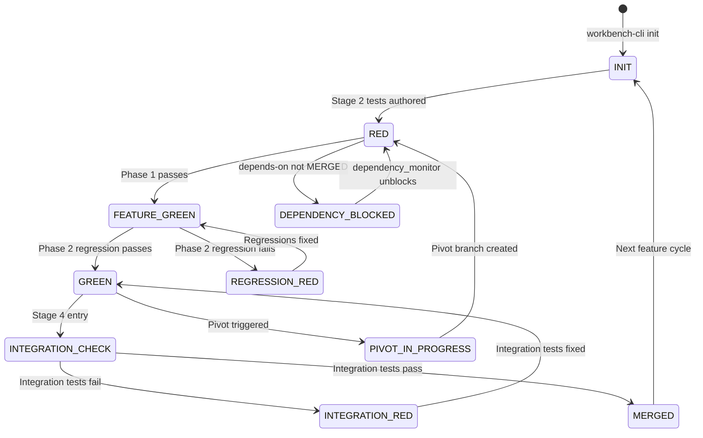
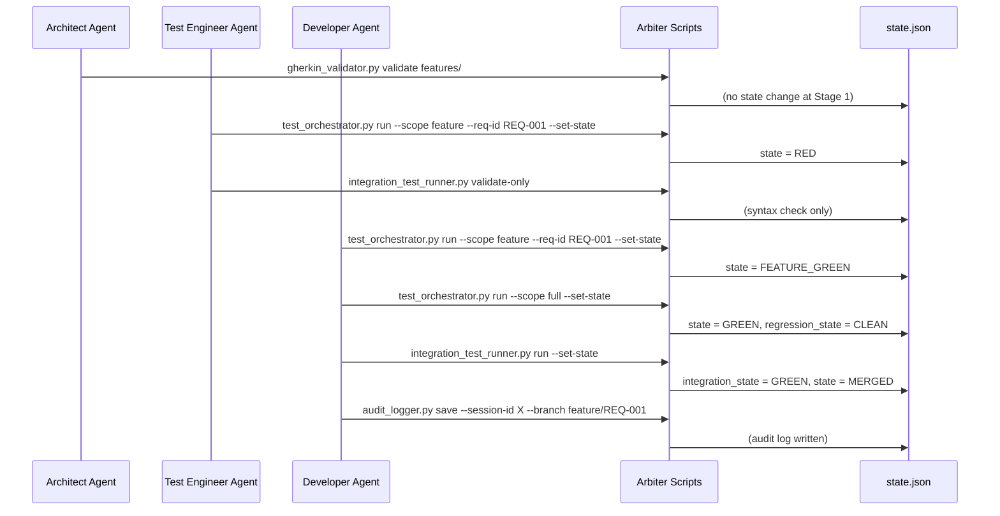

# Agentic Workbench v2.1 — Simulation Test Plan

**Author:** Senior Architect (Roo)
**Date:** 2026-04-12
**Status:** DRAFT — Pending Approval
**Reference:** [`plans/Agentic_Workbench_v2_Implementation_Strategy.md`](./Agentic_Workbench_v2_Implementation_Strategy.md)

---

## Objective

Simulate **all possible use cases** of the Agentic Workbench v2.1 using a self-contained Python test suite (`pytest`). The tests must:

1. Run entirely without a real Git repo, real test runner, or real Roo Code session
2. Cover every state machine transition in `state.json`
3. Cover every Arbiter script's happy path, edge cases, and failure modes
4. Cover every Git hook's enforcement logic
5. Cover the `workbench-cli.py` lifecycle commands
6. Be runnable with a single command: `pytest tests/workbench/`

---

## Test Suite Location

```
tests/
└── workbench/
    ├── conftest.py                    # Shared fixtures (temp dirs, state factories)
    ├── test_state_machine.py          # State transition coverage matrix
    ├── test_gherkin_validator.py      # Gherkin syntax + REQ-ID + @depends-on
    ├── test_test_orchestrator.py      # Phase 1 + Phase 2 test execution logic
    ├── test_integration_runner.py     # Stage 2b syntax + Stage 4 execution
    ├── test_dependency_monitor.py     # Dependency unblocking logic
    ├── test_memory_rotator.py         # Sprint rotation policy
    ├── test_audit_logger.py           # Immutable audit trail
    ├── test_crash_recovery.py         # Heartbeat + resume detection
    ├── test_workbench_cli.py          # init / upgrade / status / rotate
    ├── test_hooks_pre_commit.py       # Pre-commit enforcement logic (simulated)
    ├── test_hooks_pre_push.py         # Pre-push enforcement logic (simulated)
    └── test_e2e_pipeline.py           # Full Stage 1→2→2b→3→4 end-to-end
```

---

## State Machine — Full Transition Coverage Matrix

Every valid (and invalid) state transition must be tested.



| From State | To State | Trigger | Test ID |
|---|---|---|---|
| `INIT` | `RED` | Stage 2 tests authored, Phase 1 run | SM-001 |
| `RED` | `FEATURE_GREEN` | Phase 1 all tests pass | SM-002 |
| `RED` | `DEPENDENCY_BLOCKED` | `@depends-on` dep not MERGED | SM-003 |
| `FEATURE_GREEN` | `GREEN` | Phase 2 full regression passes | SM-004 |
| `FEATURE_GREEN` | `REGRESSION_RED` | Phase 2 regression fails | SM-005 |
| `REGRESSION_RED` | `FEATURE_GREEN` | Regressions fixed, Phase 1 re-run | SM-006 |
| `GREEN` | `INTEGRATION_CHECK` | Stage 4 entry triggered | SM-007 |
| `INTEGRATION_CHECK` | `MERGED` | Integration tests pass | SM-008 |
| `INTEGRATION_CHECK` | `INTEGRATION_RED` | Integration tests fail | SM-009 |
| `INTEGRATION_RED` | `GREEN` | Integration tests fixed | SM-010 |
| `MERGED` | `INIT` | Next feature cycle begins | SM-011 |
| `DEPENDENCY_BLOCKED` | `RED` | `dependency_monitor check-unblock` | SM-012 |
| `GREEN` | `PIVOT_IN_PROGRESS` | Pivot triggered | SM-013 |
| `PIVOT_IN_PROGRESS` | `RED` | Pivot branch created | SM-014 |

---

## Use Case Scenarios

### Category 1: Happy Path — Single Feature, No Dependencies

**UC-001: Complete Feature Lifecycle (Stage 1 → MERGED)**

The canonical success path. One feature, no dependencies, all tests pass.

```
INIT → RED → FEATURE_GREEN → GREEN → INTEGRATION_CHECK → MERGED
```

Steps simulated:
1. `workbench-cli.py init my-app` — scaffold created, `state.json` = INIT
2. Architect writes `features/REQ-001-user-login.feature` with valid Gherkin + `@REQ-001`
3. `gherkin_validator.py validate features/` — passes
4. Test Engineer writes `tests/unit/REQ-001-user-login.spec.ts` (intentionally failing)
5. `test_orchestrator.py run --scope feature --req-id REQ-001 --set-state` — RED
6. Developer implements `src/user-login.ts`
7. `test_orchestrator.py run --scope feature --req-id REQ-001 --set-state` — FEATURE_GREEN
8. `test_orchestrator.py run --scope full --set-state` — GREEN
9. `integration_test_runner.py run --set-state` — MERGED
10. `audit_logger.py save --session-id abc123 --branch feature/REQ-001`

---

### Category 2: Regression Handling

**UC-002: Phase 2 Regression Detected**

New feature passes Phase 1 but breaks an existing test.

```
FEATURE_GREEN → REGRESSION_RED → FEATURE_GREEN → GREEN
```

Steps simulated:
1. State pre-seeded: `state = FEATURE_GREEN`, existing tests in `tests/unit/`
2. `test_orchestrator.py run --scope full --set-state` — REGRESSION_RED (existing test fails)
3. Developer fixes regression
4. `test_orchestrator.py run --scope feature --req-id REQ-002 --set-state` — FEATURE_GREEN
5. `test_orchestrator.py run --scope full --set-state` — GREEN

**UC-003: Regression Blocks Commit (pre-commit hook)**

```
FEATURE_GREEN + REGRESSION_RED → commit blocked
```

Steps simulated:
1. State pre-seeded: `state = FEATURE_GREEN`, `regression_state = REGRESSION_RED`
2. Pre-commit hook logic invoked — must exit 1 (blocked)

---

### Category 3: Dependency Management

**UC-004: Feature Blocked on Unmerged Dependency**

```
RED → DEPENDENCY_BLOCKED (dep not MERGED)
```

Steps simulated:
1. `state.json.feature_registry` = `{REQ-001: {state: RED}, REQ-002: {state: RED, depends_on: [REQ-001]}}`
2. `dependency_monitor.py check-unblock` — REQ-002 stays DEPENDENCY_BLOCKED
3. REQ-001 transitions to MERGED
4. `dependency_monitor.py check-unblock` — REQ-002 unblocked → RED
5. `handoff-state.md` contains unblock report

**UC-005: Multiple Dependencies, Partial Satisfaction**

```
DEPENDENCY_BLOCKED (2 deps, 1 MERGED) → still DEPENDENCY_BLOCKED
```

Steps simulated:
1. REQ-003 depends on REQ-001 and REQ-002
2. REQ-001 = MERGED, REQ-002 = RED
3. `dependency_monitor.py check-unblock` — REQ-003 stays blocked
4. REQ-002 transitions to MERGED
5. `dependency_monitor.py check-unblock` — REQ-003 unblocked

**UC-006: Circular Dependency Detection (edge case)**

Steps simulated:
1. REQ-001 depends on REQ-002, REQ-002 depends on REQ-001
2. `gherkin_validator.py` — warns on cross-reference
3. `dependency_monitor.py check-unblock` — neither unblocks (infinite block)

---

### Category 4: Gherkin Validation

**UC-007: Valid Feature File**

Steps simulated:
1. Write valid `.feature` file with `@REQ-001`, `Feature:`, `Scenario:`, `Given/When/Then`
2. `gherkin_validator.py validate features/` — exit 0

**UC-008: Missing REQ-ID Tag**

Steps simulated:
1. Write `.feature` file without `@REQ-NNN`
2. `gherkin_validator.py validate features/` — exit 1, error: "Missing @REQ-NNN tag"

**UC-009: Missing Scenario Block**

Steps simulated:
1. Write `.feature` file with `@REQ-001` but no `Scenario:` keyword
2. `gherkin_validator.py validate features/` — exit 1

**UC-010: Missing Given/When/Then Steps**

Steps simulated:
1. Write `.feature` file with `Scenario:` but no step keywords
2. `gherkin_validator.py validate features/` — exit 1

**UC-011: Draft File in _inbox (no REQ-ID required)**

Steps simulated:
1. Write `_inbox/draft-feature.feature` with `@draft` but no `@REQ-NNN`
2. `gherkin_validator.py validate _inbox/ --allow-draft` — exit 0

**UC-012: @depends-on References Unknown REQ-ID**

Steps simulated:
1. Write `.feature` with `@depends-on: REQ-999` where REQ-999 not in `feature_registry`
2. `gherkin_validator.py validate features/` — exit 0 with warning (not error)

**UC-013: Empty features/ Directory**

Steps simulated:
1. `features/` directory exists but has no `.feature` files
2. `gherkin_validator.py validate features/` — exit 0, "No .feature files found"

**UC-014: Non-existent Directory**

Steps simulated:
1. `gherkin_validator.py validate /nonexistent/path/` — exit 1, "Directory not found"

---

### Category 5: Test Orchestrator

**UC-015: Phase 1 — No Tests Found for REQ-ID**

Steps simulated:
1. `tests/unit/` is empty
2. `test_orchestrator.py run --scope feature --req-id REQ-001 --set-state`
3. Returns exit 0, pass_ratio = 1.0 (no tests = pass), state unchanged

**UC-016: Phase 1 — Tests Found, All Pass**

Steps simulated:
1. Mock test runner returns exit 0
2. `test_orchestrator.py run --scope feature --req-id REQ-001 --set-state`
3. `state.json.state` = FEATURE_GREEN, `feature_suite_pass_ratio` = 1.0

**UC-017: Phase 1 — Tests Found, Some Fail**

Steps simulated:
1. Mock test runner returns exit 1
2. `test_orchestrator.py run --scope feature --req-id REQ-001 --set-state`
3. `state.json.state` = RED, `feature_suite_pass_ratio` = 0.0

**UC-018: Phase 2 — Full Regression, All Pass**

Steps simulated:
1. Mock test runner returns exit 0 for all tests
2. `test_orchestrator.py run --scope full --set-state`
3. `state.json.state` = GREEN, `regression_state` = CLEAN

**UC-019: Phase 2 — Full Regression, Some Fail**

Steps simulated:
1. Mock test runner returns exit 1
2. `test_orchestrator.py run --scope full --set-state`
3. `state.json.state` = REGRESSION_RED, `regression_state` = REGRESSION_RED

**UC-020: Missing --req-id for Feature Scope**

Steps simulated:
1. `test_orchestrator.py run --scope feature` (no --req-id)
2. Exit 2, error: "--req-id required for --scope feature"

**UC-021: Missing state.json**

Steps simulated:
1. `state.json` deleted
2. `test_orchestrator.py run --scope full`
3. Exit 2, error: "state.json not found"

---

### Category 6: Integration Test Runner

**UC-022: Stage 2b — No Integration Tests (skip)**

Steps simulated:
1. `tests/integration/` is empty
2. `integration_test_runner.py validate-only`
3. Exit 0, "No integration tests found (Stage 2b skipped)"

**UC-023: Stage 2b — Valid Integration Test Syntax**

Steps simulated:
1. Write `tests/integration/FLOW-001-login.integration.spec.ts` with `describe(` and `it(`
2. `integration_test_runner.py validate-only`
3. Exit 0, valid

**UC-024: Stage 2b — Invalid Integration Test (missing describe/it)**

Steps simulated:
1. Write `tests/integration/FLOW-001-login.integration.spec.ts` without `describe(` or `it(`
2. `integration_test_runner.py validate-only`
3. Exit 1, error: "missing test structure"

**UC-025: Stage 4 — Integration Tests Pass**

Steps simulated:
1. Mock runner returns exit 0
2. `integration_test_runner.py run --set-state`
3. `state.json.integration_state` = GREEN

**UC-026: Stage 4 — Integration Tests Fail**

Steps simulated:
1. Mock runner returns exit 1
2. `integration_test_runner.py run --set-state`
3. `state.json.integration_state` = RED

**UC-027: Stage 4 — Feature GREEN but Integration RED (INTEGRATION_RED)**

Steps simulated:
1. Pre-seed: `state.json.state` = GREEN
2. Mock runner returns exit 1
3. `integration_test_runner.py run --set-state`
4. `state.json.state` = INTEGRATION_RED

---

### Category 7: Memory Rotator

**UC-028: Sprint Rotation — All Files Present**

Steps simulated:
1. All 8 hot-context files exist with content
2. `memory_rotator.py rotate`
3. `activeContext.md`, `progress.md`, `productContext.md` → archived to `archive-cold/` + reset to template
4. `decisionLog.md`, `systemPatterns.md`, `RELEASE.md` → unchanged
5. `handoff-state.md`, `session-checkpoint.md` → reset to template (no archive)

**UC-029: Sprint Rotation — Dry Run**

Steps simulated:
1. `memory_rotator.py rotate --dry-run`
2. No files modified
3. Output shows "Would archive" / "Would reset"

**UC-030: Sprint Rotation — Missing Hot Context Directory**

Steps simulated:
1. `memory-bank/hot-context/` does not exist
2. `memory_rotator.py rotate`
3. Exit 1, error: "Hot context directory not found"

**UC-031: Sprint Rotation — Partial Files (some missing)**

Steps simulated:
1. Only `activeContext.md` exists (others missing)
2. `memory_rotator.py rotate`
3. `activeContext.md` archived + reset; others skipped with "Skipped (not found)"

**UC-032: Archive Naming Convention**

Steps simulated:
1. `memory_rotator.py rotate`
2. Archived file name matches pattern: `YYYYMMDD_HHMM UTC_activeContext.md`

---

### Category 8: Audit Logger

**UC-033: Save Session — Creates Immutable File**

Steps simulated:
1. `audit_logger.py save --session-id abc123 --branch feature/REQ-001`
2. File created in `docs/conversations/` with timestamp prefix
3. File contains session metadata + state snapshot

**UC-034: Save Session — Filename Format**

Steps simulated:
1. `audit_logger.py save --session-id abc123 --branch main`
2. Filename matches: `YYYYMMDD_HHMMSS_abc123.md`

**UC-035: List Sessions**

Steps simulated:
1. 3 audit log files exist in `docs/conversations/`
2. `audit_logger.py list`
3. Output lists all 3 files in reverse chronological order

**UC-036: Save Session — docs/conversations/ Auto-Created**

Steps simulated:
1. `docs/conversations/` does not exist
2. `audit_logger.py save --session-id xyz --branch main`
3. Directory created, file saved successfully

---

### Category 9: Crash Recovery

**UC-037: Start Daemon — Writes ACTIVE Checkpoint**

Steps simulated:
1. `crash_recovery.py start` (single heartbeat, then stop)
2. `session-checkpoint.md` contains `status: ACTIVE`
3. Contains `session_id`, `branch`, `commit_hash`, `current_task`, `last_heartbeat`

**UC-038: Status — ACTIVE Session Detected**

Steps simulated:
1. Pre-seed `session-checkpoint.md` with `status: ACTIVE` and session data
2. `crash_recovery.py status`
3. Output: "Resume available — offer to continue from this checkpoint"

**UC-039: Status — No Active Session**

Steps simulated:
1. `session-checkpoint.md` contains `status: EMPTY`
2. `crash_recovery.py status`
3. Output: "No active session — fresh start"

**UC-040: Clear Checkpoint**

Steps simulated:
1. `session-checkpoint.md` contains `status: ACTIVE`
2. `crash_recovery.py clear`
3. `session-checkpoint.md` reset to `status: EMPTY`

---

### Category 10: Workbench CLI

**UC-041: init — Creates Full Scaffold**

Steps simulated:
1. `workbench-cli.py init test-project` in temp directory
2. Verify: `state.json` exists with `state = INIT`
3. Verify: all engine files copied (`.clinerules`, `.roomodes`, `.roo-settings.json`)
4. Verify: all app directories created (`src/`, `tests/unit/`, `tests/integration/`, `features/`, `_inbox/`, `docs/conversations/`)
5. Verify: `memory-bank/hot-context/` populated with templates

**UC-042: init — Project Already Exists**

Steps simulated:
1. Directory `test-project` already exists
2. `workbench-cli.py init test-project`
3. Exit 1, error: "Directory 'test-project' already exists"

**UC-043: upgrade — Safe State (INIT)**

Steps simulated:
1. `state.json.state` = INIT
2. `workbench-cli.py upgrade --version v2.2`
3. Engine files overwritten, `state.json` preserved, `.workbench-version` updated

**UC-044: upgrade — Safe State (MERGED)**

Steps simulated:
1. `state.json.state` = MERGED
2. `workbench-cli.py upgrade --version v2.2`
3. Upgrade proceeds successfully

**UC-045: upgrade — Unsafe State (RED)**

Steps simulated:
1. `state.json.state` = RED
2. `workbench-cli.py upgrade --version v2.2`
3. Exit 1, error: "Cannot upgrade while state=RED. Must be INIT or MERGED."

**UC-046: upgrade — Unsafe State (REGRESSION_RED)**

Steps simulated:
1. `state.json.state` = REGRESSION_RED
2. `workbench-cli.py upgrade --version v2.2`
3. Exit 1, blocked

**UC-047: status — Displays All Fields**

Steps simulated:
1. `state.json` pre-seeded with known values
2. `workbench-cli.py status`
3. Output contains: version, state, stage, active REQ, test results, integration state, arbiter capabilities, feature registry count

**UC-048: status — No state.json**

Steps simulated:
1. `state.json` does not exist
2. `workbench-cli.py status`
3. Exit 1, error: "No state.json found"

**UC-049: rotate — Delegates to memory_rotator.py**

Steps simulated:
1. `workbench-cli.py rotate`
2. `memory_rotator.py rotate` is invoked
3. Sprint rotation applied

**UC-050: rotate — memory_rotator.py Not Found**

Steps simulated:
1. `.workbench/scripts/memory_rotator.py` does not exist
2. `workbench-cli.py rotate`
3. Exit 1, error: "memory_rotator.py not found"

---

### Category 11: Git Hook Logic (Simulated)

Since hooks are shell scripts, their logic is extracted and tested via Python simulation of the conditions they check.

**UC-051: pre-commit — state.json Not Staged (allowed)**

Steps simulated:
1. Staged files: `src/user-login.ts` only
2. Pre-commit state.json check: not triggered
3. Result: allowed

**UC-052: pre-commit — state.json Staged by Non-Arbiter (blocked)**

Steps simulated:
1. Staged files include `state.json`
2. Git author is not "workbench-cli" or "arbiter"
3. Result: blocked (exit 1)

**UC-053: pre-commit — Valid .feature File Staged**

Steps simulated:
1. Staged files include `features/REQ-001-login.feature` (valid Gherkin)
2. `gherkin_validator.py` returns exit 0
3. Result: allowed

**UC-054: pre-commit — Invalid .feature File Staged**

Steps simulated:
1. Staged files include `features/REQ-001-login.feature` (missing Scenario:)
2. `gherkin_validator.py` returns exit 1
3. Result: blocked

**UC-055: pre-commit — FEATURE_GREEN + REGRESSION_RED (blocked)**

Steps simulated:
1. `state.json.state` = FEATURE_GREEN, `regression_state` = REGRESSION_RED
2. Pre-commit regression check triggered
3. Result: blocked (exit 1)

**UC-056: pre-commit — FEATURE_GREEN + CLEAN regression (allowed)**

Steps simulated:
1. `state.json.state` = FEATURE_GREEN, `regression_state` = CLEAN
2. Pre-commit regression check: passes
3. Result: allowed

**UC-057: pre-push — Blocking State (RED)**

Steps simulated:
1. `state.json.state` = RED
2. Pre-push blocking state check
3. Result: blocked (exit 1)

**UC-058: pre-push — Blocking State (REGRESSION_RED)**

Steps simulated:
1. `state.json.state` = REGRESSION_RED
2. Result: blocked

**UC-059: pre-push — Blocking State (INTEGRATION_RED)**

Steps simulated:
1. `state.json.state` = INTEGRATION_RED
2. Result: blocked

**UC-060: pre-push — Blocking State (PIVOT_IN_PROGRESS)**

Steps simulated:
1. `state.json.state` = PIVOT_IN_PROGRESS
2. Result: blocked

**UC-061: pre-push — GREEN State (allowed)**

Steps simulated:
1. `state.json.state` = GREEN
2. Result: allowed

**UC-062: pre-push — Direct Push to main (blocked)**

Steps simulated:
1. Current branch = main, commit has 1 parent (not a merge commit)
2. Result: blocked

**UC-063: pre-push — Merge Commit to main (allowed)**

Steps simulated:
1. Current branch = main, commit has 2 parents (merge commit)
2. Result: allowed

**UC-064: pre-push — File Ownership Conflict (warning, not block)**

Steps simulated:
1. `state.json.file_ownership` = `{src/user-login.ts: REQ-001}`
2. REQ-001 state = RED (not MERGED)
3. Modified files include `src/user-login.ts`
4. Result: warning written, push NOT blocked

---

### Category 12: End-to-End Pipeline Simulation

**UC-065: Full Happy Path — Single Feature**

Complete simulation of Stage 1 → Stage 2 → Stage 2b → Stage 3 → Stage 4 → MERGED.



**UC-066: Full Path — With Regression Recovery**

```
INIT → RED → FEATURE_GREEN → REGRESSION_RED → FEATURE_GREEN → GREEN → MERGED
```

**UC-067: Full Path — With Dependency Block**

```
INIT → RED → DEPENDENCY_BLOCKED → (dep merges) → RED → FEATURE_GREEN → GREEN → MERGED
```

**UC-068: Full Path — With Integration Failure Recovery**

```
INIT → RED → FEATURE_GREEN → GREEN → INTEGRATION_RED → GREEN → MERGED
```

**UC-069: Sprint End — Memory Rotation**

Steps simulated:
1. Sprint completes with 3 features MERGED
2. `workbench-cli.py rotate`
3. `activeContext.md`, `progress.md`, `productContext.md` archived + reset
4. `decisionLog.md`, `systemPatterns.md`, `RELEASE.md` preserved
5. `handoff-state.md`, `session-checkpoint.md` reset

---

## Test Infrastructure Design

### `conftest.py` — Shared Fixtures

```python
# Key fixtures needed:
@pytest.fixture
def temp_workbench(tmp_path):
    """Create a minimal workbench scaffold in a temp directory."""
    # Creates: state.json, memory-bank/hot-context/, tests/unit/, tests/integration/,
    #          features/, _inbox/, docs/conversations/, .workbench/scripts/
    ...

@pytest.fixture
def state_factory(temp_workbench):
    """Factory to create state.json with specific field values."""
    def _make_state(**overrides):
        base = {state schema defaults}
        base.update(overrides)
        write state.json
    return _make_state

@pytest.fixture
def feature_factory(temp_workbench):
    """Factory to create valid/invalid .feature files."""
    ...

@pytest.fixture
def mock_test_runner_pass(monkeypatch):
    """Mock subprocess.run to simulate passing tests."""
    ...

@pytest.fixture
def mock_test_runner_fail(monkeypatch):
    """Mock subprocess.run to simulate failing tests."""
    ...
```

### Script Invocation Strategy

All Arbiter scripts are invoked via `subprocess.run(["python", script_path, ...])` with `cwd=temp_workbench`. This tests the actual scripts as black boxes, not just their internal functions.

For hook logic (shell scripts), the equivalent Python conditions are extracted and tested directly in Python — no shell execution required.

### Known Bugs to Fix During Test Implementation

During analysis of the existing scripts, the following issues were identified that tests will expose:

| Bug | Location | Description |
|---|---|---|
| BUG-001 | [`test_orchestrator.py:144`](../agentic-workbench-template/.workbench/scripts/test_orchestrator.py:144) | `run_feature_scope()` references `exit_code` before assignment — `NameError` at runtime |
| BUG-002 | [`test_orchestrator.py:157`](../agentic-workbench-template/.workbench/scripts/test_orchestrator.py:157) | `run_full_regression()` same `exit_code` NameError |
| BUG-003 | [`test_orchestrator.py:57`](../agentic-workbench-template/.workbench/scripts/test_orchestrator.py:57) | Runner loop tries all runners sequentially but breaks on first non-None returncode — `vitest`/`jest` may not be installed, causing silent fallthrough |
| BUG-004 | [`memory_rotator.py:313`](../agentic-workbench-template/.workbench/scripts/memory_rotator.py:313) | `reset_file()` called even in dry-run mode (line 313 inside dry-run branch) |
| BUG-005 | [`gherkin_validator.py`](../agentic-workbench-template/.workbench/scripts/gherkin_validator.py) | `validate` subcommand not used — script takes `directory` as positional arg but spec says `validate features/` |

---

## Implementation Plan

### Phase 1 — Test Infrastructure
1. Create `tests/workbench/conftest.py` with all shared fixtures
2. Create `tests/workbench/__init__.py`

### Phase 2 — Unit Tests per Script (in parallel)
3. `test_gherkin_validator.py` — UC-007 through UC-014
4. `test_test_orchestrator.py` — UC-015 through UC-021
5. `test_integration_runner.py` — UC-022 through UC-027
6. `test_dependency_monitor.py` — UC-004 through UC-006
7. `test_memory_rotator.py` — UC-028 through UC-032
8. `test_audit_logger.py` — UC-033 through UC-036
9. `test_crash_recovery.py` — UC-037 through UC-040
10. `test_workbench_cli.py` — UC-041 through UC-050

### Phase 3 — State Machine Tests
11. `test_state_machine.py` — SM-001 through SM-014

### Phase 4 — Hook Logic Tests
12. `test_hooks_pre_commit.py` — UC-051 through UC-056
13. `test_hooks_pre_push.py` — UC-057 through UC-064

### Phase 5 — End-to-End Pipeline
14. `test_e2e_pipeline.py` — UC-065 through UC-069

### Phase 6 — Bug Fixes
15.